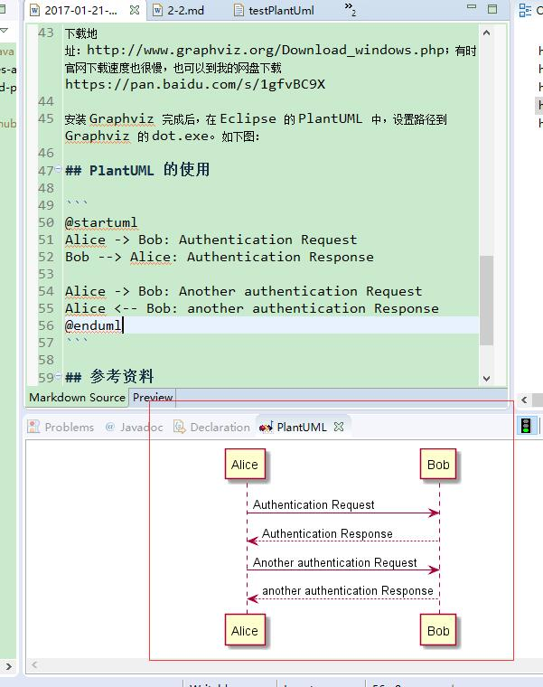

本文介绍了如果在 Eclipse 中安装、使用 PlantUML 插件，来进行常用 UML 图的绘制。
   
<!-- more -->

## PlantUML 简介

PlantUML 是一个开源项目，通过简单并带指引性语言定义来定义各种视图。该工具支持快速绘制以下 UML 图：

* 时序图
* 用例图
* 类图
* 活动图
* 组件图
* 状态图
* 部署图
* 对象图
* 线框图形界面

PlantUML 支持多个中 IDE 的集成，比如 Eclipse、NetBeans、Intellij idea 等。

## 安装 PlantUML for Eclipse 插件

PlantUML for Eclipse 插件主要用于在 Eclipse 中使用 PlantUML。在 Eclipse 的插件市场中安装，点击 “Help/Install new software”，在 Eclipse 4 (Juno) 及以上版本中，插件安装地址为：

* http://plantuml.sourceforge.net/updatesitejuno/
* http://basar.idi.ntnu.no/svn/tdt4100/anonymous/trunk/updatesite/


点击“Window/Show View/Other..”，可以将 PlantUML 预览窗口面板显示出来。

## 安装 Graphviz

下载地址：http://www.graphviz.org/Download_windows.php；有时官网下载速度也很慢，也可以到我的网盘下载 https://pan.baidu.com/s/1gfvBC9X

安装 Graphviz 完成后，在 Eclipse 的 PlantUML 中，设置路径到 Graphviz 的 dot.exe。 如下图：


如果 Graphviz 没有安装 成功，或者配置路径错误，则会有如下错误提示。


## PlantUML 的使用

在 Eclipse 中编辑如下脚本：

```
@startuml
Alice -> Bob: Authentication Request
Bob --> Alice: Authentication Response

Alice -> Bob: Another authentication Request
Alice <-- Bob: another authentication Response
@enduml
```

PlantUML 插件会自动识别上述脚本，从而在预览窗口生成一张时序图图片。该图片可以被用于导出、复制、打印。



更多示例，可以参考官方文档 http://translate.plantuml.com/zh/PlantUML_Language_Reference_Guide_ZH.pdf

## 参考资料
 

* http://plantuml.com/eclipse
* http://www.graphviz.org/content/plantuml-graphviz-dot-executable-usrbindot-does-not-excist
