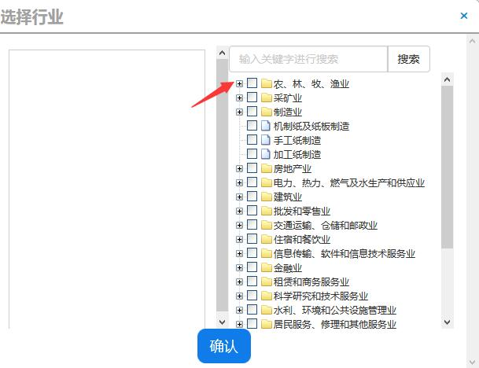
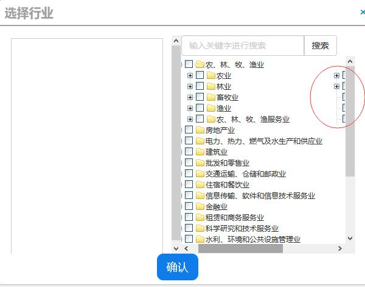

在项目中，我们广泛应用了 zTree 组件（http://www.treejs.cn/），近期发现，在 zTree 的下拉节点中，存在节点右移的问题。
   
<!-- more -->


## 问题描述

1. 我们点击第一个节点（含子节点）



 
2. 被点击的第一个节点展开后，发现之前处于该第一个节点下了同级节点（“采矿业”、“制造业”等）右移了





3. 初步判断样式被覆盖了

## 解决方式

自定义样式，强制样式不被覆盖

```
.ztree li{ 
	white-space: normal !important;
}
```


得解
 