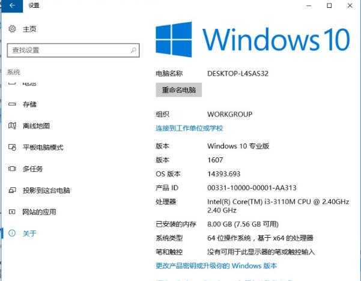
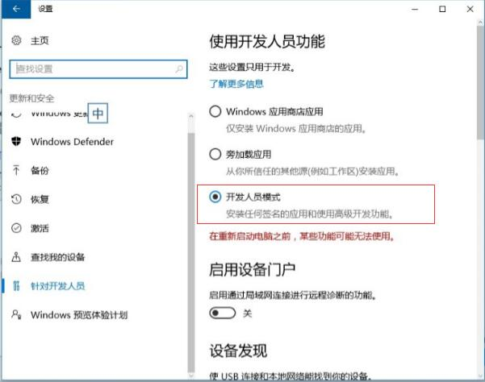
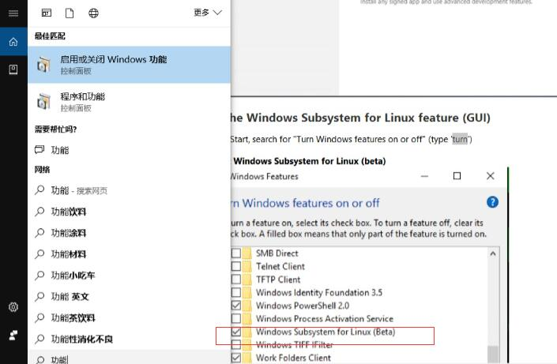
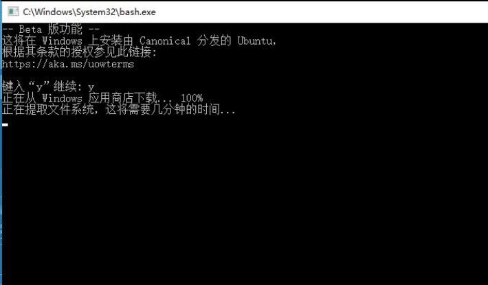
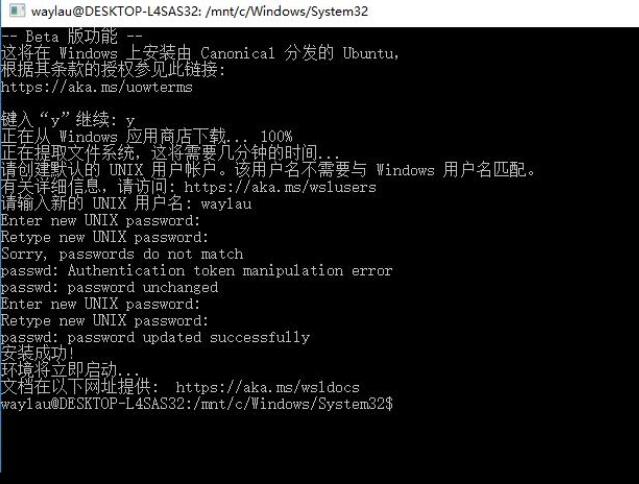
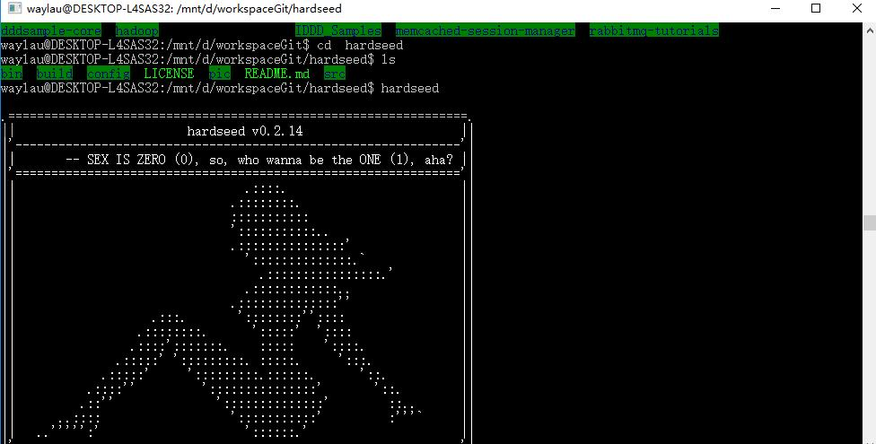

WSL(Windows Subsystem for Linux) 是 在Windows系统中为那些熟悉Linux用户准备的诸多子系统功能。换言之，你可以在Windows环境下来执行Linux操作，运行 Linux程序。这对于Windows、Linux双系统有需求的用户来说是个不错的功能。本文详细介绍了如何使用 WSL。
   
<!-- more -->


## WSL 简介

Bash 是 Linux/Unix 上非常流行的命令行 Shell，它是 Ubuntu、RHEL 等 Linux 发行版以及苹果 OS X 操作系统默认的命令行 Shell。通过 Windows Subsystem for Linux（WSL）这一 Windows 10 的最新特性实现的，使用此功能，你可以在 Windows 中原生运行 Linux 的大多数命令行程序。

>其实在 Windows 7 之前的操作系统中，都含有一个 POSIX 子系统，以便将 UNIX 的程序源代码编译为 Windows 程序。微软为 POSIX 子系统提供了众多的 UNIX 工具，而这些工具都是基于 POSIX 子系统直接使用GNU 的原生代码编译实现的，你也可以在这个 POSIX 子系统运行 C Shell、Korn Shell 等命令行 Shell。不过Windows 7 以后的操作系统中都默认移除了 POSIX 子系统。如果有兴趣的话可以在 Windows 7 操作系统中的“启用或关闭 Windows 功能”中启用“基于 UNIX 的应用程序子系统”，即可体验 POSIX 子系统。

启用 WSL 功能之后，如果使用 Bash，则 Windows 10 操作系统会下载一个由 Canonical 创建的 Ubuntu用户模式镜像（Ubuntu user-mode image），然后 Bash 程序以及其他的 Linux 二进制程序就可以运行于该 Ubuntu 镜像上。此外，微软也承诺未来会提供更多 Linux 发行版以供选择。

## 条件限制


WSL 只在 Windows 10 版本以上提供该功能，所以，如果你想玩转 WSL ，请升级你的 Windows。




## 切换到开发者模式下



## 启动 WSL 功能

在 选中 “Windows Subsystem for Linux”来启用  WSL 功能。



确认后，请重启计算机。


## 进入 Bash

进入 Bash，按照提示执行“y”，此时将会自动从 Windows 应用商店来下载 Linux （目前，暂时只支持Ubuntu系统）。





可能会由于网络原因安装会中断，请重复执行安装或者翻墙。

## 设置用户名密码

安装完成后，会提示你设置用户名和密码。当一切都完成后，你就可以像Linux 一样玩耍了。



## 设置Ubuntu镜像

使用镜像，可以加快软件的安装。编辑/etc/apt/sources.list文件, 在文件最前面添加以下条目(操作前请做好相应备份)

```
deb http://mirrors.163.com/ubuntu/ wily main restricted universe multiverse
deb http://mirrors.163.com/ubuntu/ wily-security main restricted universe multiverse
deb http://mirrors.163.com/ubuntu/ wily-updates main restricted universe multiverse
deb http://mirrors.163.com/ubuntu/ wily-proposed main restricted universe multiverse
deb http://mirrors.163.com/ubuntu/ wily-backports main restricted universe multiverse
deb-src http://mirrors.163.com/ubuntu/ wily main restricted universe multiverse
deb-src http://mirrors.163.com/ubuntu/ wily-security main restricted universe multiverse
deb-src http://mirrors.163.com/ubuntu/ wily-updates main restricted universe multiverse
deb-src http://mirrors.163.com/ubuntu/ wily-proposed main restricted universe multiverse
deb-src http://mirrors.163.com/ubuntu/ wily-backports main restricted universe multiverse
```

## 实战

我从网上找了一个 Linux 程序的源码，进行了编译，并成功运行了。



## 参考资料

* https://msdn.microsoft.com/en-us/commandline/wsl/install_guide
* https://linux.cn/article-7209-1.html
* http://mirrors.163.com/.help/ubuntu.html
 