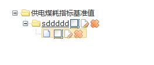

zTree 的新增按钮不显示，但是编辑和删除等操作的按钮都正常。在官方的DEMO中，新增按钮也是正常的，

   


<!-- more -->

排查了官网的例子，demo\cn\exedit\edit_super.html 上面的按钮都是正常的。里面有这么一段样式，加上就好了：

```css
<style type="text/css">
.ztree li span.button.add {
    margin-left: 2px;
    margin-right: -1px;
    background-position: -144px 0;
    vertical-align: top;
    *vertical-align: middle
}
</style>
```


 

## 参考资料

* http://www.treejs.cn/
 