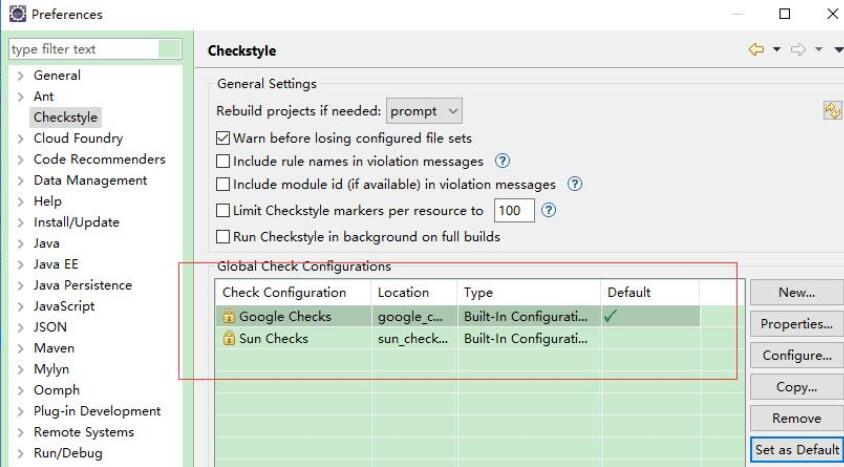
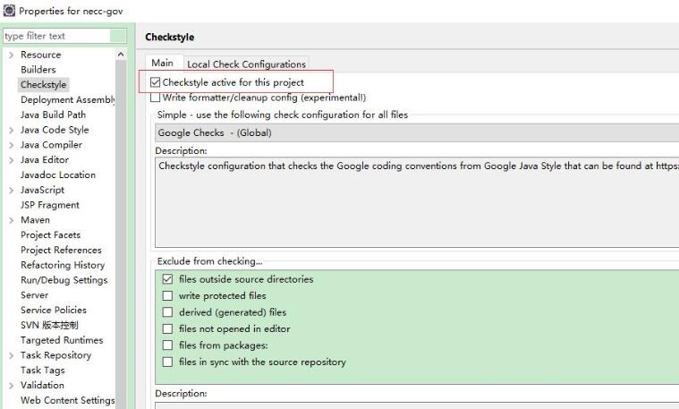
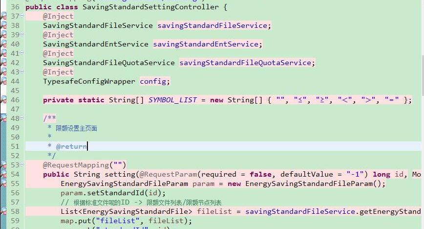
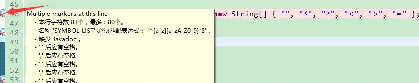
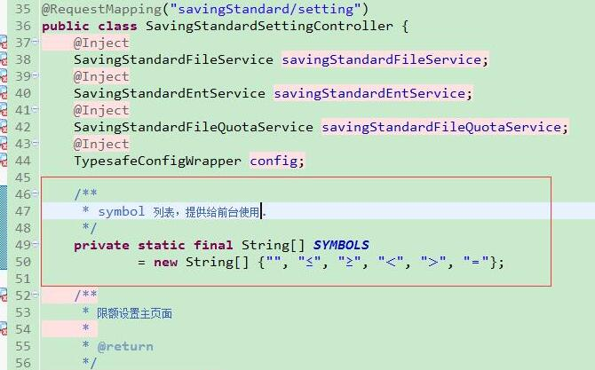
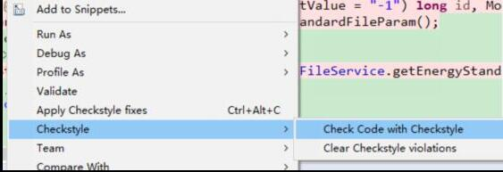

Checkstyle是一个开发工具，帮助程序员编写符合编码标准的Java代码。 好的代码规范，在一个项目协作的团队中尤为重要。Checkstyle 能够自动化检查Java代码的过程，免去了人工校验的繁琐。 同时，Checkstyle是高度可配置的，可以支持几乎任何编码标准。 只需要提供了一个示例配置文件，就能支持代码的约定。

本文介绍了如何在 Eclipse 里面安装、使用  Checkstyle 插件的过程。

<!-- more -->

## 安装

有几种方式来安装 Eclipse Checkstyle Plugin。

### 1. 通过 Eclipse Marketplace

在 Eclipse (Help -> Eclipse Marketplace...)
搜索关键字，比如`Checkstyle` 选择点击安装。

### 2. 通过  update site

在 Eclipse (Help -> Install New Software...)

输入 url: `http://eclipse-cs.sf.net/update`
 

选择下载  Eclipse Checkstyle Plugin 。

### 3. 通过离线插件包

官方下载地址：http://eclipse-cs.sourceforge.net/

有时，官网下载很慢我这里准备了网盘：https://pan.baidu.com/s/1qXQmonq

离线插件包安装方式，可以参考 https://waylau.com/about-optimizer-for-eclipse/

## 项目设置

可以设置代码规范样式类型，默认提供了 Google 和 Sun  的规范。当然也可以导入其他样式规范。

右键项目，勾选“Checkstyle active for this project”，则整个项目都会使用样式校验。

## 使用

重新编译代码，会帮你校验。未通过校验的代码给你高亮起来了，左侧还有提示信息。

Checkstyle 在项目编译之后才会给出结论，所以，如果你刚刚修改完了代码，记得编译下项目，再观察新结果。校验通过了，代码看上去就很干净

当然，你也可以采用手工校验的方式来使用 Checkstyle。这样，方便你每次修改完代码，就校验下代码。

 

## 参考文献

* http://eclipse-cs.sourceforge.net/#!/install
* Sun公司Java规范：https://github.com/waylau/java-code-conventions
* Google 公司Java规范：http://checkstyle.sourceforge.net/reports/google-java-style.html
