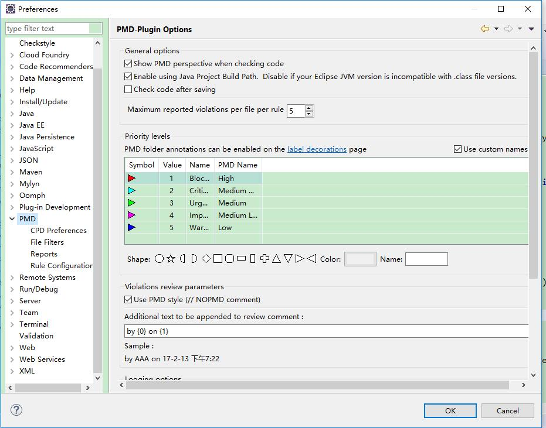
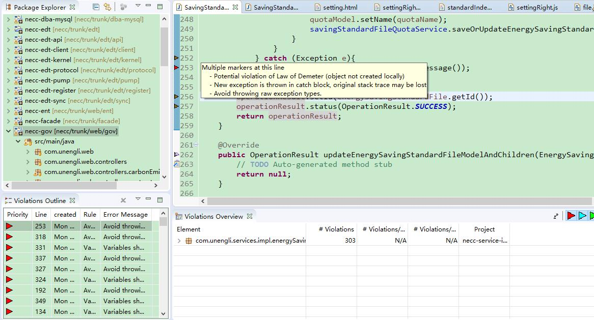

PMD 是一个源代码分析器。 它发现常见的编程缺陷，如未使用的变量、空 catch 块、不必要的对象创建等等。 它支持Java、JavaScript、Salesforce.com Apex、PLSQL、Apache Velocity、XML、XSL 等。

此外，它包括 CPD（copy-paste-detector，复制粘贴检测器）。 CPD 在Java、C、C++、C＃、Groovy、PHP、Ruby、Fortran、JavaScript、PLSQL、Apache Velocity、Scala、Objective C、Matlab、Python、Go、Swift 和 Salesforce.com Apex 中能够发现重复的代码。

本文介绍了如何在 Eclipse 里面安装、使用  PMD 插件的过程。

<!-- more -->

## 安装

有几种方式来安装 Eclipse Checkstyle Plugin。

### 1. 通过  update site

在 Eclipse (Help -> Install New Software...)

输入 url: `https://sourceforge.net/projects/pmd/files/pmd-eclipse/update-site/`
 

选择下载  PMD Eclipse 插件 。

### 2. 通过离线插件包

官方下载地址：https://sourceforge.net/projects/pmd/
或者是 https://github.com/pmd/pmd-eclipse-plugin/releases

有时，官网下载很慢我这里准备了网盘：https://pan.baidu.com/s/1hsE74Zq

离线插件包安装方式，可以参考 https://waylau.com/about-optimizer-for-eclipse/

## 项目设置

在“Windows”->“Preferences” 对 PMD 进行设置
 

## 使用

右键项目，选择“PMD”->“Check code with PMD” 即可。

要运行重复代码检测器，请右键单击项目节点，然后选择 “PMD”->“Find suspect cut and paste”。 报告将放置在名为“reports”目录下的“cpd-report.txt”的文件中。
 
 
 
## 参考文献

* http://pmd.sourceforge.net/
* https://pmd.github.io/pmd-5.5.3/usage/integrations.html#Eclipse
