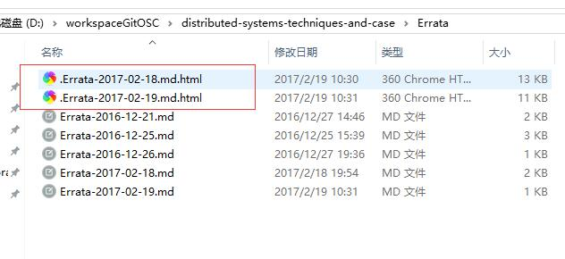
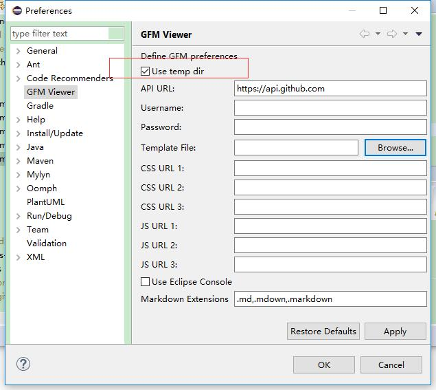

GFM 是 GitHub Flavored Markdown Viewer 的简称，是一款对 GitHub 友好的 Markdown 编辑器 ，在 Eclipse中可以以插件形式安装。

在使用过程中，我们发现对使用 GFM 编辑过的`.md`文件，都会在同个目录下生成`.md.html`的同名文件。显然，很多时候，我们并不需要保存`.md.html`文件，我们只想把`.md`文件存储到代码库。

<!-- more -->

## 解决方案

解决方法比较简单，设置GFM，将"Use temp dir" 选上即可：

 
 
 
## 参考文献

* https://github.com/waylau/everything-in-eclipse
 
