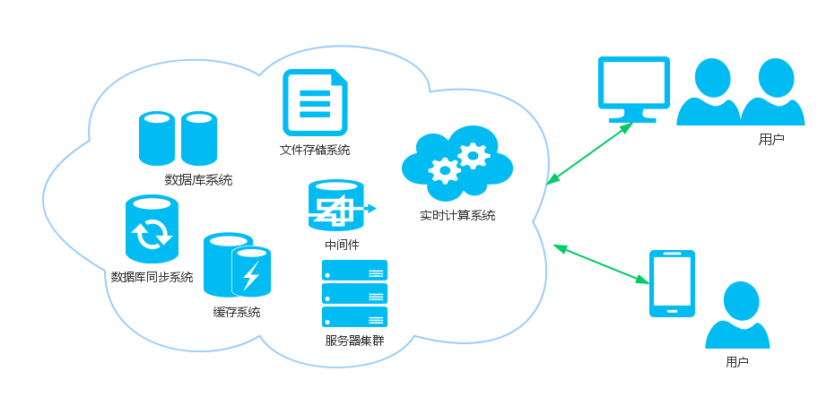

一提起“分布式系统”，大家的第一感觉就是好高大上啊，深不可测，看各类大牛关于分布式系统的演讲或者书籍，也大多是一脸懵逼。本文期望用浅显易懂的大白话来就什么是分布式系统、分布式系统有哪些优势、分布式系统会面临哪里挑战、如何来设计分布式等方面的话题来展开讨论。

<!-- more -->

## 什么是分布式系统

关于“分布式系统”的定义，我们先看下老外是怎么说的。《分布式系统原理和范型》一书中是这样定义分布式系统的：“分布式系统是若干独立计算机的集合，这些计算机对于用户来说就像是单个相关系统”。

关于这个定义，我们直观的感受就是：

* 首先，这种系统相对来说比较牛逼，起码由好几台主机组成。以谷歌、亚马逊等服务商而言，他们的数据中心都由上万台主机支撑起来的。
* 其次，虽然很牛逼，但对于外人来说，是感觉不到这些主机的存在。也就是说，我们只看到是一个系统在运作。以最近的“亚马逊 S3 宕机事件”为例，平时，我们压根不知道亚马逊所提供的服务背后是由多少台主机组成，但是等到 S3 宕机才知道，这货已经是占了互联网世界的半壁江山了。

从进程角度看，两个程序分别运行在两个台主机的进程上，它们相互协作最终完成同一个服务（或者功能），那么理论上这两个程序所组成的系统，也可以称作是“分布式系统”。

当然，这个两个程序可以是不同的程序，也可以是相同的程序。如果是相同的程序，我们又可以称之为“集群”。所谓集群，就是将相同的程序，通过不断横向扩展，以提高服务能力的方式。

“分布式系统”和“集群”的定义够都简单吧。

(图片选自[《分布式系统常用技术及案例分析》](https://github.com/waylau/distributed-systems-technologies-and-cases-analysis))

## 分布式系统有哪些优势

那么，为啥我们要用分布式系统？

说起分布式系统，我们就不得不说下分布式系统的祖先——集中式系统。集中式系统跟分布式系统是完全相反的两个概念。集中式系统就是把所有的程序、功能都集中到一台主机上，从而往外提供服务的方式。

集中式系统最容易理解了。比如，我们主机的PC电脑，或者手机，我们把各种软件都安装在一台机子上，当我需要什么功能，我就从这台机子上去获取。再比如，我们在学生时代做的课程设计或者开发时的小应用，我们把Web服务器、数据库等都会安装到一台电脑上。好处是，易于理解、方便维护，想要的东西我都放到了一个地方，东西好找啊。当然弊端也是显而易见的，如果这台机子崩了，或者硬盘坏了，那相当与整个系统就奔溃了，而且如果备份也是在这个硬盘上，那相当于招了灭顶之灾。

所以巴菲特有个关于投资的名言，就是“不要把鸡蛋放在一个篮子里”。对于系统而言也是如此。厂商的机子不可能永远保证永远不坏，我们也无法保证黑客不会来对我们的系统搞基，最为关键的是，我们自己无法保证自己的程序不会出bug。所以问题无法避免，错误也不可避免。我们只能鸡蛋分散到不同的篮子里，来减轻一锅端的风险。这就是为什么需要分布式系统的原因。

使用分布式系统的另外一个理由是可扩展性。毕竟任何主机（哪怕是小型机、超级计算机）都会有性能的极限。而分布式系统可以通过不断扩张主机的数量以实现横向水平性能的扩展。大家也都了解到 Google 的服务器主机，大多是淘汰的二线机子拼凑的吧。

## 分布式系统会面临哪里挑战

毫无疑问，分布式系统对于集中式系统而言，在实现上会更加复杂。分布式系统将会是更难理解、设计、构建 和管理的，同时意味着应用程序的根源问题更难发现。

设计分布式系统时，经常需要考虑如下的挑战：

* 异构性：分布式系统由于基于不同的网络、操作系统、计算机硬件和编程语言来构造，必须要考虑一种通用的网络通信协议来屏蔽异构系统之间的差异。一般交由中间件来处理这些差异。
* 缺乏全球时钟：在程序需要协作时，它们通过交换消息来协调它们的动作。紧密的协调经常依赖于对程序动作发生时间的共识，但是，实际上网络上计算机同步时钟的准确性受到极大的限制，即没有一个正确时间的全局概念。这是通过网络发送消息作为唯一的通信方式这一事实带来的直接结果。
* 一致性：数据被分散或者复制到不同的机器上，如何保证各台主机之间的数据的一致性将成为一个难点。
* 故障的独立性：任何计算机都有可能故障，且各种故障不尽相同。他们之间出现故障的时机也是相互独立的。一般分布式系统要设计成被允许出现部分故障而不影响整个系统的正常使用。
* 并发：分布式系统的目的，是为了更好的共享资源。那么系统中的每个资源都必须被设计成在并发环境中是安全的。
* 透明性：分布式系统中任何组件的故障、或者主机的升级、迁移对于用户来说都是透明的，不可见的。
* 开放性：分布式系统由不同的程序员来编写不同的组件，组件最终要集成成为一个系统，那么组件所发布的接口必须遵守一定的规范且能够被互相理解。
* 安全性：加密用于给共享资源提供适当的保护，在网络上所有传递的敏感信息，都需要进行加密。拒绝服务攻击仍然是一个有待解决的问题。
* 可扩展性：系统要设计成随着业务量的增加，相应的系统也必须要能扩展来提供对应的服务。

## 如何来设计分布式

设计分布式系统的本质就是“如何合理将一个系统拆分成多个子系统部署到不同机器上”。所以首要考虑的问题是如何合理的将系统进行拆分。由于拆分后的各个子系统不可能孤立的存在，必然是通过网络进行连接交互，所以它们之间如何通信变得尤为重要。当然在通信过程要识别“敌我”，防止信息在传递过程中被拦截和窜改，这就涉及到安全问题了。分布式系统要适应不断增长的业务需求，那么就需要考虑其扩展性。分布式系统还必须要保证可靠性和数据的一致性。

概况起来，在设计分布式系统时，应考虑以下几个问题：

* 系统如何拆分为子系统？
* 如何规划子系统间的通信？
* 通信过程中的安全如何考虑？
* 如何让子系统可以扩展？
* 子系统的可靠性如何保证？
* 数据的一致性是如何实现的？

实际上，上面的每一个问题都不是简单的问题。还好，我们要感谢开源，让这个时代的技术可以共享，让实现复杂系统的成本越来越低。比如，我们在设计通信时，我们可以采用面向消息的中间件，比如Apache ActiveMQ、RabbitMQ、Apache RocketMQ、Apache Kafka等，也有类似与 Google Protocol Buffer、Thrift等 RPC框架。在设计分布式计算时，我们分布式计算可以采用 MapReduce、Apache Hadoop、Apache Spark 等。在大数据和分布式存储方面，我们可以选择 Apache HBase、Apache Cassandra、Memcached、Redis、MongoDB等。在分布式监控方面，常用的技术包括Nagios、Zabbix、Consul、ZooKeeper等。

当然，本文也只是抛砖引玉，不可能面面俱到。望各位读者有不同的见解，欢迎讨论。

## 参考文献

* 《分布式 Java》：<https://github.com/waylau/distributed-java>
* 《分布式系统常用技术及案例分析》:<https://github.com/waylau/distributed-systems-technologies-and-cases-analysis>

