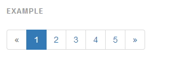
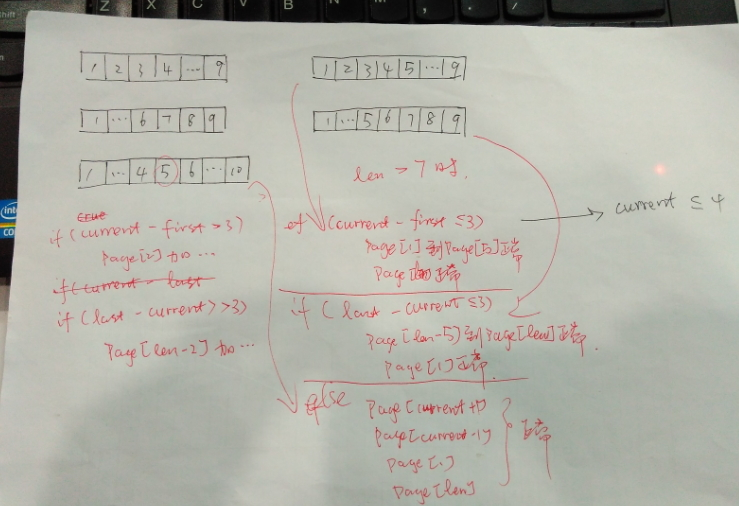
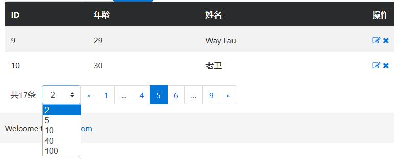

实际上分页器或者分页组件在现实中都有广泛着的应用，照理来说老卫没有必要单独撰文来提这茬。事实是，我近期刚好在写一门关于Spring Data、Thymeleaf 3、Bootstrap 4 的应用课程，所以用了Bootstrap 4的样式，结果之前很多例如 Bootstrap 3 的表格、分页器啊之类的插件都不能很好的兼容，百度谷歌无果，而且 Bootstrap 4 还没有出稳定版本，官网的示例也是少的可怜，最终下决心要自己写个分页器了，所用到的技术就是 Spring Data、Thymeleaf 3、Bootstrap 4 。

<!-- more -->

## 分页器有哪些需求


中国式报表从来都是最复杂的，随之衍生而来的分页器要求也是错综复杂。本例为求把分页器原理告诉给大家，所以，将分页组件的抽象为以下通用的内容：

* 显示页码的列表；
* 该列表的第一项是“上一页”，最后一项是“下一页”；
* 当前选中的页码要高亮；
* 当当前页的上一页没有页码可选时，则“上一页”置为不可点击的状态；
* 当当前页的下一页没有页码可选时，则“下一页”置为不可点击的状态；

我们很容易就能找到一个 Bootstrap 分页器的设计原型，如下图：





你可以参考 Bootstrap 官网的介绍 <http://getbootstrap.com/components/#pagination>，但建议你不要直接用上面的样式，因为这个样式是 Bootstrap 3版本的。
最后，我找到的了Bootstrap 4 里面的样式，却不在官网 <http://www.quackit.com/bootstrap/bootstrap_4/tutorial/bootstrap_pagination.cfm>。感谢 [books-collection](https://github.com/waylau/books-collection) 项目带给程序员的开源、免费图书集合！


## Spring Data 能做什么

[org.springframework.data.domain.Page](http://docs.spring.io/spring-data/commons/docs/current/api/org/springframework/data/domain/class-use/Page.html) 是 Spring Data 提供的一个分页器接口，提供了常用的方法，比如：

* List<T> getContent(); // 返回分页后的数据的列表
* int getTotalPages();  // 总页数
* long getTotalElements();  // 总数据量
* boolean isFirst(); // 是否是第一个数据；
* boolean isLast();  // 是否是最后一个数据；
* int getNumber();   // 当前页面索引

构造一个  Page，通常需要传入一个 [org.springframework.data.domain.PageRequest.PageRequest](http://docs.spring.io/spring-data/commons/docs/current/api/org/springframework/data/domain/PageRequest.html)对象，所需参数为 `(int page, int size)`，其中 page 就是 要请求的页面的索引，size 是页面的大小（一页最多有多少个数据）。

Spring Data 可以说提供了我们前端分页器所需要的所有元素了。


## Thymeleaf 牛刀小试

Thymeleaf 作为模版引擎，其好处就是可以绑定数据源，并且根据数据源来渲染页面。最爽的莫过于根据绑定的数据列表来遍历生成页面元素，比如：


```
<ul class="pagination" >
	<!-- 上一页 -->
	<li class="page-item" data-th-classappend="*{first} ? 'disabled' : ''">
		<a href="javascript:void(0);" class="page-link" data-th-attr="pageIndex=${page.number} - 1" aria-label="Previous">
			<span aria-hidden="true">«</span>
		</a>
	</li>
	
	<!-- 迭代生成页码 -->
	<li class="page-item" data-th-each="i : ${#numbers.sequence(1, page.totalPages)}" 
		data-th-classappend="${(page.number + 1) eq i} ? 'active' : ''" >
		<a class="page-link" data-th-attr="pageIndex=${i} - 1" href="javascript:void(0);">
             <span data-th-text="${i}"></span>
        </a>
	</li>
	
	<!-- 下一页 -->
	<li class="page-item" data-th-classappend="*{last} ? 'disabled' : ''">
		<a href="javascript:void(0);" class="page-link" data-th-attr="pageIndex=${page.number} + 1" aria-label="Next">
			<span aria-hidden="true">»</span>
		</a>
	</li>
</ul>
```

这个就是简单版本的分页器了，可以看到我们的分页器的“上一页”和“下一页”是固定不变的，中间根据 totalPages（总页数）来动态生成页面。同时，我们根据是否是当前页（number + 1）来设置样式是否高亮（active）。“上一页”和“下一页”是需要做一下判断的，若当前页是第一页（first）则“上一页”不能点击（disabled）；如果当前页是最后一页（last）则“下一页”不能点击（disabled）。

## 考虑的再多一点

实际上，上面版本可以应付大多数的应用场景了。但是，可能会有点不完美，比如，我的页数很多怎么办？那么我们的分页列表可能被拉得很长了，领导们可能会不满意的！绝对要把这种不满意的情绪扼杀在摇篮里。


可以看到，假如要做得更加完美，则还需要考虑，当页数太多时，应该将某些用省略号。这就涉及到三种情况了：

* 当当前页页码接近首页时，省略号在后部出现；
* 当当前页页码接最后页时，省略号在前部出现；
* 最烦的要属于，当当前页在中部时，前部、后部都需要省略号；

## 带省略号的分页器


聪明的工程师们应该马上行动起来，大致的把算法画了个草图：



为求简单，我们预设页码的列表最多在 7 页（你也可以根据需要来改），也就是说，当 totalPages（总页数）超过 7时，我们才需要考虑省略号的事情。

* “上一页”和“下一页”的算法于我们上面的简单版本类似，这里就不赘述了。
* 当前页面页码小于等于4时，省略号在列表后部的倒数第二个出现；
* 最后一页与当前页面之差小于等于3时，省略号在列表前部的第二个位置出现；
* 其余情况，则当前页适中处于中间位置，省略号同时在列表第二个位置及倒数第二个位置出现。

实现方式如下：

```
<!-- 处理页数大于7 的情况 -->	
<ul class="pagination" data-th-if="${page.totalPages gt 7}" >
 	<!-- 上一页 -->
	<li class="page-item" data-th-classappend="*{first} ? 'disabled' : ''">
		<a href="javascript:void(0);" class="page-link" data-th-attr="pageIndex=${page.number} - 1" aria-label="Previous">
			<span aria-hidden="true">«</span>
		</a>
	</li>
	
		<!-- 首页 -->
	<li class="page-item" data-th-classappend="${(page.number + 1) eq 1} ? 'active' : ''" >
		<a href="javascript:void(0);" class="page-link" data-th-attr="pageIndex=0">1</a>
	</li>
	 
	
 	<!-- 当前页面小于等于4 -->
 	<li class="page-item" data-th-if="${(page.number + 1) le 4}" data-th-each="i : ${#numbers.sequence(2,5)}" 
		data-th-classappend="${(page.number + 1) eq i} ? 'active' : ''" >
		<a class="page-link" href="javascript:void(0);" data-th-attr="pageIndex=${i} - 1">
            <span data-th-text="${i}"></span>
        </a>
	</li>

	<li class="page-item disabled" data-th-if="${(page.number + 1) le 4}">
		<a href="javascript:void(0);" class="page-link">
			<span aria-hidden="true">...</span>
		</a>
	</li>
	
	<!-- 最后一页与当前页面之差，小于等于3 -->
	<li class="page-item disabled" data-th-if="${(page.totalPages-(page.number + 1)) le 3}">
		<a href="javascript:void(0);" class="page-link">
			<span aria-hidden="true">...</span>
		</a>
	</li>  
 	<li class="page-item" data-th-if="${(page.totalPages-(page.number + 1)) le 3}" data-th-each="i : ${#numbers.sequence(page.totalPages-4, page.totalPages-1)}" 
		data-th-classappend="${(page.number + 1) eq i} ? 'active' : ''" >
		<a class="page-link" href="javascript:void(0);" data-th-attr="pageIndex=${i} - 1">
            <span data-th-text="${i}"></span>
       </a>
	</li>
 
	 <!-- 最后一页与当前页面之差大于3，且  当前页面大于4-->
	 
	<li class="page-item disabled" data-th-if="${((page.number + 1) gt 4) && ((page.totalPages-(page.number + 1)) gt 3 )}">
		<a href="javascript:void(0);" class="page-link">
			<span aria-hidden="true">...</span>
		</a>
	</li> 
 	<li class="page-item" data-th-if="${((page.number + 1) gt 4) && ((page.totalPages-(page.number + 1)) gt 3 )}" >
 		<a href="javascript:void(0);" class="page-link" data-th-attr="pageIndex=${page.number}">[[${page.number}]]</a>
 	</li>
	<li class="page-item active" data-th-if="${((page.number + 1) gt 4) && ((page.totalPages-(page.number + 1)) gt 3 )}">
		<a href="javascript:void(0);" class="page-link" data-th-attr="pageIndex=${page.number} + 1">[[${page.number + 1}]]</a>
	</li>
	<li class="page-item" data-th-if="${((page.number + 1) gt 4) && ((page.totalPages-(page.number + 1)) gt 3 )}">
		<a href="javascript:void(0);" class="page-link" data-th-attr="pageIndex=${page.number} + 2">[[${page.number + 2}]]</a>
	</li>
	
	<li class="page-item disabled"  data-th-if="${((page.number + 1) gt 4) && ((page.totalPages-(page.number + 1)) gt 3 )}">
		<a href="javascript:void(0);" class="page-link">
			<span aria-hidden="true">...</span>
		</a>
	</li>

	<!-- 最后一页 -->
	<li class="page-item" data-th-classappend="${(page.number + 1) eq page.totalPages} ? 'active' : ''" >
		<a href="javascript:void(0);" class="page-link" data-th-attr="pageIndex=${page.totalPages} - 1">[[${page.totalPages}]]</a>
	</li>

		<!-- 下一页 -->
		<li class="page-item" data-th-classappend="*{last} ? 'disabled' : ''">
		<a href="javascript:void(0);" class="page-link" data-th-attr="pageIndex=${page.number} + 1" aria-label="Next">
			<span aria-hidden="true">»</span>
		</a>
	</li>
</ul>
```

## 还要再考虑的多一点？

当然，正如我们开篇所讲，中国式报表的需求千奇百怪，本文也只是从大部分通用需求出发，给个思路， 不一定能满足所有人的需求。如果可能的话，再考虑多一点，比如：

* 是否可以选择页面的最大页？
* 是否可以选择任意页面的索引？
* ...

等等，尼玛看来下表快凌晨1点了。顶不顺了，要睡了。各位读者朋友可以继续完善~


## 最终效果



## 参考文献

* <http://getbootstrap.com/components/#pagination>
* <https://github.com/waylau/books-collection>
* http://www.quackit.com/bootstrap/bootstrap_4/tutorial/bootstrap_pagination.cfm
* http://docs.spring.io/spring-data/commons/docs/current/api/org/springframework/data/domain/class-use/Page.html
* http://docs.spring.io/spring-data/commons/docs/current/api/org/springframework/data/domain/PageRequest.html
* https://waylau.com/thymeleaf-3-adopts-a-new-parsing-system