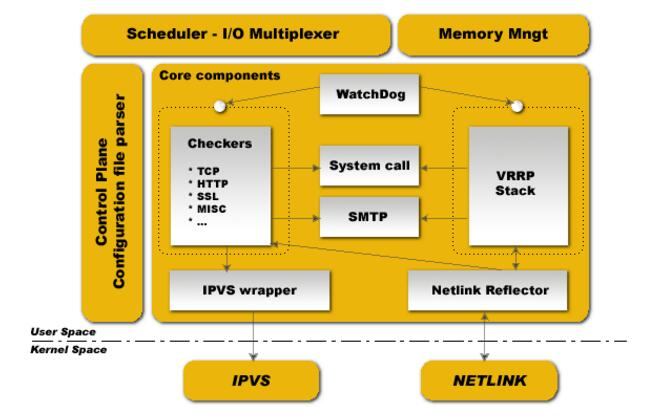

Keepalived 顾名思义，就是保持存活、保持在线了， 也就是用来实现服务的高可用（high availably）或热备，从而避免单点故障的发生。本文对 Keepalived 架构设计进行讲解。

<!-- more -->

Keepalived 整体软件架构设计如下：




 

Keepalived 完全采用 ANSI/ISO C 写出。

Keepalived 主要围绕一个中央 I/O 多路复用器（ multiplexer）而设计，这个 I/O 多路复用器提供实时网络功能。

Keepalived 设计目标着重于给所有元素提供同质化模块， 这是核心库产生的意义所在———降低代码的重复。另一方面，设计目标是使用安全和有保障的的代码来保证生产的稳定性和健壮性。

为了保证的稳定性和健壮性，后台程序被分解为3个不同的进程。全局设计思想是一个简约的父进程来负责监控它创建的子进程。父进程创建了2个子进程，一个负责 VRRP 框架，一个负责健康检查。每个子进程都有自己的调度 I/O 多路复用器，这样就可以优化 VRRP 调度抖动，因为 VRRP 调度比健康检查更明智/重要。 另一方面，这种拆分设计最小化了健康检查外部库使用情况的工作，并将自己的操作最小化，并实现了主循环的限制，从而避免自身造成的故障。父进程监控框架被称为看门狗（watchdog）， 设计思路如下 : 每个子进程打开一个 unix 域套接字，当后台程序启动后，父进程连接到那些套接字，然后周期性地（5s）发送 hello 报文包给子进程。如果父进程不能发送 hello 报文包到已经建立连接远程的子进程套接字，就直接重启子进程。这种看门狗设计方式主要有两个好处： 

* 所有从父进程发送到远程连接到子进程的 hello 报文包都是通过 I/O 复用分发调度器来完成，这样可以检测到子进程调度框架的死循环
* 由使用 sysV 信号来检测死亡的子进程

Keepalived 运行时，可以查看到如下进程 :

```
PID	 	 
111	Keepalived		<-- 父进程监控子进程
112	\_ Keepalived	<-- VRRP 子进程
113	\_ Keepalived	<-- 健康检查子进程
```

所有的原子模块介绍如下。

## Control Plane（控制面板）

Keepalived 的配置通过`keepalived.conf`文件来完成. 一个编译器用来解析这个文件。编译器读取关键字层次树，关键字层次树将配置文件中的关键字和响应的处理方法映射到一起。 一个中央、多级、递归函数读取配置文件，转换为关键字树。在解析过程中，配置文件被读取到内存中。

## Scheduler - I/O Multiplexer（调度器 - I/O 复用器）

所有的事件被调度到同一个进程进行处理。Keepalived  是单进程的。它是一个网络路由软件，和I/O密切相关。这里的设计方式是中央 select(...) ，它负责调度所有内部任务。没有使用 POSIX 线程库。因网络原因，这个框架提供了自己的线程抽象优化。


## Memory Mngt（内存管理）

这个框架提供了一些通用的内存管理功能如分配、再分配、释放等。可以工作在两种模式`normal_mode`和`debug_mode`。当使用`debug_mode`提供强有力的办法消除和跟踪内存泄漏。这种底层环境级别通过追踪内存的分派和释放来提供低运行缓存保护。这些使用的缓存的长度是固定，原因是为了防止最终的缓冲区溢出。

## Core components（核心组件）

这个框架定义了可以在所有代码中用到的一些通用的及一些全局库，这些库有：html解析、link-list、定时器、vector、字符串格式化、buffer dump、网络工具类、后台程序管理、pid 处理，底层4层 TCP 层。这里的目标是将代码分解为最大限度地重用代码来增加模块化。

## WatchDog（看门狗）

这个框架提供了子进程的监控（VRRP和健康检查）。每一个子进程打开自己的看门狗unix域套接字连接，父进程发送hello消息到子进程unix域套接字，hello消息经由父进程的I/O复用分发器发送到子进程的I/O复用分发器接受处理。如果子进程仍然存活，但父进程使用sysV系统监测到管道破坏时，就重启子进程。
每个子进程都接受连接到自己的看门狗 unix 域套接字。 父进程向子进程 unix 域套接字发送“hello”消息。 Hello 消息是使用父进程 I/O 多路复用器发送的，并使用 I/O 多路复用器进行接收/处理。 父进程使用 sysV 信号进行测试，如果检测到断开的管道而子进程仍然存在，则将其重新启动。

## Checkers（检查器） 

这是 Keepalived 最重要的功能点之一。检查器对真实服务器进行健康检测。只要真实服务器存活着，一个检测器就一直进行检测，当从 LVS 拓扑结构中移除或者加入一个真实服务器时该检测器停止工作。内部检测器设计成一个网络实时软件，它完全使用多线程FSM（Finite State Machine，有限状态机）设计。这个检测器栈根据四层或者5/7层测试结果对 LVS 拓扑进行操作。 它运行在一个独立的进程中，该进程被父进程所监控。

## VRRP Stack（VRRP 栈）

这个是 Keepalived 另一个最重要的功能。 VRRP（ Virtual Router Redundancy Protocol : RFC2338）是一种选择协议，它可以把一个虚拟路由器的责任动态分配到局域网上的 VRRP 路由器中的一台。它为路由器备份提供底层设计。 它实现了完整的 IETF RFC2338 标准，并提供了 LVS 和防火墙设计的一些规定和扩展。 它实现了`vrrp_sync_group`扩展，保证协议接管后的持久性路由路径。 它使用 MD5-96位密码提供实现IPSEC-AH，用于保护协议广告交换。 有关VRRP的更多信息，请阅读 RFC。 重要的事情：VRRP代码可以在没有 LVS 支持的情况下使用，它被设计为独立使用。它运行在由父进程监控的独立子进程中。

## System call（系统调用）

该框架提供启动额外的系统脚本的能力。主要是用在 MISC 检查器。在 VRRP 框架协议状态转换中，提供执行额外的脚本的能力。系统调用通过生成一个子进程完成的，不干扰全局调度计时器。

## SMTP

SMTP协议用来管理通知，使用多线程有限状态机设计，满足IETF RFC821 标准。 管理通知用来发送健康检测活动和 VRRP 协议状态转换信息。SMTP 非常通用，它也可以和其他通知子系统进行交互，如 GSM 短消息接口、寻呼机等等。

## Netlink Reflector（Netlink 反射器）

类似于 IPVS 包装器。Keepalived 有自己的网络接口结构，核心netlink通道设置ip地址和接口标志和监控。netlink消息子系统用来设置VRRP的vip。netlink 核心消息广播用来映射成事件相关接口的keepalived自定义用户空间的数据结构。因此通过netlink核心广播(RTMGRP_LINK & RTMGRP_IPV4_IFADDR)，可以将任意的用户空间（别的程序）的netlink操作映射到keeaplived 数据结构。

类似于 IPVS 包装器。IP地址和接口标志通过内核 Netlink 通道进行设置和监控。 Netlink 消息传递子系统用于设置VRRP VIP。 另一方面，Netlink 内核消息广播功能用于反映我们的用户空间 Keepalived 内部数据表示与接口相关的任何事件。 因此，任何其他用户空间（其他程序）Netlink 操作都将通过 Netlink 内核广播（RTMGRP_LINK和RTMGRP_IPV4_IFADDR）反映到我们的 Keepalived 数据表示。

## IPVS wrapper（IPVS 包装器）

该框架用来发送规则到 IPVS 核心代码. 它作为 Keepalived 内部数据结构和 IPVS rule_user 结构的转换桥梁。使用 IPVS libipvs 和 IPVS 代码保持通用的集成。

## IPVS

IPVS 是 Linux 核心代码，贡献者是 Wensong，属于 LinuxVirtualServer.org 开源工程。

## NETLINK :

是 Linux 核心代码，贡献者 Alexey Kuznetov，它拥有优美、先进的路由框架和子系统能力。


## 参考文献

* http://www.keepalived.org/documentation.html


