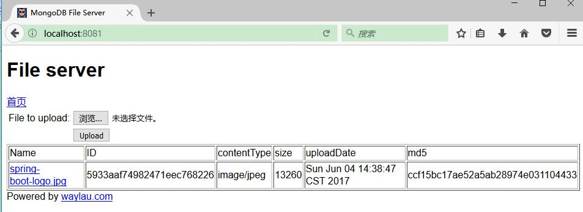

MongoDB 是一个介于关系数据库和非关系数据库之间的产品，是非关系数据库当中功能最丰富，最像关系数据库的，旨在为 WEB 应用提供可扩展的高性能数据存储解决方案。它支持的数据结构非常松散，是类似 JSON 的 BSON 格式，因此可以存储比较复杂的数据类型。

本文将介绍通过  MongoDB 存储二进制文件，从而实现一个文件服务器 	MongoDB File Server。

<!-- more -->

## 文件服务器的需求

本文件服务器致力于小型文件的存储，比如博客中图片、普通文档等。由于MongoDB 支持多种数据格式的存储，对于二进制的存储自然也是不话下，所以可以很方便的用于存储文件。由于  MongoDB 的 BSON 文档对于数据量大小的限制（每个文档不超过16M），所以本文件服务器主要针对的是小型文件的存储。对于大型文件的存储（比如超过16M），MongoDB 官方已经提供了成熟的产品  [GridFS](https://docs.mongodb.com/manual/core/gridfs/)，读者朋友可以自行了解。

本文不会对 MongoDB 的概念、基本用法做过多的介绍，有兴趣的朋友可自行查阅其他文献，比如，笔者所著的[《分布式系统常用技术及案例分析》](https://github.com/waylau/distributed-systems-technologies-and-cases-analysis)一书，对 MongoDB 方面也有所着墨。 

## 所需环境

本例子采用的开发环境如下：

* MongoDB 3.4.4
* Spring Boot 1.5.3.RELEASE
* Thymeleaf 3.0.3.RELEASE
* Thymeleaf Layout Dialect 2.2.0
* Embedded MongoDB 2.0.0
* Gradle 3.5

其中，Spring Boot 用于快速构建一个可独立运行的 Java 项目；Thymeleaf 作为前端页面模板，方便展示数据；Embedded MongoDB 则是一款由 Organization Flapdoodle OSS 出品的内嵌 MongoDB，可以在不启动 MongoDB 服务器的前提下，方面进行相关的 MongoDB 接口测试；Gradle 是一个类似于 Apache Maven 概念的新一代项目自动化构建工具。


有关 Spring Boot 的方面的内容，可以参阅笔者所著著的开源书《[Spring Boot 教程](https://github.com/waylau/spring-boot-tutorial)》。有关 Thymeleaf 的方面的内容，可以参阅笔者所著著的开源书《[Thymeleaf 教程](https://github.com/waylau/thymeleaf-tutorial)》。有关 Gradle 的方面的内容，可以参阅笔者所著著的开源书《[Gradle 3 用户指南](https://github.com/waylau/gradle-3-user-guide)》。


## build.gradle


本文所演示的项目，是采用 Gradle 进行组织以及构建的，如果您对 Gradle 不熟悉，也可以自行将项目转为 Maven 项目。

build.gradle 文件内容如下：

```groovy
// buildscript 代码块中脚本优先执行
buildscript {

	// ext 用于定义动态属性
	ext {
		springBootVersion = '1.5.3.RELEASE'
	}
			
	// 自定义  Thymeleaf 和 Thymeleaf Layout Dialect 的版本
	ext['thymeleaf.version'] = '3.0.3.RELEASE'
	ext['thymeleaf-layout-dialect.version'] = '2.2.0'
	// 自定义 Embedded MongoDB 的 依赖
	ext['embedded-mongo.version'] = '2.0.0'

	// 使用了 Maven 的中央仓库（你也可以指定其他仓库）
	repositories {
		//mavenCentral()
		maven {
			url 'http://maven.aliyun.com/nexus/content/groups/public/'
		}
	}
	
	// 依赖关系
	dependencies {
		// classpath 声明说明了在执行其余的脚本时，ClassLoader 可以使用这些依赖项
		classpath("org.springframework.boot:spring-boot-gradle-plugin:${springBootVersion}")
	}
}

// 使用插件
apply plugin: 'java'
apply plugin: 'eclipse'
apply plugin: 'org.springframework.boot'

// 打包的类型为 jar，并指定了版本
version = '1.0.0'

// 指定编译 .java 文件的 JDK 版本
sourceCompatibility = 1.8

// 默认使用了 Maven 的中央仓库。这里改用自定义的镜像库
repositories {
	//mavenCentral()
	maven {
		url 'http://maven.aliyun.com/nexus/content/groups/public/'
	}
}

// 依赖关系
dependencies {
	// 该依赖对于编译发行是必须的
	compile('org.springframework.boot:spring-boot-starter-web')
 
	// 添加 Thymeleaf 的依赖
	compile('org.springframework.boot:spring-boot-starter-thymeleaf')

	// 添加 Spring Data Mongodb 的依赖
	compile 'org.springframework.boot:spring-boot-starter-data-mongodb'
	
	// 添加  Embedded MongoDB 的依赖用于测试
	compile('de.flapdoodle.embed:de.flapdoodle.embed.mongo')

	// 该依赖对于编译测试是必须的，默认包含编译产品依赖和编译时依
	testCompile('org.springframework.boot:spring-boot-starter-test')
}

```

该 build.gradle 文件中的各配置项的注释已经非常详尽了，这里就不再赘述其配置项的含义了。

## 领域对象

### 文档类  File

文档类是类似与 JPA 中的实体的概念。

```java
import org.springframework.data.mongodb.core.mapping.Document;

@Document
public class File {
	@Id  // 主键
	private String id;
    private String name; // 文件名称
    private String contentType; // 文件类型
    private long size;
    private Date uploadDate;
    private String md5;
    private byte[] content; // 文件内容
    private String path; // 文件路径
    
    ...
	// getter/setter 
    ...
    
    protected File() {
    }
    
    public File(String name, String contentType, long size,byte[] content) {
    	this.name = name;
    	this.contentType = contentType;
    	this.size = size;
    	this.uploadDate = new Date();
    	this.content = content;
    }
   
    @Override
    public boolean equals(Object object) {
        if (this == object) {
            return true;
        }
        if (object == null || getClass() != object.getClass()) {
            return false;
        }
        File fileInfo = (File) object;
        return java.util.Objects.equals(size, fileInfo.size)
                && java.util.Objects.equals(name, fileInfo.name)
                && java.util.Objects.equals(contentType, fileInfo.contentType)
                && java.util.Objects.equals(uploadDate, fileInfo.uploadDate)
                && java.util.Objects.equals(md5, fileInfo.md5)
                && java.util.Objects.equals(id, fileInfo.id);
    }

    @Override
    public int hashCode() {
        return java.util.Objects.hash(name, contentType, size, uploadDate, md5, id);
    }

    @Override
    public String toString() {
        return "File{"
                + "name='" + name + '\''
                + ", contentType='" + contentType + '\''
                + ", size=" + size
                + ", uploadDate=" + uploadDate
                + ", md5='" + md5 + '\''
                + ", id='" + id + '\''
                + '}';
    }
}
```

文档类，主要采用的是 Spring Data MongoDB 中的注解，用于标识这是个 NoSQL 中的文档概念。

### 存储库 FileRepository

存储库用于提供与数据库打交道的常用的数据访问接口。其中 FileRepository 接口继承自`org.springframework.data.mongodb.repository.MongoRepository`即可，无需自行实现该接口的功能，
Spring Data MongoDB 会自动实现接口中的方法。

```java
import org.springframework.data.mongodb.repository.MongoRepository;
import com.waylau.spring.boot.fileserver.domain.File;

public interface FileRepository extends MongoRepository<File, String> {
}

```

### 服务接口及实现类

FileService 接口定义了对于文件的 CURD 操作，其中查询文件接口是采用的分页处理，以有效提高查询性能。

```java
public interface FileService {
	/**
	 * 保存文件
	 * @param File
	 * @return
	 */
	File saveFile(File file);
	
	/**
	 * 删除文件
	 * @param File
	 * @return
	 */
	void removeFile(String id);
	
	/**
	 * 根据id获取文件
	 * @param File
	 * @return
	 */
	File getFileById(String id);

	/**
	 * 分页查询，按上传时间降序
	 * @param pageIndex
	 * @param pageSize
	 * @return
	 */
	List<File> listFilesByPage(int pageIndex, int pageSize);
}
```

FileServiceImpl 实现了 FileService 中所有的接口。


```java
@Service
public class FileServiceImpl implements FileService {
	
	@Autowired
	public FileRepository fileRepository;

	@Override
	public File saveFile(File file) {
		return fileRepository.save(file);
	}

	@Override
	public void removeFile(String id) {
		fileRepository.delete(id);
	}

	@Override
	public File getFileById(String id) {
		return fileRepository.findOne(id);
	}

	@Override
	public List<File> listFilesByPage(int pageIndex, int pageSize) {
		Page<File> page = null;
		List<File> list = null;
		
		Sort sort = new Sort(Direction.DESC,"uploadDate"); 
		Pageable pageable = new PageRequest(pageIndex, pageSize, sort);
		
		page = fileRepository.findAll(pageable);
		list = page.getContent();
		return list;
	}
}
```

## 控制层/API 资源层

FileController 控制器作为 API 的提供者，接收用户的请求及响应。API 的定义符合 RESTful 的风格。有关 REST 相关的知识，读者可以参阅笔者所著的开源书《[REST 实战]》(https://github.com/waylau/rest-in-action)。


```java
@CrossOrigin(origins = "*", maxAge = 3600)  // 允许所有域名访问
@Controller
public class FileController {

    @Autowired
    private FileService fileService;
    
    @Value("${server.address}")
    private String serverAddress;
    
    @Value("${server.port}")
    private String serverPort;
    
    @RequestMapping(value = "/")
    public String index(Model model) {
    	// 展示最新二十条数据
        model.addAttribute("files", fileService.listFilesByPage(0,20)); 
        return "index";
    }

    /**
     * 分页查询文件
     * @param pageIndex
     * @param pageSize
     * @return
     */
	@GetMapping("files/{pageIndex}/{pageSize}")
    @ResponseBody
	public List<File> listFilesByPage(@PathVariable int pageIndex, @PathVariable int pageSize){
		return fileService.listFilesByPage(pageIndex, pageSize);
	}
			
    /**
     * 获取文件片信息
     * @param id
     * @return
     */
    @GetMapping("files/{id}")
    @ResponseBody
    public ResponseEntity<Object> serveFile(@PathVariable String id) {

        File file = fileService.getFileById(id);

        if (file != null) {
            return ResponseEntity
                    .ok()
                    .header(HttpHeaders.CONTENT_DISPOSITION, "attachment; fileName=\"" + file.getName() + "\"")
                    .header(HttpHeaders.CONTENT_TYPE, "application/octet-stream" )
                    .header(HttpHeaders.CONTENT_LENGTH, file.getSize()+"")
                    .header("Connection",  "close") 
                    .body( file.getContent());
        } else {
            return ResponseEntity.status(HttpStatus.NOT_FOUND).body("File was not fount");
        }

    }
    
    /**
     * 在线显示文件
     * @param id
     * @return
     */
    @GetMapping("/view/{id}")
    @ResponseBody
    public ResponseEntity<Object> serveFileOnline(@PathVariable String id) {

        File file = fileService.getFileById(id);

        if (file != null) {
            return ResponseEntity
                    .ok()
                    .header(HttpHeaders.CONTENT_DISPOSITION, "fileName=\"" + file.getName() + "\"")
                    .header(HttpHeaders.CONTENT_TYPE, file.getContentType() )
                    .header(HttpHeaders.CONTENT_LENGTH, file.getSize()+"")
                    .header("Connection",  "close") 
                    .body( file.getContent());
        } else {
            return ResponseEntity.status(HttpStatus.NOT_FOUND).body("File was not fount");
        }

    }
    
    /**
     * 上传
     * @param file
     * @param redirectAttributes
     * @return
     */
    @PostMapping("/")
    public String handleFileUpload(@RequestParam("file") MultipartFile file,
                                   RedirectAttributes redirectAttributes) {

        try {
        	File f = new File(file.getOriginalFilename(),  file.getContentType(), file.getSize(), file.getBytes());
        	f.setMd5( MD5Util.getMD5(file.getInputStream()) );
        	fileService.saveFile(f);
        } catch (IOException | NoSuchAlgorithmException ex) {
            ex.printStackTrace();
            redirectAttributes.addFlashAttribute("message",
                    "Your " + file.getOriginalFilename() + " is wrong!");
            return "redirect:/";
        }

        redirectAttributes.addFlashAttribute("message",
                "You successfully uploaded " + file.getOriginalFilename() + "!");

        return "redirect:/";
    }
 
    /**
     * 上传接口
     * @param file
     * @return
     */
    @PostMapping("/upload")
    @ResponseBody
    public ResponseEntity<String> handleFileUpload(@RequestParam("file") MultipartFile file) {
    	File returnFile = null;
        try {
        	File f = new File(file.getOriginalFilename(),  file.getContentType(), file.getSize(),file.getBytes());
        	f.setMd5( MD5Util.getMD5(file.getInputStream()) );
        	returnFile = fileService.saveFile(f);
        	String path = "//"+ serverAddress + ":" + serverPort + "/view/"+returnFile.getId();
        	return ResponseEntity.status(HttpStatus.OK).body(path);
 
        } catch (IOException | NoSuchAlgorithmException ex) {
            ex.printStackTrace();
            return ResponseEntity.status(HttpStatus.INTERNAL_SERVER_ERROR).body(ex.getMessage());
        }
 
    }
    
	/**
     * 删除文件
     * @param id
     * @return
     */
    @DeleteMapping("/{id}")
    @ResponseBody
    public ResponseEntity<String> deleteFile(@PathVariable String id) {
 
    	try {
			fileService.removeFile(id);
			return ResponseEntity.status(HttpStatus.OK).body("DELETE Success!");
		} catch (Exception e) {
			return ResponseEntity.status(HttpStatus.INTERNAL_SERVER_ERROR).body(e.getMessage());
		}
    }
}
```

其中`@CrossOrigin(origins = "*", maxAge = 3600)` 注解标识了 API 可以被跨域请求。为了能够启用该注解，仍然需要安全配置类的支持。

## 安全配置

为了支持跨域请求，我们设置了安全配置类 SecurityConfig：

```java
@Configuration
@EnableWebMvc
public class SecurityConfig extends WebMvcConfigurerAdapter {

	@Override
	public void addCorsMappings(CorsRegistry registry) {
		registry.addMapping("/**").allowedOrigins("*") ; // 允许跨域请求
	}
}
```

## 运行

有多种方式可以运行 Gradle 的 Java 项目。使用 Spring Boot Gradle Plugin 插件运行是较为简便的一种方式，只需要执行：

```
$ gradlew bootRun
```

> 其他运行方式，请参阅笔者的开源书《[Spring Boot 教程](https://github.com/waylau/spring-boot-tutorial)》


项目成功运行后，通过浏览器访问 <http://localhost:8081> 即可。首页提供了上传的演示界面，上传后，就能看到上传文件的详细信息：



相关上传的接口暴露在了 <http://localhost:8081/> ，其中

* GET  /files/{pageIndex}/{pageSize} : 分页查询已经上传了的文件
* GET  /files/{id} : 下载某个文件
* GET  /view/{id} : 在线预览某个文件。比如，显示图片。
* POST /upload : 上传文件

## 源码

MongoDB File Server 是一款开源的产品，完整的项目源码见 <https://github.com/waylau/mongodb-file-server>。

## 参考文献

* https://docs.mongodb.com/manual/core/gridfs/
* 《分布式系统常用技术及案例分析》：<https://github.com/waylau/distributed-systems-technologies-and-cases-analysis>
* 《Spring Boot 教程》：<https://github.com/waylau/spring-boot-tutorial>
* 《Thymeleaf 教程》：<https://github.com/waylau/thymeleaf-tutorial>
* 《Gradle 3 用户指南》：<https://github.com/waylau/gradle-3-user-guide>
* 《REST 实战》<https://github.com/waylau/rest-in-action>
* https://github.com/waylau/mongodb-file-server


