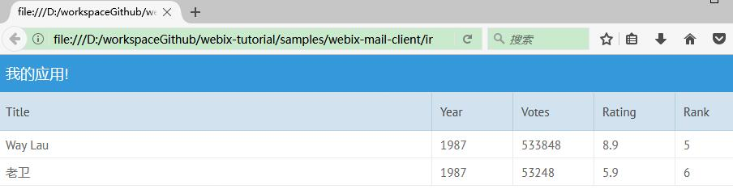
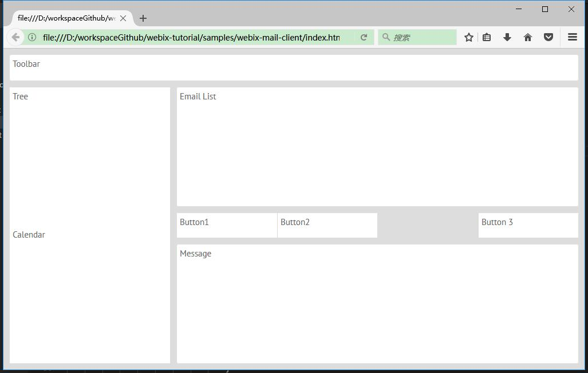
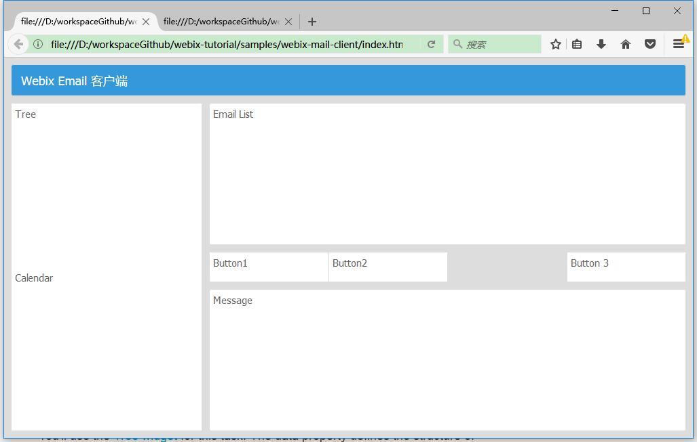
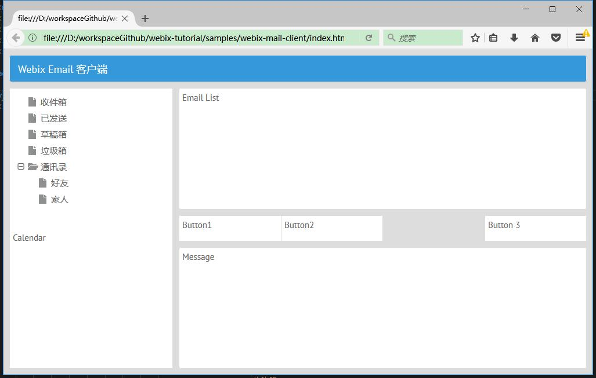
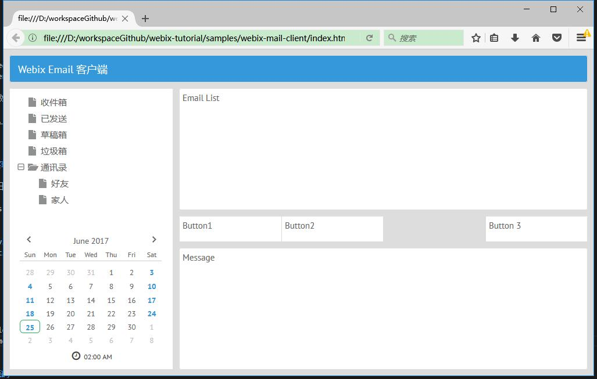
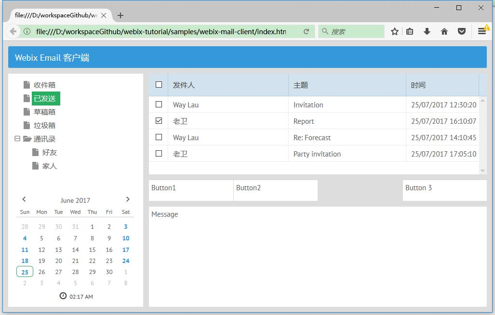
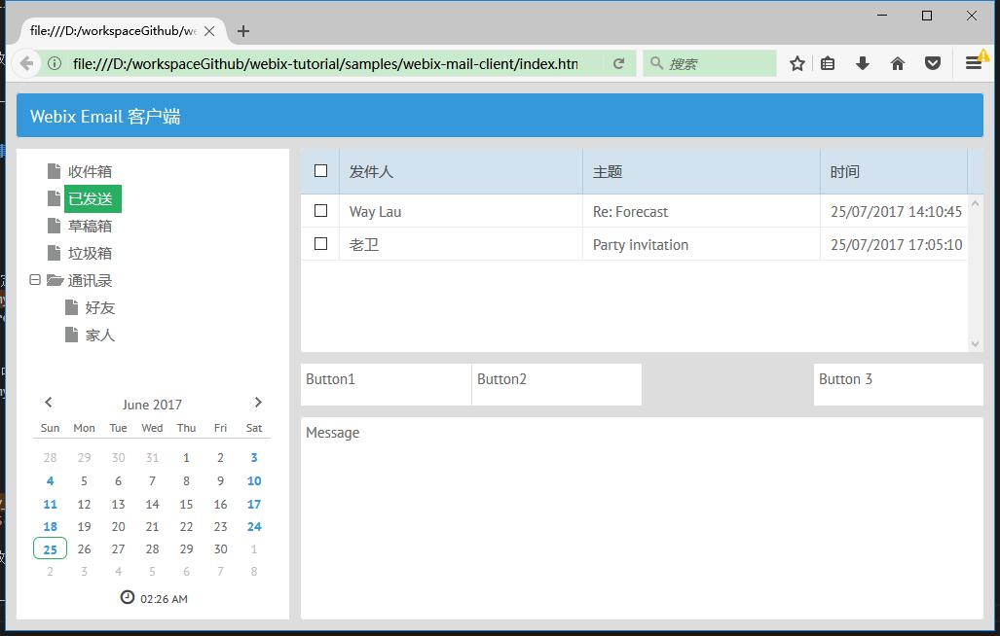
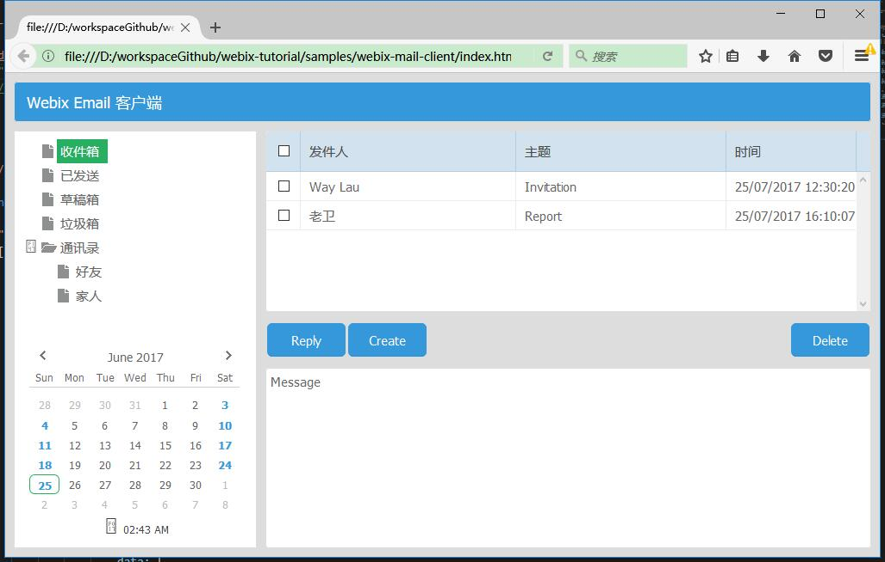
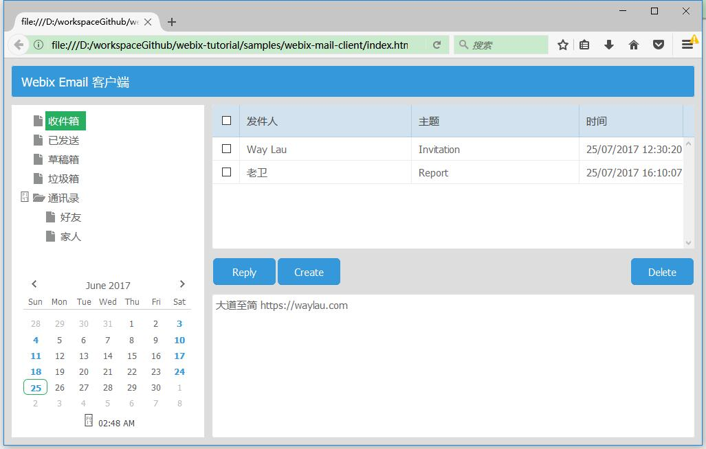
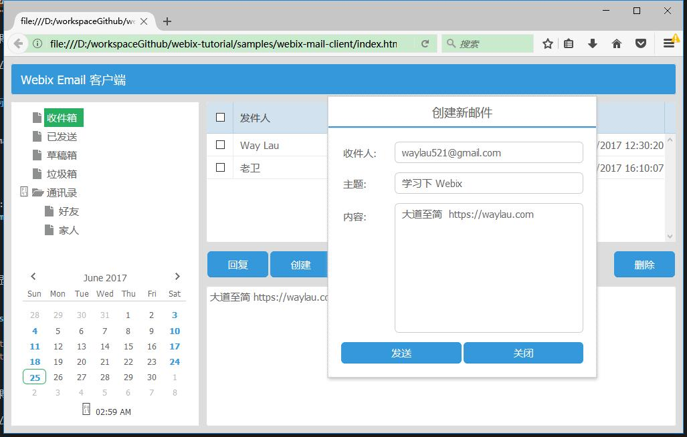

Webix 是一个JavaScript UI 库，提供了多达88个UI小部件和功能丰富的 CSS/HTML5 JavaScript 控件。使用 Webix 可以有效地加快 Web 应用的开发。文本将演示了如何通过 Webix 框架，来创建一个 Email 客户端原型。

<!-- more -->

## 安装 Webix

可以下载 Webix 的 JS、CSS 文件，但最快的方式是使用 Webix 的 CDN， 如下：

```html
<!DOCTYPE HTML>
<html>
    <head>
    <link rel="stylesheet" href="http://cdn.webix.com/edge/webix.css" type="text/css"> 
    <script src="http://cdn.webix.com/edge/webix.js" type="text/javascript"></script>  
    </head>
    ...
</html>
```

## 快速开始

我们为我们的第一个应用创建第一个页面 index.html。在 `<body>` 中定义 js 脚本，来放置 UI 配置：

```html
<!DOCTYPE HTML>
<html>
    <head>
    <link rel="stylesheet" href="http://cdn.webix.com/edge/webix.css" type="text/css"> 
    <script src="http://cdn.webix.com/edge/webix.js" type="text/javascript"></script>  
    </head>
    <body>
        <script type="text/javascript" charset="utf-8">
        /*  UI 配置 */
        </script>
    </body>
</html>
```


接着，我们编写 UI 配置：

```js
webix.ui({
    rows: [
        {
            view: "template",
            type: "header", 
            template: "我的应用!"
        },
        {
            view: "datatable",
            autoConfig: true,
            data: [
                { title: "Way Lau", year: 1987, votes: 533848, rating: 8.9, rank: 5 },
                { title: "老卫", year: 1987, votes: 53248, rating: 5.9, rank: 6 }
            ]
        }
    ]
});
```

为了能更加友好显示中文，我们在`<head>`标签里面加上`<meta charset="UTF-8">`。

这样，我们完整的第一个应用的代码如下：

```html
<!DOCTYPE HTML>
<html>

<head>
    <meta charset="UTF-8">
    <link rel="stylesheet" href="http://cdn.webix.com/edge/webix.css" type="text/css">
    <script src="http://cdn.webix.com/edge/webix.js" type="text/javascript"></script>
</head>

<body>
    <script type="text/javascript" charset="utf-8">
        /*  UI 配置 */
        webix.ui({
            rows: [
                {
                    view: "template",
                    type: "header", 
                    template: "我的应用!"
                },
                {
                    view: "datatable",
                    autoConfig: true,
                    data: [
                        { title: "Way Lau", year: 1987, votes: 533848, rating: 8.9, rank: 5 },
                        { title: "老卫", year: 1987, votes: 53248, rating: 5.9, rank: 6 }
                    ]
                }
            ]
        });
    </script>
</body>

</html>
```


用浏览器直接打开我们的index.html 页面，可以看到如下效果：



## 探索项目


那么，我们来简单介绍下 Webix 的原理。

Webix 的应用程序都是放置在 script  脚本中：


```js
webix.ui({
  // 组件
});
```

需要注意的是，如果想让 Webix 脚本在 HTML 文档加载完了再执行，可以使用 `webix.ready(function(){ ....})` 来包裹我们的 Webix，用法如下：


```js
webix.ready(function(){
  webix.ui({
      ....
  });
});
```

下面代码是用 Webix 中的 `view` 来定义一个视图组件，多个 `view` 可以实现复杂的应用布局结构：

```js

rows: [
    {
        view: "template",
        type: "header", 
        template: "我的应用!"
    },
    {
        view: "datatable",
        autoConfig: true,
        data: [
            { title: "Way Lau", year: 1987, votes: 533848, rating: 8.9, rank: 5 },
            { title: "老卫", year: 1987, votes: 53248, rating: 5.9, rank: 6 }
        ]
    }
]
```

在上述例子中，我们用到了两种类型的 `view`，其中，

* `rows` 代码垂直布局的多个列，这个，我们每个行（row）就是一个`view`；
* [ui.template](https://docs.webix.com/api__refs__ui.template.html) 是一个用于包裹 HTML 内容的容器。这里我们用来类型为`header`的`template`来说明这个是应用头。更多 `template` 的类型，可以自行参阅<https://docs.webix.com/samples/80_docs/template_types.html>；
* [ui.datatable](https://docs.webix.com/api__refs__ui.datatable.html) 是一个功能丰富的数据表格组件；
    * autoConfig 设置为 true，表明表格会根据数据来自适应；
    * data 就是表格中放置的数据

## 进阶

在快速了解 Webix 的相关概念之后，我们就要来创建一个稍微复杂一点的应用，就是本文的主要内容“Email 客户端”。


### 布局

从大布局开始，再逐步求精，是构建前端应用的基本思路。我们创建了如下布局结构：





```js
webix.ui({
    type: "space",
    rows: [
        /* 1st row. Toolbar */
        {
            template: "Toolbar",
            height: 45,
            
        },
        /* 2nd row. The rest of application */
        {
            type: "wide", 
            cols: [
                /* 1st column of the second row.
                /* Folder tree and Calendar */
                {
                    type: "clean",
                    rows: [
                        {
                            template: "Tree",
                            width: 280
                        },
                        {
                            template: "Calendar"
                        }
                    ]
                },
                /* 2nd column of the second row.
                /* Email list, Buttons, and Message reader */
                {
                    type: "wide",                    
                    rows: [
                        { template: "Email List" },
                        {
                            height: 45, cols: [
                                { template: "Button1" },
                                { template: "Button2" },
                                {},
                                { template: "Button 3" }
                            ]
                        },
                        { template: "Message" }
                    ]
                }
            ]
        }
    ]
});
```

其中：

* cols 就是列，每行（row）可能包含了多个列（col）；
* height 和 width 属性来定义视图所需的大小了
* type，它定义了布局边框。如果使用`clean`将获得无边框的单元格，使用`wide`将获得有边框的、有更大空间的单元格。


### 实现 Toolbar

Toolbar（工具栏）可以包含各种元素，如按钮或下拉菜单等。

记住，要使用Webix创建组件，必须使用`view:“component_name”`代码行，元素属性允许选择工具栏的内容。



```js
...
{
    view: "toolbar",
    height: 45,
    elements:[
        {view: "label", label: "Webix Email 客户端"}
    ]
},
...
````


* elements 用来放置子的`view`组件。
* label 就是显示普通的文本标签

这里，我们使用了 [ui.chart](https://docs.webix.com/api__refs__ui.chart.html)，来创建图表。

### 实现 Tree

创建菜单目录树：

```js
...
{
    view:"tree",
    id: "my_tree",
    select: true,
    width:280,
    data:[
        { id:"1", value:"收件箱"},
        { id:"2", value:"已发送"},
        { id:"3", value:"草稿箱"},
        { id:"4", value:"垃圾箱"},
        { id:"5", value:"通讯录", open:true, 
            data:[
                { id:"5-1", value:"好友"},
                { id:"5-2", value:"家人"}
            ]
        }
    ]
},
...
```


其中:

* tree 是一个功能丰富的树形组件；
* open 设置为 true，来让我们的树在初始化时就处于打开状态。

最终效果如下：




### 实现 Calendar

创建日历组件：

```js
...
{
    view:"calendar",
    timepicker:true
},
...
```

其中:

* calendar 是一个功能丰富的日历组件；
* timepicker 设置为 true，在日历上显示时间选择器。

最终效果如下：




### 实现 Email 列表


还记得我们的在“快速开始”部分的那个表格吗？这里同样需要用表格来实现 Email 列表：

创建Email 列表：

```js
...
 {
    id: "my_datatable",
    view: "datatable",
    scrollX: false,
    columns: [
        {
            id: "checked", header: { content: "masterCheckbox" },
            template: "{common.checkbox()}", width: 40
        },
        { id: "name", width: 250, header: "发件人" },
        { id: "subject", header: "主题", fillspace: true },
        { id: "date", header: "时间", width: 150 }
    ],
    data: [
        {
            id: 1, folder: 1, name: "Way Lau",
            email: "waylau521@gmail.com", subject: "Invitation",
            date: "25/07/2017 12:30:20"
        },
        {                                                
            id: 2, folder: 1, name: "老卫",
            email: "waylau521@163.com", subject: "Report",
            date: "25/07/2017 16:10:07"
        },
        {
            id: 11, folder: 2, name: "Way Lau",
            email: "waylau521@gmail.com", subject: "Re: Forecast",
            date: "25/07/2017 14:10:45"
        },

        {
            id: 12, folder: 2, name: "老卫",
            email: "waylau521@163.com", subject: "Party invitation",
            date: "25/07/2017 17:05:10"
        }
    ]
    },
...
```

其中:

* columns 用来定义表头；
* ` header:{ content:"masterCheckbox" }` 定义了可以全选列表的 checkbox；
* `template:"{common.checkbox()}"` 设置每个列表项都会带有一个 checkbox；
* scrollX 设置为 false，意味着禁用了水平的滚动条。
* fillspace 设置为 true，意味可以自动填充宽度。


最终效果如下：




### 事件处理


事件，让组件具备交互功能：

```js
...
// 绑定事件
$$("my_datatable").bind($$("my_tree"),function(obj,filter){
    return obj.folder == filter.id;
});

// 选中第一个节点
$$("my_tree").select(1);
...
```

其中：

* "my_datatable" 为 `datatable` 组件的 id。绑定了"my_tree"的点击事件；
* `$$("my_tree").select(1)` 意味着树节点会选中第一个节点。

最终效果如下：




### 按钮实现

按钮实现如下：

```js
...
{
    height: 45, cols: [
        {
            view:"button",
            label:"回复",
            width: 95
        },
        {
            view:"button",
            label:"创建",
            width: 95
        },
        {},
        {
            view:"button",
            label:"删除",
            width: 95
        }
    ]
},
...
```

其中：

* "my_datatable" 为 `datatable` 组件的 id。绑定了"my_tree"的点击事件；
* `$$("my_tree").select(1)` 意味着树节点会选中第一个节点。

最终效果如下：




### 展示 Email 正文


展示 Email 正文实现如下：

```js
...
{
    id:"details",
    template:"No message selected"
},
...
```

如果想显示文本，可以编写如下脚本：

```js
var message = "大道至简  https://waylau.com";

$$("details").define("template",message);
$$("details").render();
```

最终效果如下：




### 编辑窗口

发送邮件，我们需要有一个编辑窗口：

```js
webix.ui({
    view:"window",
    move: true,
    id:"my_win",
    width:400,
    head:"创建新邮件",
    position: "center",
    body: {
        view:"form",
        borderless:true,
        elements: [
        { view:"text", label:'收件人:', name:"address" },
        { view:"text", label:'主题:', name:"subject" },
        { view:"textarea", height:200, label:"内容:", name:"message"},
        { cols: [
            { view:"button", value: "发送", },
            { view:"button", value: "关闭", click:("$$('my_win').hide();") }
        ]},
        ],
    }
});
```

然后在“创建”的按钮上，添加弹出窗口的事件：

```js
...
{
    view:"button",
    label:"创建",
    width: 95,
    click:function(){
        $$("my_win").getBody().clear();
        $$("my_win").show();
    }
},
...
```

最终效果如下：



## 源码

* <https://github.com/waylau/webix-tutorial>

## 参考文献

* <https://opensource.com/article/17/5/10-step-guide-webix-framework>
* <https://docs.webix.com/tutorials__quick_start.html>


