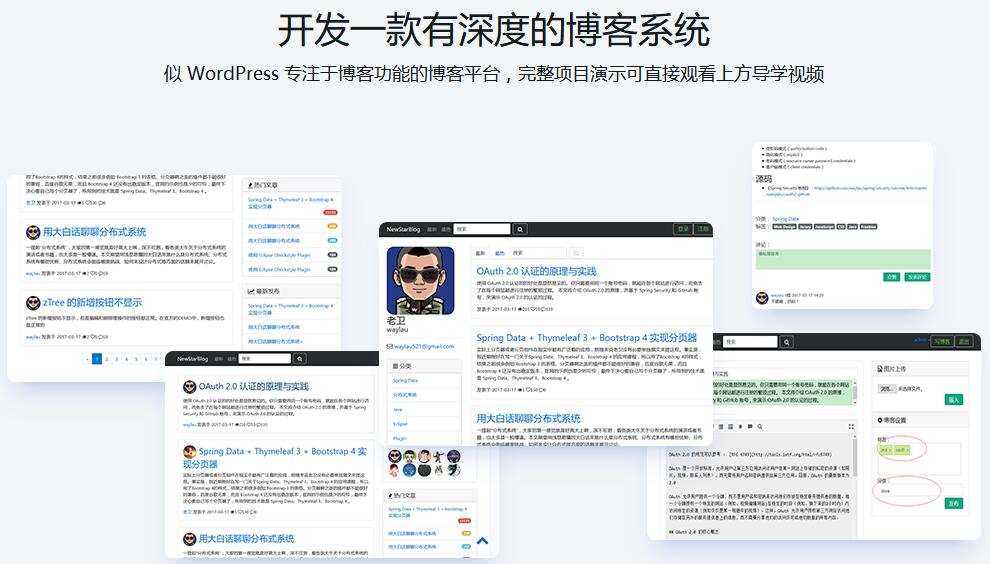

接到慕课网的通知，本人所设计的视频教程《基于Spring Boot 企业级博客系统实战》于 2017年7月31日中午发布了!课程地址：<http://coding.imooc.com/class/125.html>。
课程从策划、编码、录制到后期制作，差不多花费了4-5个月的时间。 课程中的每行代码都是笔者亲自敲的，光写代码都要个把个月时间。编码期间也是遇到了很多技术问题，埋了很多坑，其中心酸只有自知。

<!-- more -->

## 课程简介

通过实战课程的讲解，学员们可以围绕 Spring Boot 技术栈，以整合多个技术点，搭建一个能够用于快速开发的框架，一步一步构建博客系统的各个功能，实现一个完整前后端的企业级Java应用。

Spring Boot技术是当前Java应用框架的热门。市面上对于Spring Boot的需求很旺盛，虽然有很多的技术资料来介绍Spring Boot这门技术，但缺乏实战。特别是在围绕Spring Boot技术栈来构建完整的企业级应用这个课程，讲师给出了自己的见解。本课程围绕整合以Spring Boot为核心的技术栈，来搭建并实现一个完整的企业级博客系统而展开。该博客系统支持市面上博客系统的常见功能。学员们可以通过学习构建这个博客系统的整个过程，来达到设计和实现一个企业级Java应用开发的目的。该博客系统是一个类似于 WordPress 的专注于博客功能的博客平台，支持多用户访问和使用。本博客系统所涉及的相关的技术有 Spring Boot、Spring、Spring MVC、Spring Security 、Spring Data、Hibernate、Gradle、Bootstrap、jQuery、HTML5、JavaScript、CSS、Thymeleaf、MySQL、H2、Elasticsearch、MongoDB 等。通过本课程的学习，不仅可以令学员了解企业级开发的完整流程，而且通过实战结合技术点的精讲和归纳，令读者知其然知其所以然。另外，本课程所涉及的技术，符合当前主流，并富有一定的前瞻性，可以有效提升学员在市场中的核心竞争力。

本课程按照渐进式的讲解方式来授课。课程的前半部分为实战入门及进阶阶段，后半部分为实战高级阶段。

## 本课程针对用户人群

本课程主要面向的是Java开发者，以及对 Spring Boot 及企业级开发感兴趣的读者朋友。由于Spring Boot的核心技术还是Spring，所以学员在参与本课程的时候对于Spring技术有一定的理解。本课程涉及前端和后端以及数据存储、大数据处理等方面的知识，通过本课程的学习，有利于提升学员的知识的广度，并能掌握构建企业级应用的完整流程。

## 课程的亮点与卖点是什么？

虽然本课程所列举的案例是一个博客系统，但课程中所涉及的技术并不仅限于某个领域。可以广泛应用于传统IT行业、互联网行业的企业级应用。通过课程的学习，利于技术的提升。市面上缺乏同类型的课程，如果有，也缺少像本课程那样的注重实战，整合这么多种技术点，实现系统的架构，并应用于真实应用的能力。

## 本课中讲解的技术点有哪些？

本课程所涉及的相关的技术有 Spring Boot、Spring、Spring MVC、Spring Security 、Spring Data、Hibernate、Gradle、Bootstrap、jQuery、HTML5、JavaScript、CSS、Thymeleaf、MySQL、H2、Elasticsearch、MongoDB 等。据个人了解，Spring、Spring MVC、jQuery、HTML5、JavaScript、CSS、MySQL这些技术相对来说历史比较悠久学习介绍这些技术的资料也会较多。本课程的重点除了会侧重讲解市面比较少人介绍过的Spring Boot、Gradle、Bootstrap、Thymeleaf、H2、Elasticsearch、MongoDB等技术外，同时也会讲解如何来将这些所有技术做一个整合，搭建系统的框架，来构建一个完整的企业级应用。这不同于单讲某个技术点时，都是一些“Hello world”级别的小案例。 

本课程中选型的技术，都是市面上流行和热门的，富有前瞻性。

## 课程安排及讲解方式 

重点是如何来围绕Spring Boot技术栈，通过整合这么多的技术，搭建一个能够用于快速开发的框架，最终实现一个完整的企业级应用。难点是技术点多，要完全掌握是有点难度的。所以本课程的安排是，前半部分先对一些市面上比较前瞻（或者说相关课程介绍比较少的）技术，做一个精讲，讲课的过程中辅以实战案例。后半部分，整合了所有的技术，搭建一个能够用于快速开发的框架，并来逐步构建博客系统的各个功能。案例是绝对高大上，功能是很专业的，技术点是很符合企业级开发应用的要求的。

## 课程中的项目开发流程是怎么样的？

* 知识点的技术归纳与实战
* 分析功能需求，定义并API
* 实现后台接口
* 实现前端功能
* 进行完整的测试。

## 课程除了课程内容外，还有哪些增值服务？

除了讲师答疑、代码全部开放外其他的增值福利，还有QQ群提供一对一的辅导。本课程相关的技术点都已经整理成相关的技术书籍，供学员免费参阅（见<https://waylau.com/books/>）。后期会有出版一本与本课程相关的Spring Boot书籍，届时，边看视频边看书，有利于知识点的梳理与巩固。

