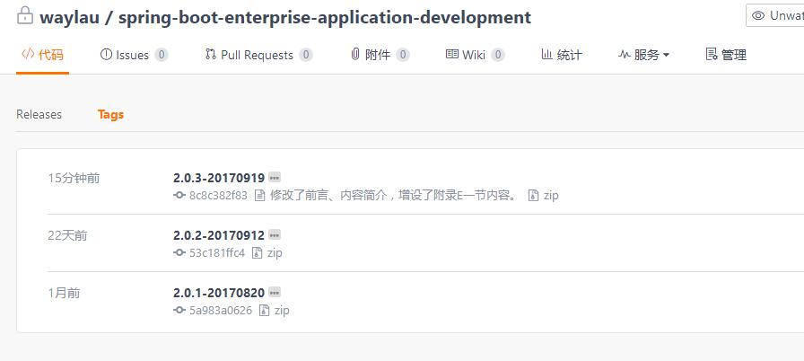

本文演示了如何使用  Git 的 tag 功能来给项目打标签

<!-- more -->

## 为啥要打标签

标签，是某一个时间点的项目的快照。比如，发布某一个特定的版本是，可以打个标签作为标识。利于回溯。

## 使用 Git 的 tag 功能来打标签

列出所有的标签，使用：

```
$ git tag
2.0.1-20170820
2.0.2-20170912
```

新增标签并添加注释，使用：

```
$ git tag -a 2.0.3-20170919 -m 修改了前言、内容简介，增 设了"附录E"一节内容。

$ git tag
2.0.1-20170820
2.0.2-20170912
2.0.3-20170919
```

推送所有的标签到线上库，使用：

```
$ git push origin --tags
Counting objects: 1, done.
Writing objects: 100% (1/1), 230 bytes | 0 bytes/s, done.
Total 1 (delta 0), reused 0 (delta 0)
To https://git.oschina.net/waylau/spring-boot-enterprise-application-development.git
 * [new tag]         2.0.3-20170919 -> 2.0.3-20170919
```

在线上库，我们就能看到推送的标签了。


