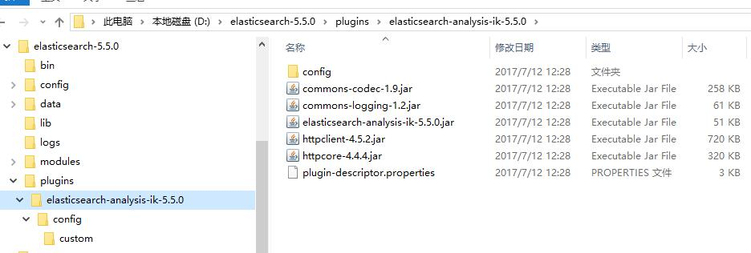

本文演示了如何使用IK Analysis 插件来实现在 Elasticsearch 中的中文分词功能。

<!-- more -->

## 使用中文分词

在“Spring Boot应用企业级博客系统”课程中（<http://coding.imooc.com/class/125.html>），所有的博客功能都已经完成了。读者朋友们开始愉快地使用博客来发表博客了。但如果朋友们足够细心的话，发现在输入中文的标签的时候，存在一定的问题。

比如，当我们想将某个博客标记为“大神”时，博客系统却将这个单词粗暴的分成了如图21-2所示的两个词“大”和“神”。显然，这并不符合用户的使用习惯。


这是 Elasticsearch  语言分析器上的限制，它并不能友好的处理所有语言，特别是中文。这种情况下，我们就需要额外的中文分词器来协助我们了。

本章节，我们将演示使用 IK Analysis 插件来帮助我们实现中文分词。


## IK Analysis 插件
 
IK Analysis 插件（<https://github.com/medcl/elasticsearch-analysis-ik/>）就是一款专门用于 Elasticsearch 的分词器，可以友好的处理中文。


IK Analysis 插件将 Lucene IK 分析仪（<http://code.google.com/p/ik-analyzer/>）集成到了 Elasticsearch 中，从而支持自定义分词。


## 安装 IK Analysis 

安装 IK Analysis 非常简单。主要有两种方式。

### 使用 elasticsearch-plugin 

如果 Elasticsearch 是 5.5.1 以后的版本，可以使用 elasticsearch-plugin 来安装，安装方式如下：

```
./bin/elasticsearch-plugin install https://github.com/medcl/elasticsearch-analysis-ik/releases/download/v5.5.1/elasticsearch-analysis-ik-5.5.1.zip
```


### 下载解压到指定目录

另外一种方式是，下载安装包，解压到 Elasticsearch 安装目录的 `/plugins/`目录下即可。


下图展示了 IK 的安装目录。




需要注意的是，不管是哪种安装方式，相应的插件，要对应相应的 Elasticsearch 版本，否则可能会安装不成功。
下载地址为 <https://github.com/medcl/elasticsearch-analysis-ik/releases>。本章节，我们使用 IK Analysis for Elasticsearch 5.5.0 版本。


## 使用 IK Analysis

要使用  IK Analysis，需要在文档类里面，指定相应的分词器。我们在 EsBlog 的 tags 属性上，添加了`searchAnalyzer = "ik_smart", analyzer = "ik_smart"`的注解内容就可以了。


```java
public class EsBlog implements Serializable {
 
    ...

	@Field(type = FieldType.text,fielddata = true, searchAnalyzer = "ik_smart", analyzer = "ik_smart") 
	private String tags;  // 标签
```


下图展示了使用了IK分词的标签效果


## IK Analysis 类型

ik_smart 是 IK Analysis 其中一种分词形式。IK Analysis主要有两种类型的分词形式，分别是 ik_max_word 和 ik_smart。

* ik_max_word: 会将文本做最细粒度的拆分，比如会将“中华人民共和国国歌”拆分为“中华人民共和国”、“中华人民”、“中华”、“华人”、“人民共和国”、“人民”、“人”、“民”,、“共和国”、“共和”、“和”、“国歌”等，会穷尽各种可能的组合；
* ik_smart: 会做最粗粒度的拆分，比如会将“中华人民共和国国歌”拆分为“中华人民共和国”、“国歌”。


## 参考

* https://waylau.com/spring-boot-blog-video-release/
* http://coding.imooc.com/class/125.html