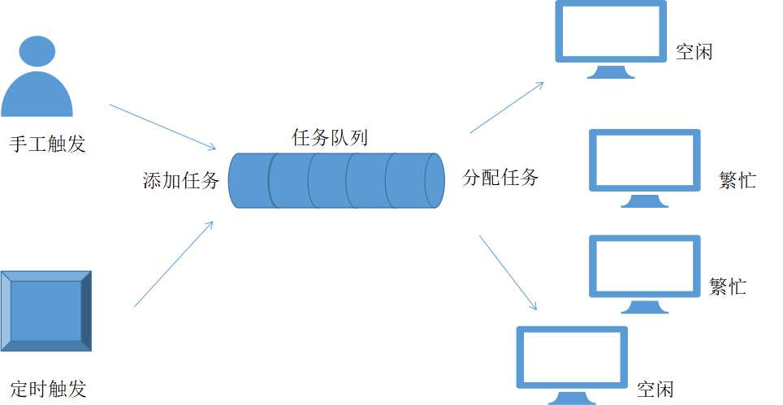

最新在公司承担一个供需匹配模拟引擎的项目。该项目在最近上线的版本中，由于数据量和计算量暴增，原本在测试环境中没有发现的问题，在生产环境中暴露了出来。基于消息队列的分布式任务分配系统可以有效解决该问题。

<!-- more -->

## 什么是供需匹配模拟引擎

供需匹配模拟引擎是为了计算不同的订单，在现有的供应能力的情况下，给出一个具体的供应时间和供应的数量。这个过程称为“供需匹配”，简言之，我有一堆需求，你什么时候、以什么形式满足我，每种形式的能满足的数量是多少。

以购物网站为例，你购买了商品，网站会给出提示，“预计XX天送达”。供需匹配模拟引擎类似也是要给用户一个预期。

模拟任务是一个定时任务，每隔一定时间会执行一次。同时，不同的模拟任务类型，时间间隔、参数都是不同的。

## 数据开始混起来了

原本在测试中，没有发现问题。虽然，在项目中应用了多线程，但每个模拟任务，相当于是单线的，所以不存在任务交叉的情况。但最近，业务上量了，要求同一时间，要启用多个模拟任务。
这样，如果同一台主机上启动了多个模拟任务，数据就开始混起来了。

虽然，在生产环境，我们部署了4台主机，但并不能保障，负载均衡器能很好的将每个模拟任务都分摊到不同的主机上去执行，也就没有办法保证模拟任务之间的隔离。

## 解决思路

很明显，目前，存在的最大问题是数据的隔离问题。我们期望每个模拟任务最好不要在一台主机上运行。所以，需求总结如下：

1. 不要在同一台主机上运行多个模拟任务
2. 新的模拟任务能够分配到闲置的主机上去
3. 模拟任务不能及时得到执行的，可以先等待

## 基于消息队列的分布式任务分配系统

基于上述需求，消息队列是非常符合上述的应用场景。

1. 用户可以放消息队列里面放置模拟任务
2. 模拟任务不能及时得到执行的，可以先在消息队列中等待
3. 每台主机都是一个消费者，可以从消息队列中获取模拟任务
4. 如果主机处于繁忙状态，就不从消息队列中获取模拟任务
5. 如果主机处于闲置状态，就从消息队列中获取模拟任务
6. 实现了水平扩展，需要执行多少个模拟任务，就部署多少个服务实例

以上就能实现一个基于消息队列的分布式任务分配系统，可以很好的解决目前所面临的数据混杂以及任务负载均衡的问题。

整体架构图如下：

