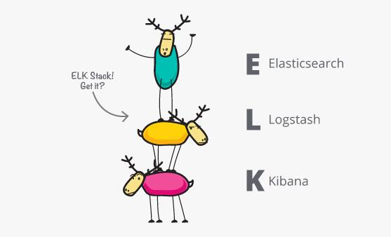

在很多场合，都可以看到 ELK Stack 或者是 Elastic Stack 的介绍，大多数人都会产生疑问，这两者到底有什么区别？本文将介绍 ELK Stack 与 Elastic Stack 的异同点。

<!-- more -->

## 什么是 ELK Stack

那么，什么是 ELK ？ “ELK”是三个开源项目的首字母缩写：Elasticsearch、Logstash 和 Kibana。 

* Elasticsearch 是一个搜索和分析引擎。 
* Logstash 是一个服务器端的数据处理管道，可以同时从多个源获取数据，将其转换为Elasticsearch之类的“stash”。
* Kibana 允许用户在 Elasticsearch 中使用图表和图表可视化数据。

业界，经常会组合使用 Elasticsearch、Logstash 和 Kibana 这三种技术，来实现分布式系统的日志管理及可视化，所以，这三种技术的组合就被称为“ELK Stack”。

那么，Elastic Stack 又是什么？

## 什么是 Elastic Stack

随着 ELK 社区越来越大，对于 ELK 的个性化用例需求也越来越多，催生出了很多其他的产品，比如 Beats，是一系列轻量级、单一用途的数据托运工具。

那么，显然 ELK 已经不能够代表后续新添加的各类工具小兄弟了。于是，更名为了 Elastic Stack，用以统称以 ELK 为核心的技术栈。

Elastic Stack 也是 ELK Stack ，具有更大的灵活性。可以理解为，Elastic Stack 是 ELK 的下一个发展版本。

## 参考引用

* https://www.elastic.co/elk-stack
