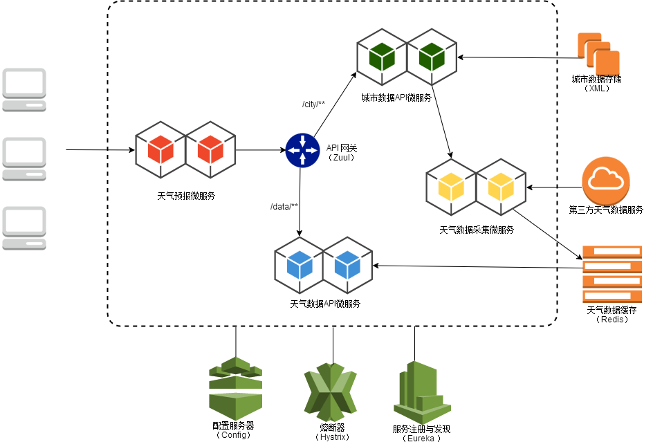
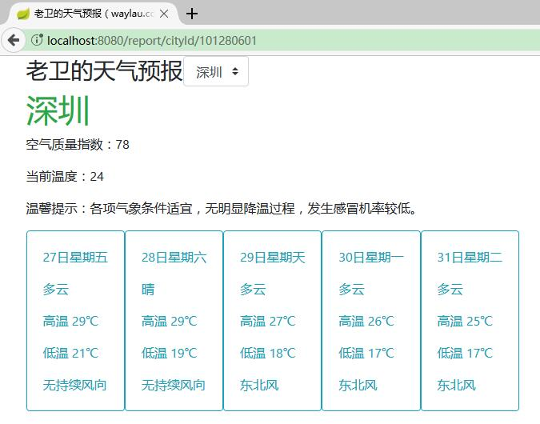

接到慕课网的通知，本人所设计的视频教程《基于Spring Cloud的微服务实战》于 2018年1月22日下午发布了!课程地址：<https://coding.imooc.com/class/177.html>。
课程从策划、编码、录制到后期制作，差不多花费了4-5个月的时间。课程中的每行代码都是笔者亲自敲的，光写代码都也要好几个月时间。编码期间也是遇到了很多技术问题，埋了很多坑，其中心酸只有自知。

那么，这门课程到底是怎么样的?

<!-- more -->

## 课程简介

本课程基于Spring Boot + Spring Cloud 技术栈来实现一个完整的天气预报系统。在课程中，先从 Spring Boot 入手，从0到1 快速搭建了具备高并发能力、界面友好的天气预报系统。而后剖析单块架构的利弊，从而引入微服务架构的概念，并实从1到0实现微服务的拆分。最后引入Spring Cloud 技术来实现对这些微服务的治理，重点讲解了服务注册与发现、服务交互、服务消费、负载均衡、API网关、配置中心、服务熔断、自动扩展等方面的话题。

学员不但可以学会 Spring Boot 及 Spring Cloud 最新的周边技术栈（本课程基于最新的 Spring Boot 2.0.0.M4 以及 Spring Cloud Finchley.M2），掌握如何运用上述技术进行整合，搭建框架的能力，熟悉单体架构及微服务架构的特点，并最终实现掌握构建微服务架构的实战能力。

## 本课程针对用户人群

本课程主要面向的是 Java 开发者，以及对 Spring Boot、Spring Cloud 感兴趣的朋友。由于Spring Cloud 的核心技术还是 Spring Boot，所以学员在参与本课程的时候对于 Spring Boot 技术有一定的理解。本课程涉及前端和后端以及微服务治理等方面的知识，通过本课程的学习，有利于提升学员的知识的广度，并能掌握构建微服务架构的完整流程。

如果您对 Spring Boot 还不熟悉，可以选择学习笔者的另外一门课程，《基于Spring Boot 企业级博客系统实战》课程（<https://waylau.com/spring-boot-blog-video-release/>）。

## 课程的亮点与卖点是什么？

本课程所列举的案例是一个天气预报系统。天气预报系统人人都在用，所以在业务上比较好理解。这样就能让学员的注意力，集中在技术上而非业务上。

案例是麻雀虽小五脏俱全。用于完整展现微服务架构的实现过程，足矣。

## 本课中讲解的技术点有哪些？

本课程所涉及的相关的技术有 ：

* XML解析：JABX
* JSON序列化:Jackson
* 缓存：Redis
* 定时器：Quartz Scheduler 
* Java模版技术Thymeleaf 
* 前端样式：Bootstrap
* API网关：Zuul
* 服务注册与发现：Eureka Server、Eureka Client
* 服务交互：RestTemplate、Apache HttpClient
* 服务消费：Ribbon、OpenFeign
* 负载均衡：Ribbon
* 配置中心：Config Server、Config Client
* 服务熔断：Hystrix
* 项目构建：Gradle

本课程中选型的技术，都是市面上流行和热门的，富有前瞻性。

本课程所采用的技术及相关版本较新，请读者将相关开发环境设置成跟本书所采用的一致，或者不低于本书的配置。

* JDK 8
* Gradle 4.0
* Spring Boot 2.0.0.M4
* Spring Boot Web Starter 2.0.0.M4
* Apache HttpClient 4.5.3
* Spring Boot Data Redis Starter 2.0.0.M4
* Redis 3.2.100
* Spring Boot Quartz Starter 2.0.0.M4
* Quartz Scheduler 2.3.0
* Spring Boot Thymeleaf Starter 2.0.0.M4
* Thymeleaf 3.0.7.RELEASE
* Bootstrap 4.0.0-beta.2
* Spring Boot 2.0.0.M3
* Spring Cloud Starter Netflix Eureka Server Finchley.M2
* Spring Cloud Starter Netflix Eureka Client Finchley.M2
* Spring Cloud Starter Netflix Ribbon Finchley.M2
* Spring Cloud Starter OpenFeign Finchley.M2
* Spring Cloud Starter Netflix Zuul Finchley.M2
* Spring Cloud Config Server Finchley.M2
* Spring Cloud Config Client Finchley.M2
* Spring Cloud Starter Netflix Hystrix Finchley.M2

另外，本课程采用示例采用 Eclipse Oxygen.1a Release (4.7.1a) 来编写，但示例源码与具体的 IDE 无关，学员朋友可以自行选择适合自己的 IDE，比如 IntelliJ IDEA、NetBeans 等。

## 课程安排及讲解方式 

课程安排如下：

1. 从0到1 基于Spring Boot 构建完整的天气预报系统（第1-2章）
2. 从1到0 实现从单体架构向微服务架构的拆分演进（第3-4章）
3. 基于Spring Cloud实现微服务的治理（第5-11章）

其中微服务的拆分和治理是本课程的重点。在课程中，介绍了很多微服务的设计原则，帮助学员建立思想高度。同时，辅以技术实战，双管齐下，利于学员掌握。

## 课程除了课程内容外，还有哪些增值服务？

除了讲师集中答疑外，课程全套代码全部开放。本课程相关的技术点都已经整理成相关的技术书籍，供学员免费参阅（见<https://waylau.com/books/>）。后期会有出版一本与本课程相关的 Spring Cloud 书籍，届时，边看视频边看书，有利于知识点的梳理与巩固。

