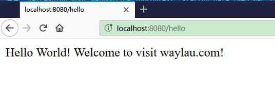
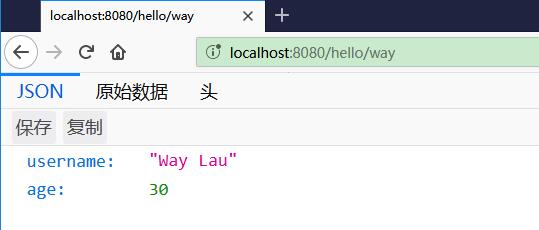

Jetty 是高性能的 Servlet 容器，经常会在开发环境中作为服务器来使用。在本文中，我们将使用 Spring Web MVC 技术来实现 REST 接口，并使用 Jetty 作为内嵌服务器，方便测试。


<!-- more -->

## 接口设计

我们将会在系统中实现两个接口：

* GET http://localhost:8080/hello
* GET http://localhost:8080/hello/way

其中，第一个接口“/hello”将会返回“Hello World!” 的字符串；而第二个接口“/hello/way”则会返回一个包含用户信息的JSON字符串。

## 系统配置

 我们需要在应用中添加如下依赖：


```xml
<properties>
    <spring.version>5.0.4.RELEASE</spring.version>
    <jetty.version>9.4.9.v20180320</jetty.version>
    <jackson.version>2.9.4</jackson.version>
</properties>
<dependencies>
    <dependency>
        <groupId>org.springframework</groupId>
        <artifactId>spring-webmvc</artifactId>
        <version>${spring.version}</version>
    </dependency>
    <dependency>
        <groupId>org.eclipse.jetty</groupId>
        <artifactId>jetty-servlet</artifactId>
        <version>${jetty.version}</version>
        <scope>provided</scope>
    </dependency>
    <dependency>
        <groupId>com.fasterxml.jackson.core</groupId>
        <artifactId>jackson-core</artifactId>
        <version>${jackson.version}</version>
    </dependency>
    <dependency>
        <groupId>com.fasterxml.jackson.core</groupId>
        <artifactId>jackson-databind</artifactId>
        <version>${jackson.version}</version>
    </dependency>
</dependencies>
```


其中，

* `spring-webmvc` 是为了使用 Spring MVC 的功能。
* `jetty-servlet`是为了提供内嵌的 Servlet 容器，这样我们就无需依赖外部的容器，可以直接运行我们的应用。
* `jackson-core` 和 `jackson-databind` 为我们的应用提供 JSON 序列化的功能。


## 后台编码实现


### 领域模型


创建一个 User 类，代表用户信息。

```java
public class User {
	private String username;
	private Integer age;

	public User(String username, Integer age) {
		this.username = username;
		this.age = age;
	}

	public String getUsername() {
		return username;
	}

	public void setUsername(String username) {
		this.username = username;
	}

	public Integer getAge() {
		return age;
	}

	public void setAge(Integer age) {
		this.age = age;
	}

}
```

### 控制器

创建 HelloController 用于处理用户的请求。

```java
@RestController
public class HelloController {

	@RequestMapping("/hello")
	public String hello() {
	    return "Hello World! Welcome to visit waylau.com!";
	}
	
	@RequestMapping("/hello/way")
	public User helloWay() {
	    return new User("Way Lau", 30);
	}
}
```


其中，映射到“/hello”的方法将会返回“Hello World!” 的字符串；而映射到“/hello/way”则会返回一个包含用户信息的JSON字符串。


## 应用配置

在本应用中，我们采用基于 Java  注解的配置。

AppConfiguration 是我们的主应用配置：


```java
import org.springframework.context.annotation.ComponentScan;
import org.springframework.context.annotation.Configuration;
import org.springframework.context.annotation.Import;

@Configuration
@ComponentScan(basePackages = { "com.waylau.spring" })  
@Import({ MvcConfiguration.class })
public class AppConfiguration {

}
```

AppConfiguration 会扫描“com.waylau.spring”包下的文件，并自动将相关的 bean 进行注册。

AppConfiguration 同时又引入了 MVC 的配置类 MvcConfiguration：


```java
@EnableWebMvc
@Configuration
public class MvcConfiguration implements WebMvcConfigurer {

	public void extendMessageConverters(List<HttpMessageConverter<?>> converters) {
		converters.add(new MappingJackson2HttpMessageConverter());
	}
}
```

MvcConfiguration 配置类一方面启用了 MVC 的功能，另一方面添加了 Jackson JSON 的转换器。


最后，我们需要引入 Jetty 服务器 JettyServer：

```java
import org.eclipse.jetty.server.Server;
import org.eclipse.jetty.servlet.ServletContextHandler;
import org.eclipse.jetty.servlet.ServletHolder;
import org.springframework.web.context.ContextLoaderListener;
import org.springframework.web.context.WebApplicationContext;
import org.springframework.web.context.support.AnnotationConfigWebApplicationContext;
import org.springframework.web.servlet.DispatcherServlet;
import com.waylau.spring.mvc.configuration.AppConfiguration;

public class JettyServer {
    private static final int DEFAULT_PORT = 8080;
    private static final String CONTEXT_PATH = "/";
    private static final String MAPPING_URL = "/*";

    public void run() throws Exception {
        Server server = new Server(DEFAULT_PORT);
        server.setHandler(servletContextHandler(webApplicationContext()));
        server.start();
        server.join();
    }

    private ServletContextHandler servletContextHandler(WebApplicationContext context) {
        ServletContextHandler handler = new ServletContextHandler();
        handler.setContextPath(CONTEXT_PATH);
        handler.addServlet(new ServletHolder(new DispatcherServlet(context)), MAPPING_URL);
        handler.addEventListener(new ContextLoaderListener(context));
        return handler;
    }

    private WebApplicationContext webApplicationContext() {
        AnnotationConfigWebApplicationContext context = new AnnotationConfigWebApplicationContext();
        context.register(AppConfiguration.class);
        return context;
    }
}
```

JettyServer 将会在 Application 类中进行启动：

```java
public class Application {

	public static void main(String[] args) throws Exception {
		new JettyServer().run();;
	}

}
```


## 11.13.6 运行

在编辑器中，直接运行 Application 类即可。启动之后，应能看到如下控制台信息：

```
2018-03-21 23:14:52.665:INFO::main: Logging initialized @203ms to org.eclipse.jetty.util.log.StdErrLog
2018-03-21 23:14:52.868:INFO:oejs.Server:main: jetty-9.4.9.v20180320; built: 2018-03-20T20:21:10+08:00; git: 1f8159b1e4a42d3f79997021ea1609f2fbac6de5; jvm 1.8.0_112-b15
2018-03-21 23:14:52.902:INFO:oejshC.ROOT:main: Initializing Spring root WebApplicationContext
三月 21, 2018 11:14:52 下午 org.springframework.web.context.ContextLoader initWebApplicationContext
信息: Root WebApplicationContext: initialization started
三月 21, 2018 11:14:52 下午 org.springframework.context.support.AbstractApplicationContext prepareRefresh
信息: Refreshing Root WebApplicationContext: startup date [Wed Mar 21 23:14:52 CST 2018]; root of context hierarchy
三月 21, 2018 11:14:52 下午 org.springframework.web.context.support.AnnotationConfigWebApplicationContext loadBeanDefinitions
信息: Registering annotated classes: [class com.waylau.spring.mvc.configuration.AppConfiguration]
三月 21, 2018 11:14:53 下午 org.springframework.web.servlet.handler.AbstractHandlerMethodMapping$MappingRegistry register
信息: Mapped "{[/hello]}" onto public java.lang.String com.waylau.spring.mvc.controller.HelloController.hello()
三月 21, 2018 11:14:53 下午 org.springframework.web.servlet.handler.AbstractHandlerMethodMapping$MappingRegistry register
信息: Mapped "{[/hello/way]}" onto public com.waylau.spring.mvc.vo.User com.waylau.spring.mvc.controller.HelloController.helloWay()
三月 21, 2018 11:14:53 下午 org.springframework.web.servlet.mvc.method.annotation.RequestMappingHandlerAdapter initControllerAdviceCache
信息: Looking for @ControllerAdvice: Root WebApplicationContext: startup date [Wed Mar 21 23:14:52 CST 2018]; root of context hierarchy
三月 21, 2018 11:14:53 下午 org.springframework.web.context.ContextLoader initWebApplicationContext
信息: Root WebApplicationContext: initialization completed in 983 ms
2018-03-21 23:14:53.893:INFO:oejshC.ROOT:main: Initializing Spring FrameworkServlet 'org.springframework.web.servlet.DispatcherServlet-6aaa5eb0'
三月 21, 2018 11:14:53 下午 org.springframework.web.servlet.FrameworkServlet initServletBean
信息: FrameworkServlet 'org.springframework.web.servlet.DispatcherServlet-6aaa5eb0': initialization started
三月 21, 2018 11:14:53 下午 org.springframework.web.servlet.FrameworkServlet initServletBean
信息: FrameworkServlet 'org.springframework.web.servlet.DispatcherServlet-6aaa5eb0': initialization completed in 15 ms
2018-03-21 23:14:53.910:INFO:oejsh.ContextHandler:main: Started o.e.j.s.ServletContextHandler@2796aeae{/,null,AVAILABLE}
2018-03-21 23:14:54.037:INFO:oejs.AbstractConnector:main: Started ServerConnector@42054532{HTTP/1.1,[http/1.1]}{0.0.0.0:8080}
2018-03-21 23:14:54.038:INFO:oejs.Server:main: Started @1578ms
```

分别在浏览器中访问 “http://localhost:8080/hello” 和 “http://localhost:8080/hello/way” 地址进行测试，能看到图11-2和图11-3的响应效果。




图11-2 “/hello”接口的返回内容




图11-3 “/hello/way”接口的返回内容


## 参考应用

* 源码:见《Spring 5 案例大全》（<https://github.com/waylau/spring-5-book>）的 “s5-ch11-mvc-rest”应用。
* 原文同步至：<https://waylau.com/spring-mvc-use-jetty/>