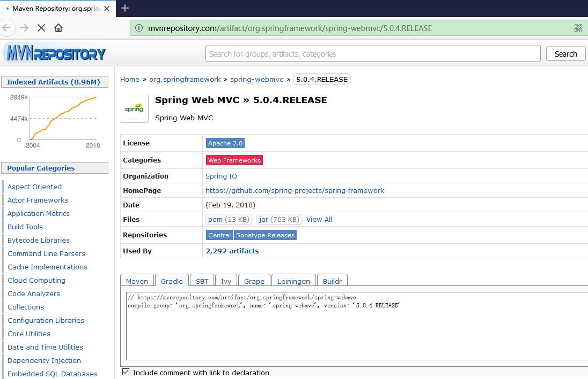

“Stop Trying to Reinvent the Wheel（不要重复造轮子 ）”， 可能是每个程序员入行被告知的第一条准则。在公司里面，我也会对团队里面每个新进的成员反复灌输这个理念。但要真正做到这一点也非易事。

<!-- more -->

## 寻找轮子

所谓“轮子”可以理解为行业里面的技术解决方案。特别是当今开源社区的盛行，开源软件以及开源技术方案层出不穷，这为寻找轮子提供了丰富的途径。

## 避免重复造轮子

一个轮子能够个被复用，体现了软件的复用性。

使用轮子，本身就是“站在巨人的肩膀上”，最大化享受当今技术所带来的便利，避免了从零开始开发的繁琐以及复杂，有效降低成本。

以ORM框架为例，在Java邻域，真正做到强大的唯有Hibernate几家，一方面，开发如何自己来实现ORM在技术有一定的难度，另一方面，开发自己的ORM需要很多的人力以及技术投入，一般的小公司根本没有能力来做这方面的研发。

以 GNU/Linux 操作系统为例，如果不是 Linux 作为操作系统内核，提供给了 GNU 计划，那么 GNU 也许不知道要延迟多少年才能推出自己的操作系统；另一方面，GNU 计划，提供了很多 GNU/Linux 操作系统的生态软件，让 GNU/Linux 操作系统更为普通用户所接受。

## 轮子难找

因为选择很多，所以很难选。目前，软件行业空前发展，以分布式消息服务框架，光开源的产品就有很多，包括Apache ActiveMQ、RabbitMQ、Apache Kafka、Apache RocketMQ等。这就对个人的信息检索能力有非常高的要求。同时，也正因为有很多选择性，这也对用户各种技术要有一定的了解，各种技术的优缺点要了如指掌，才能做出合理的选择。这对于用户的技术要有很高的要求。老卫的《分布式系统常用技术及案例分析》一书，为开发者提供了非常好的选择依据。

其次，这个轮子好不好用，需要时间来论证。不能一眼就判断出一个项目的质量以及易用性，这其实需要大量项目经验的积累。即便做出了选择，也需要一定的时间来验证合理性。毕竟项目很多问题，只能在运行中才能体现出来。

最后一点是，好轮子需要打磨。要想将一个开源项目成功整合到自己的项目中，需要对这个项目有比较深入的了解。大部分的开源项目的文档质量参差不齐，当使用轮子时，只看文档往往是不够的，还需要阅读源代码甚至深度修改定制。即便集成到了自己的项目中，也可能需要不断的进行修正调优以符合自己项目的实际。

## 掌握IT技能的“复制-粘贴-改”

合理复用现有的好轮子，以最大化降低开发项目的成本。如果说，轮子代表了框架级别的可复用的项目，那么“复制-粘贴-改”则是更加精细颗粒度的代码层次的复用。

很多开发者都很鄙视“复制-粘贴-改”，认为所有的代码必须要从0开始敲出来才能真正牛人。这其实有失偏驳。比如，开发人员C君在A项目里面写了一段方法，经历住了上线的压力，目前也在线上能够稳定运行。那么如果项目B也需要同样功能的方法，C君有必要再从头去敲一遍代码呢？为什么不直接“复制-粘贴”，除非有特殊的需求或者有对该方法的更好的改进，那么大胆的“复制-粘贴-改”即可。或者将该方法重构出来，放到项目A和B共享的公用项目里面不是很好？从头敲一遍已有的代码，除了增加自己的敲错的机率意外，实在不知道还有什么好处。当然，可能锻炼了打字速度。

也掌握“复制-粘贴-改”的技能，最难是要做到“改”这一点，因为这一点做不好就是抄袭了。以前，老是说腾讯的软件大多数模仿云云，但恰恰是人家“改”的功能出神入化，时间证明了，那些曾经被腾讯模拟的公司、项目，要不死了要不半死不活，而腾讯却稳坐大佬的位置，可见“改”功的重要性。

很多配置文件，其实能少打就不打。比如 Maven 的 pom 文件坐标，你想要什么类库直接上中央仓库去查找并“复制-粘贴-改”下即可，实现是没有必要手打，打错了XML也不会给你提示哦。

以下是 MvnRepository 提供的Maven坐标。

## 真实案例

理解了复用了轮子的理论重要性，我们来看下真实的案例。

据统计，Google 有软件工程师平均一天写 100 ~ 150 行代码，而且已经算是业界高效的了。这从侧面反馈了，写代码并不是一天中工作的重心，高效的工程师更加注重于花时间在代码的思考上面。

笔者的视频课程《基于Spring Boot的博客系统实战》（<http://coding.imooc.com/class/125.html>），遵循了业界软件开发的真实开发方式，采用敏捷的渐进式开发的，后续章节会基于前一个章节的内容来延生。这个不是重复，而是最大化重用现有的代码。递进的每个章节的内容都是前后关联的，让前几章的代码内容，为后续章节所用，即为“学以致用”。

当然，这种开发方式也不是见得为所有的开发者所接受。正如开篇所讲的，热衷于重复造论的人还是不少。

## 参考引用：

* 《分布式系统常用技术及案例分析》：<https://github.com/waylau/distributed-systems-technologies-and-cases-analysis>
* 《基于Spring Boot的博客系统实战》：<http://coding.imooc.com/class/125.html>
* 原文同步至<https://waylau.com/stop-trying-to-reinvent-the-wheel/>