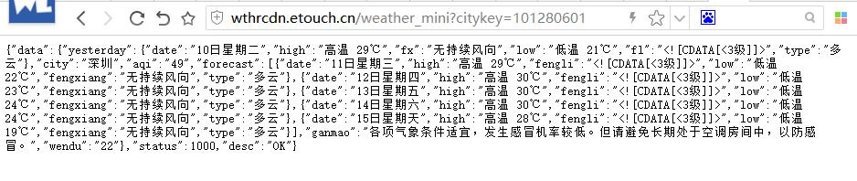
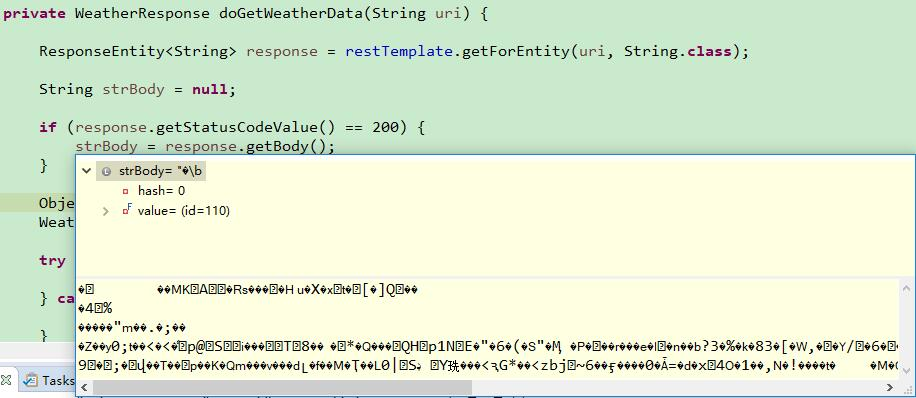
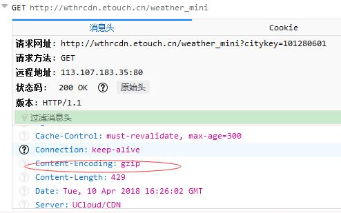
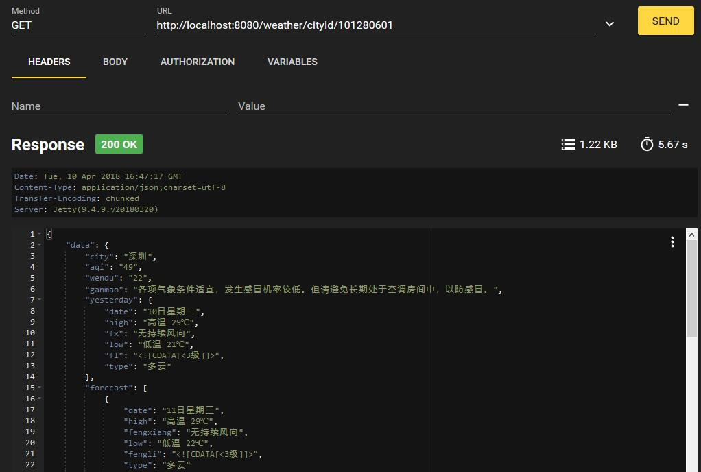

Spring RestTemplate 调用天气预报接口可能遇到中文乱码的问题，解决思路如下。

<!-- more -->

## 问题出现

我们在网上找了一个免费的天气预报接口 <http://wthrcdn.etouch.cn/weather_mini?citykey=101280601>。我们希望调用该接口，并将返回的数据解析为 JSON 格式。


核心业务逻辑如下：

```java
private WeatherResponse doGetWeatherData(String uri) {

    ResponseEntity<String> response = restTemplate.getForEntity(uri, String.class);
    
    String strBody = null;

    if (response.getStatusCodeValue() == 200) {
        strBody = response.getBody();
    }

    ObjectMapper mapper = new ObjectMapper();
    WeatherResponse weather = null;

    try {
        weather = mapper.readValue(strBody, WeatherResponse.class);
    } catch (IOException e) {
        e.printStackTrace();
    }

    return weather;
}
```

在浏览器里面访问该接口都挺正常。如下图所示：




但在纯 Spring 应用里面，尝试使用 RestTemplate 来调用，结果解析数据为 JSON 失败，因为数据有乱码。如下图所示：




## 尝试进行编码转换

一开始，我们认为这可能是对方转过来的数据不是 UTF-8 导致的，所以，尝试加入了消息转换器。


```java
@Configuration
public class RestConfiguration {

    @Bean  
    public RestTemplate restTemplate() { 
    	RestTemplate restTemplate = new RestTemplate(); 
    	restTemplate.getMessageConverters().set(1, 
    			new StringHttpMessageConverter(StandardCharsets.UTF_8)); // 支持中文编码
        return restTemplate;
    }

}
```

StringHttpMessageConverter 默认是 ISO_8859_1，所以我们设置为了 UTF_8。

再次执行，发现仍然是乱码。

## 找到问题的根源


这一次我没有再瞎猜了，而是仔细观察了 HTTP 的请求协议。发现消息头里面的蛛丝马迹：





原来，数据是经过 GZIP 压缩过的。默认情况下， RestTemplate 使用的是 JDK 的 HTTP 调用器，并不支持 GZIP 解压，难怪解析不了。

## 解决方案

既然找到了问题所在，解决起来就简单了。主要考虑了以下几种方案。

### 1. 编写 GIZP 工具类


处理 Gizp 压缩的数据的工具类如下：


```java
/**
 * Welcome to https://waylau.com
 */
package com.waylau.spring.mvc.util;

import java.io.ByteArrayInputStream;
import java.io.ByteArrayOutputStream;
import java.io.IOException;
import java.util.zip.GZIPInputStream;

/**
 * String Util.
 * 
 * @since 1.0.0 2018年3月27日
 * @author <a href="https://waylau.com">Way Lau</a>
 */
public class StringUtil {

	/**
	 * 处理 Gizp 压缩的数据.
	 * 
	 * @param str
	 * @return
	 * @throws IOException
	 */
	public static String conventFromGzip(String str) throws IOException {
		ByteArrayOutputStream out = new ByteArrayOutputStream();
		ByteArrayInputStream in;
		GZIPInputStream gunzip = null;

		in = new ByteArrayInputStream(str.getBytes("ISO-8859-1"));
		gunzip = new GZIPInputStream(in);
		byte[] buffer = new byte[256];
		int n;
		while ((n = gunzip.read(buffer)) >= 0) {
			out.write(buffer, 0, n);
		}

		return out.toString();
	}
}
```

核心业务逻辑如下：

```java
private WeatherResponse doGetWeatherData(String uri) {

    ResponseEntity<String> response = restTemplate.getForEntity(uri, String.class);
    String strBody = null;

    if (response.getStatusCodeValue() == 200) {
        try {
            strBody = StringUtil.conventFromGzip(response.getBody());
        } catch (IOException e) {
            e.printStackTrace();
        }
    }

    ObjectMapper mapper = new ObjectMapper();
    WeatherResponse weather = null;

    try {
        weather = mapper.readValue(strBody, WeatherResponse.class);
    } catch (IOException e) {
        e.printStackTrace();
    }

    return weather;
}
```

### 2. 使用 Apache HttpClient

使用 Apache HttpClient 作为 REST 客户端。Apache HttpClient 内置了对于 GZIP 的支持

```java
@Configuration
public class RestConfiguration {

    @Bean  
    public RestTemplate restTemplate() { 
    	RestTemplate restTemplate = new RestTemplate(
    			new HttpComponentsClientHttpRequestFactory()); // 使用HttpClient，支持GZIP
    	restTemplate.getMessageConverters().set(1, 
    			new StringHttpMessageConverter(StandardCharsets.UTF_8)); // 支持中文编码
        return restTemplate;
    }

}
```

核心业务逻辑如下：

```java
private WeatherResponse doGetWeatherData(String uri) {

    ResponseEntity<String> response = restTemplate.getForEntity(uri, String.class);
    
    String strBody = null;

    if (response.getStatusCodeValue() == 200) {
        strBody = response.getBody();
    }

    ObjectMapper mapper = new ObjectMapper();
    WeatherResponse weather = null;

    try {
        weather = mapper.readValue(strBody, WeatherResponse.class);
    } catch (IOException e) {
        e.printStackTrace();
    }

    return weather;
}
```


当然，使用该方案，需要引入 Apache HttpClient 的依赖。


最终效果,完美！




## 在 Spring Boot 中所使用的差异

也有学员问到，为啥我在[“基于Spring Cloud的微服务实战”](https://coding.imooc.com/class/177.html)课程中，没有同样也是使用 RestTemplate, 调用同样的接口，为啥没有出现乱码的问题？

其实，细心的学员应该发现，在课程中，我们同样也是使用了 Apache HttpClient，由于 Spring Cloud 本身也是基于 Spring Boot 来构建的，所以屏蔽了很多消息转换的细节而言。

以下是 Spring Boot 中通过 RestTemplateBuilder 来构建 RestTemplate 的方式：

```java
@Configuration
public class RestConfiguration {
	
	@Autowired
	private RestTemplateBuilder builder;

	@Bean
	public RestTemplate restTemplate() {
		return builder.build();
	}
	
}
```

所以学习编码，知其然要知其所以然！


## 源码

* 本文示例源码，见 “Spring 5 案例大全”（<https://github.com/waylau/spring-5-book>） 的 “基于 RestTemplate 的天气预报服务”例子

## 参考引用

* 《Spring Boot 教程》:<https://github.com/waylau/spring-boot-tutorial>
* 《基于Spring Boot的博客系统实战》：<http://coding.imooc.com/class/125.html>
* 原文同步至<https://waylau.com/spring-resttemplate-gzip/>