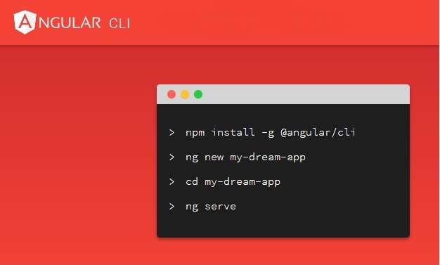

Angular CLI 是 Angular 客户端命令行工具，提供非常多的命令来简化  Angular 的开发。
本文总结了在实际项目中经常会用到的 Angular CLI 命令。

<!-- more -->




## 获取帮助（`ng -h`）


`ng -h`等同于`ng --help`，跟所有的其他命令行一样，用于查看所有命令的一个帮助命令。执行该命令可以看到 Angular CLI 所有的命令：

```
>ng -h
Available Commands:
  add Adds support for an external library to your project.
  build (b) Compiles an Angular app into an output directory named dist/ at the given output path. Must be executed from within a workspace directory.
  config Retrieves or sets Angular configuration values.
  doc (d) Opens the official Angular documentation (angular.io) in a browser, and searches for a given keyword.
  e2e (e) Builds and serves an Angular app, then runs end-to-end tests using Protractor.
  generate (g) Generates and/or modifies files based on a schematic.
  help Lists available commands and their short descriptions.
  lint (l) Runs linting tools on Angular app code in a given project folder.
  new (n) Creates a new workspace and an initial Angular app.
  run Runs a custom target defined in your project.
  serve (s) Builds and serves your app, rebuilding on file changes.
  test (t) Runs unit tests in a project.
  update Updates your application and its dependencies. See https://update.angular.io/
  version (v) Outputs Angular CLI version.
  xi18n Extracts i18n messages from source code.

For more detailed help run "ng [command name] --help"
```

## 创建应用

以下示例，创建一个名为“user-management”的 Angular 应用：


```
ng new user-management
```

## 创建组件

以下示例，创建一个名为 UsersComponent 的组件：


```
ng generate component users
```


## 创建服务

以下示例，创建一个名为 UserService 的服务：


```
ng generate service user
```


## 启动应用

执行：

```
ng serve --open
```

此时，应用就会自动在浏览器中打开。访问地址为 http://localhost:4200/。


## 升级依赖

目前，Angular 社区非常活跃，版本会经常更新。对 Angular 的版本做升级，只需简单一步执行：

```
ng update
```

如果是想把整个应用的依赖都升级，则执行：

```
ng update --all
```


## 自动化测试

Angular 支持自动化测试。Angular的测试，主要是基于Jasmine和Karma库来实现的。只需简单一步执行：

```
ng test
```

要生成覆盖率报告，运行下列命令：

```
ng test --code-coverage
```

## 下载依赖

光有 Angular 源码是否不足以将 Angular 启动起来的，需要先安装 Angular 应用所需要的依赖到本地。

在应用目录下执行：

```
npm install
```


## 参考引用

* 更多有关 Angular 的内容，可以参阅《跟老卫学Angular》：<https://github.com/waylau/angular-tutorial>
