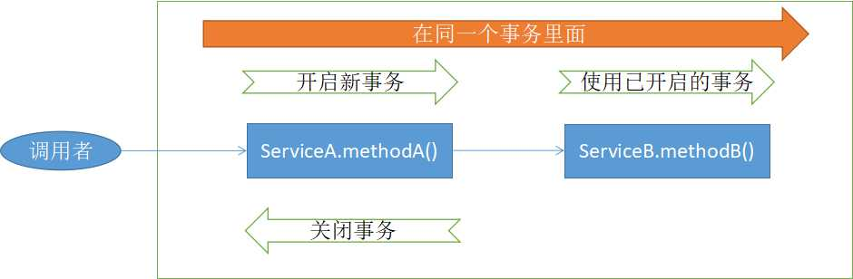
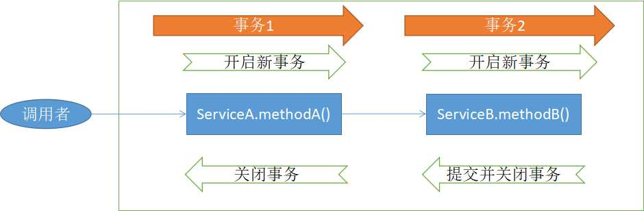
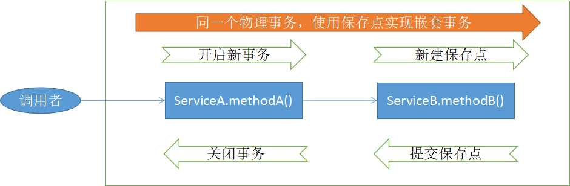

Spring其中一个强大之处在于，他是支持声明式事务的。而用好声明式事务的前提是，要理解Spring的事务传播机制。

本文详细介绍了Spring事务传播机制。

<!-- more -->

## Spring的事务传播类型

Spring的事务传播机制类型定义在了Propagation枚举类中。主要有以下几种类型。


```java
public enum Propagation {
REQUIRED(TransactionDefinition.PROPAGATION_REQUIRED),
SUPPORTS(TransactionDefinition.PROPAGATION_SUPPORTS),
MANDATORY(TransactionDefinition.PROPAGATION_MANDATORY),
REQUIRES_NEW(TransactionDefinition.PROPAGATION_REQUIRES_NEW),
NOT_SUPPORTED(TransactionDefinition.PROPAGATION_NOT_SUPPORTED),
NEVER(TransactionDefinition.PROPAGATION_NEVER),
NESTED(TransactionDefinition.PROPAGATION_NESTED);
// ...
}
```

下面主要对常用的PROPAGATION_REQUIRED、PROPAGATION_REQUIRES_NEW和PROPAGATION_NESTED做详细介绍。


## PROPAGATION_REQUIRED

PROPAGATION_REQUIRED表示加入当前正要执行的事务不在另外一个事务中，那么就开启一个新的事务。

例如，ServiceB.methodB()的事务级别定义为PROPAGATION_REQUIRED, 那么由于执行ServiceA.methodA()时，ServiceA.methodA()已经开启了事务，这时调用ServiceB.methodB()，ServiceB.methodB()看到自己已经运行在ServiceA.methodA()的事务内部，就不再开启新的事务。而假如ServiceA.methodA()运行时发现自己没有在事务中，它就会为自己分配一个事务。

这样，在ServiceA.methodA()或在ServiceB.methodB()内的任何地方出现异常，事务都会被回滚。
即使ServiceB.methodB()的事务已经被提交，但是ServiceA.methodA()在下面异常了要回滚，那么ServiceB.methodB()也会回滚。

图1所示为PROPAGATION_REQUIRED类型的事务处理流程。





## PROPAGATION_REQUIRES_NEW

例如，定义ServiceA.methodA()的事务级别为PROPAGATION_REQUIRED，ServiceB.methodB()的事务级别为PROPAGATION_REQUIRES_NEW，那么当执行到 ServiceB.methodB()的时候，ServiceA.methodA()所在的事务就会挂起，ServiceB.methodB()会开启一个新的事务。等ServiceB.methodB的事务完成以后，ServiceA.methodA()才继续执行。它与PROPAGATION_REQUIRED的事务区别在于，事务的回滚程度。因为ServiceB.methodB()是新开启一个事务，那么就
是存在两个不同的事务。如果ServiceB.methodB()已经提交，那么ServiceA.methodA()失败回滚，ServiceB.methodB()是不会回滚的。如果ServiceB.methodB()失败回滚，如果它抛出的异常被ServiceA.methodA()捕获，ServiceA.methodA()事务仍然可能提交。

图2所示为PROPAGATION_REQUIRES_NEW类型的事务处理流程。



## PROPAGATION_NESTED


PROPAGATION_NESTED使用具有可回滚到的多个保存点的单个物理事务。PROPAGATION_NESTED与PROPAGATION_REQUIRES_NEW的区别是，PROPAGATION_REQUIRES_NEW 另开启一个事务，将会与它的父事务相互独立，而PROPAGATION_NESTED的事务和它的父事务是相依的，它的提交要和它的父事务一起。也就是说，如果父事务最后回滚，它也要回滚。如果子事务回滚或提交，不会导致父事务回滚或提交，但父事务回滚将导致子事务回滚。

图3所示为PROPAGATION_NESTED类型的事务处理流程。




## 参考引用

* 更多有关Spring的内容，可以参阅《Spring 5 开发大全》：<https://github.com/waylau/spring-5-book>
* 原文同步至<https://waylau.com/spring-transaction/>