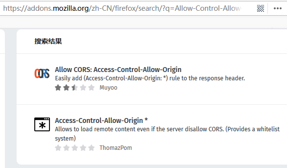

在前后台分离的应用中，Angular 与 Java 是一对好搭档。但是如果是分开部署应用，则势必会遇到跨域访问的问题。


<!-- more -->

## 什么是跨域

启动应用之后，有些浏览器会提示如下告警信息：

```
No 'Access-Control-Allow-Origin' header is present on the requested resource. Origin 'http://localhost:4200' is therefore not allowed access. 
```

这个是典型的跨域问题。浏览器为了安全考虑，不同的域之间是不能够互相访问的的。

比如，Angular 应用部署在本地的4200端口，而 Java 服务部署在8080端口，他们虽然是同台机子，但仍然是不同的域。Angular 应用视图通过HttpClient 去访问 Java 的 <http://localhost:8080/hello> 接口是不允许的。

## 如何解决跨域问题


在知道了什么是跨域之后，解决方案就有多种。

### 1. 避免跨域


既然，分开部署导致了跨域，那么最简单的方式莫过于避免分开部署，即Angular 与 Java 同时部署到同个 Web 服务器中。

这种方式部署在传统的 Java Web 中非常常见。比如，JSP 应用。

但带来的问题是，水平扩展和性能调优将变得困难，不适合大型互联网应用。

### 2. 安装支持跨域请求的插件

其实，很多浏览器都提供了允许跨域访问的插件，只需启用这种插件，就能实现在开发环境跨域请求第三方 API 了。

下图展示的是在 Firefox 浏览器中能够实现的跨域访问的插件。




这种方式是最简单，但使用的场景比较受限，一般用于开发环境。

### 3. 设置反向代理


这种方式是业界最为常用的方式，原理是设置反向代理服务器，让 Angular 应用都访问自己的服务器中的API，而这类API都会被反向代理服务器转发到 Java 服务API中，而这个过程对于 Angular 应用是无感知的。


业界经常是采用 NGINX 服务来承担反向代理的职责。而在 Angular 中，使用反向代理将变得更加简单。在 Angualr 应用的根目录下，添加配置文件proxy.config.json，并填写如下格式内容：


```json
{
    "/lite": {
      "target": "http://localhost:8080",
      "secure": "false"
    }
}
```

使用 Angular CLI 启动应用时，只需要执行如下命令即可，非常方法：

```
ng serve --proxy-config proxy.config.json
```


这样，当 Angular 要访问<http://localhost:4200/lite> 时，会被转发到 Java 的 <http://localhost:8080/lite>  接口。


## 参考引用

* 原文同步至<https://waylau.com/angular-proxy/>
* Angular CLI 常用命令：<https://waylau.com/angular-cli-commands/>
* Spring 5 开发大全：<https://github.com/waylau/spring-5-book>
* 跟老卫学Angular：<https://github.com/waylau/angular-tutorial>
* NGINX 教程：<https://github.com/waylau/nginx-tutorial>
