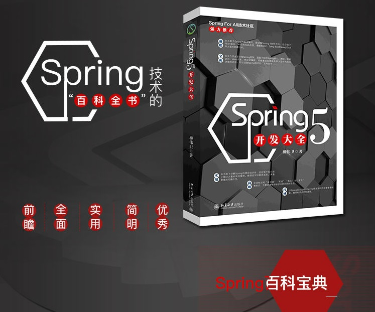

2019年快来了，为了答谢各位关注老卫的读者朋友，特送《Spring 5开发大全》三本，无套路，快上车。

<!-- more -->

时间的脚步总是匆匆，经历了一年的付出收获、欢乐忧伤，我们悄然间就要迈步到2019年了。

回顾这一年，最大的成就莫过于将Spring三剑客付梓出版。

何为Spring三剑客？即《Spring Boot 企业级应用开发实战》、《Spring Cloud 微服务架构开发实战》、《Spring 5 案例大全》，全方面覆盖从Java企业级到微服务的各个领域开发，是每个Java开发者的良师益友。

当然，书中的案例来自工资实践，来自于网友的讨论，更来自于这个开源的世界。不管是书里，还是老卫的博客里，每一篇教程的编写，我都满怀憧憬和希冀，每一个代码，都是一个相遇的音符。

2018年对我来说，是收获的一年。我收获了读者们的支持，给了我全新的人生体验。和你们的互动，让我感受到知识分享的快乐。你们对我的肯定，是我坚持的动力，所以谢谢大家。

2018年岁末，我的新书《Spring 5 案例大全》由北京大学出版社出版发行，在京东、当当等电商网站上陆续开始上市。这当然离不开你们的支持，为了感谢大家，特送出《Spring 5开发大全》三本，以回馈读者朋友们。

## 活动方式

愿意参加本次活动的朋友，请你们在该书的主页（<https://book.douban.com/subject/30370024/>），进行评价留言，讲述你我关于Spring的故事。届时将会挑选出三篇最佳留言，送上这三份新年礼物。绝对没有套路！

*Tips：打5星、长文字更容易中奖哦~*

## 活动时间

只要在2019年1月5日24时前的评价留言，都可以参与评选。

## 礼品介绍

礼品介绍可以见：

* 当当：<http://product.dangdang.com/25581763.html>
* 京东：<https://item.jd.com/12474404.html>

