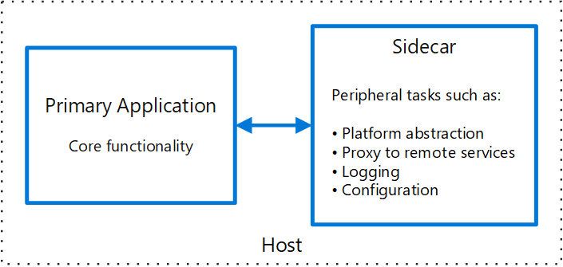
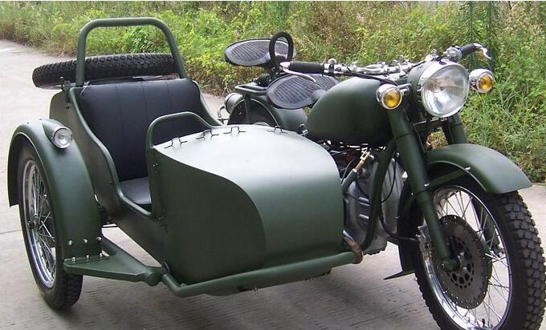

本文介绍Sidecar模式的特点，及其应用的场景。熟悉[Native Cloud](https://github.com/waylau/cloud-native-book-demos)或者[微服务](https://github.com/waylau/spring-cloud-microservices-development)的童鞋应该知道，在云环境下，技术栈可以是多种多样的。那么如何能够将这些异构的服务组件串联起来，成为了服务治理的一个重大课题。而Sidecar模式为服务治理，提供了一种解决方案。


<!-- more -->


将应用程序的组件部署到单独的进程或容器中，以提供隔离和封装。此模式还可以使应用程序由异构组件和技术组成。

这种模式被称为Sidecar，因为它类似于连接到摩托车的边车。在该模式中，边车附加到父应用程序并为应用程序提供支持功能。 sidecar还与父应用程序共享相同的生命周期，与父项一起创建和退役。边车图案有时被称为搭接图案并且是分解图案。

## 问题背景


应用程序和服务通常需要相关的功能，例如监控、日志、集中化配置和网络服务等。这些外围任务可以作为单独的组件或服务来实现。

如果它们紧密集成到应用程序中，它们可以在与应用程序相同的进程中运行，从而有效地使用共享资源。但是，这也意味着它们没有很好地隔离，并且其中一个组件的中断可能会影响其他组件或整个应用程序。此外，它们通常需要使用与父应用程序相同的语言或者技术栈来实现。因此，组件和应用程序彼此之间具有密切的相互依赖性。

如果将应用程序分解为服务，则可以使用不同的语言和技术构建每个服务。虽然这提供了更大的灵活性，但这意味着每个组件都有自己的依赖关系，并且需要特定于语言的库来访问底层平台以及与父应用程序共享的任何资源。此外，将这些功能部署为单独的服务可能会增加应用程序的延迟。管理这些特定于语言的接口的代码和依赖关系也会增加相当大的复杂性，尤其是对于托管、部署和管理服务。

## 解决方案

上述问题的解决方案是，将一组紧密结合的任务与主应用程序共同放在一台主机（Host）中，但会将它们部署在各自的进程或容器中。这种方式也被称为“Sidecar（边车）模式”。

下图展示了任务与主应用程序的部署关系图。



## Sidecar模式

边车服务不一定是应用程序的一部分，而是与之相关联。它适用于父应用程序的任何位置。Sidecar支持与主应用程序一起部署的进程或服务。这就像是如下图所示的边三轮摩托车那样，将边车安装在一辆摩托车上，就变成了边三轮摩托车。每辆边三轮摩托车都有自己的边车。类似同样的方式，边车服务共享其父应用程序的主机。对于应用程序的每个实例，边车的实例被部署并与其一起托管。





使用边车模式的优点包括：

* 在运行时环境和编程语言方面，边车独立于其主要应用程序，因此不需要为每种语言开发一个边车。
* 边车可以访问与主应用程序相同的资源。例如，边车可以监视边车和主应用程序使用的系统资源。
* 由于它靠近主应用程序，因此在它们之间进行通信时没有明显的延迟。
* 即使对于不提供可扩展性机制的应用程序，也可以使用边车通过将其作为自己的进程附加到与主应用程序相同的主机或子容器中来扩展功能。

Sidecar模式通常与容器一起使用，并称为边车容器。有关容器方面的内容，可以参阅<https://waylau.com/ahout-docker/>。

## Sidecar模式的实现


Spring Cloud Netflix Sidecar框架提供了Sidecar模式的现成解决方案。Spring Cloud Netflix Sidecar框架框架可以提供对其他非Spring Cloud技术栈的微服务的治理。比如，你可以使用Node或者Golang编写一个Web项目，这个服务同样可以以Sidecar模式，纳入到Spring Cloud管理中去。

下面是实现步骤。

### 1. 为Web项目添加健康检查接口

提供REST接口，返回JSON格式内容`{"status" : "up"}`。其中status用于描述微服务的状态，常见的取值有UP、DOWN、OUT_OF_SERVICE和UNKNOWN等。

### 2. 编写Sidecar微服务

创建项目，添加Eureka、Sidecar的依赖：


```xml
<dependency>
    <groupId>org.springframework.cloud</groupId>
    <artifactId>spring-cloud-netflix-sidecar</artifactId>
</dependency>
<dependency>
    <groupId>org.springframework.cloud</groupId>
    <artifactId>spring-cloud-starter-eureka</artifactId>
</dependency>
```

启动类上加上@EnableSidecar注解。这是一个组合注解，它整合了三个注解，分别是@EnableCircuiBreaker和@EnableDiscoveryClient。

在配置文件中加入端口号、服务名称、Eureka地址以及Web项目的端口以及健康检查地址，如：

```
server.port=8887
spring.application.name=sidecar-mylife-service
eureka.client.serviceUrl.defaultZone=http://localhost:8881/eureka/
eureka.client.instance.prefer-ip-address=true
sidecar.port=8080
sidecar.health-uri=http://localhost:8080/health
eureka.instance.hostname=localhost
```

启动项目，并访问8887接口，就可以访问到Web项目中的接口。

### 3. Sidecar的一些端点

以下是Sidecar的常用端点：


* `/hosts/{serviceId}` 指定微服务在Eureka上的实例列表
* `/ping` 返回OK字符串
* `/{serviceId}` 请求对应的微服务

### 4. 部署应用


将Sidecar与Web服进行部署。一般是部署在相同的主机里面。


有关Spring Cloud的更多内容，可以参阅[Spring Cloud 教程](https://github.com/waylau/spring-cloud-tutorial)。


## 参考引用


* Spring Cloud 微服务架构开发实战:<https://github.com/waylau/spring-cloud-microservices-development>
* Spring Boot 企业级应用开发实战:<https://github.com/waylau/spring-boot-enterprise-application-development>
* <https://docs.microsoft.com/en-us/azure/architecture/patterns/sidecar>