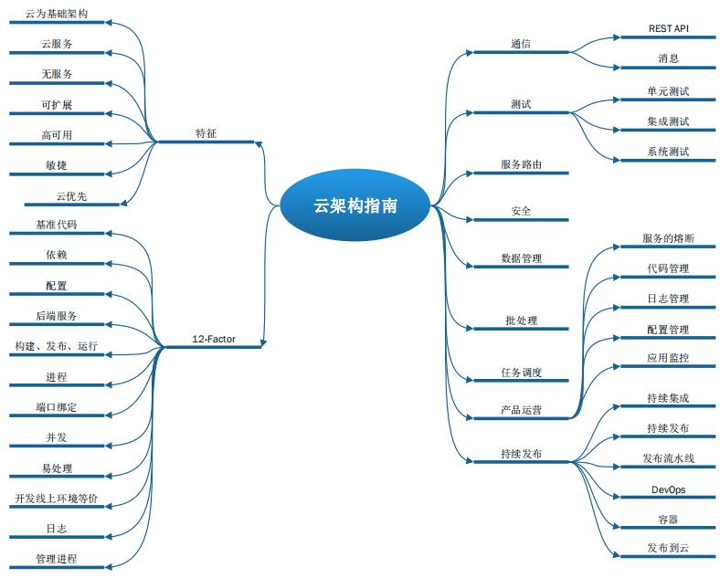

Cloud Native（云原生）是以云架构为优先的应用开发模式。目前，越来越多的企业已经在大规模开始拥抱云，在云环境开发应用、部署应用、发布应用。未来，越来越多的开发者也将采用 Cloud Native 来开发应用。本书是国内第一本 Java 领域 Cloud Native 著作。

那么为什么Cloud Native模式会越来越流行？Cloud Native与微服务有什么区别？何时选择使用Cloud Native？等等，这些问题将在本文一一解答。

<!-- more -->

## 什么是 Cloud Native

Cloud Native （国内译为“云原生”），最早是 [Matt Stine](http://www.mattstine.com) 提出的一个概念。与微服务一样，Cloud Native 并不是一种具体的技术，而是一类思想的集合，包括DevOps、持续交付（Continuous Delivery）、微服务（MicroServices）、敏捷基础设施（Agile Infrastructure）、康威定律（Conways Law）等，以及根据商业能力对公司进行重组。Cloud Native 既包含技术（微服务，敏捷基础设施），也包含管理（DevOps，持续交付，康威定律，重组等）。所以，Cloud Native 也可以说是一系列Cloud技术、企业管理方法的集合。 

Cloud Native 具备有以下特性：

* 以云为基础架构
* 云服务
* 无服务
* 可扩展
* 高可用
* 敏捷
* 云优先
* 等等

下图是《[Cloud Native 分布式架构原理与实践](https://item.jd.com/12496131.html)》书中所罗列的 Cloud Native 云架构模式。可见  Cloud Native  体系是非常庞杂的。

随着云计算的不断发展，企业开始采用基础架构即服务（IaaS）和平台即服务（PaaS）服务，并利用它们构建利用云的弹性和可伸缩性的应用程序，同时也能够满足云环境下的容错性。同时，云环境更加便宜和经济，因此，未来云环境会被作为企业部署、个人开发的优先选择。Cloud Native 的出现恰逢其时， 其架构可以指导企业或者个人轻松实现云应用开发或者云部署。

## Cloud Native 与微服务的关系

在“[简述 Microservices（微服务）](https://waylau.com/ahout-microservices/)”一文中，已经对微服务的概念做了简单的论述。

微服务架构风格其本质是把大的应用拆分成为小的服务（微服务）。微服务是单一应用的形式， 因此可以独立部署和运行在其自己的进程中。微服务一般采用轻量级的机制进行通信（一般是 HTTP 资源 API），因此可以不限制技术栈。微服务是围绕业务能力来构建，因此更加聚焦业务能力，能够把握住领域边界，放置需求的蔓延。微服务其固有的特性，方便通过全自动部署工具来实现独立部署，因此非常适合在云环境中进行部署。

在 Cloud Native 中，倾向于使用微服务来构建应用。同时，Cloud Native因为是以云环境为优先的，非常适合微服务的部署和管理。

目前，业界针对微服务有非常多的成熟方案，比如[Spring Boot](https://github.com/waylau/spring-boot-enterprise-application-development)、[Spring Cloud](https://github.com/waylau/spring-cloud-microservices-development)等，都可以简化微服务的开发工作。这微服务方面，笔者也撰写了一些列的免费教程（<https://waylau.com/books/>），读者朋友可以作为参考。

## 为什么我们需要使用 Cloud Native？

云计算的第一个浪潮是关于成本节约和业务敏捷性，尤其是云计算的基础设施更加廉价。

很多企业倾向于使用微服务架构来开发应用。微服务开发快速，职责单一，能够更快速的被客户所采纳。同时，这些应用能够通过快速迭代的方式，得到进化，赢得客户的认可。Cloud Native 可以打通微服务开发、测试、部署、发布的整个流程环节。

云供应商为迎合市场，提供了满足各种场景方案的 API，例如用于定位的 Google Maps，用于社交协作的认证平台等。将所有这些 API 与企业业务的特性和功能混合在一起，可以让他们为客户构建独特的方案。所有这些整合都在 API 层面进行。这意味着，不管是移动应用还是传统的桌面应用都能无缝集成。所以，采用 Cloud Native 所开发的应用都且具备极强的可扩展性。

软件不可能不出故障。传统的企业级开发方式，需要有专职人员来对企业应用进行监控与维护。而在 Cloud Native 架构下，底层的服务或者是 API 都由将部署到云中，等价于将繁重的运维工作转移给了云平台供应商。这意味着客户应用将得到更加专业的看护，同时，也节省了运维成本。

因此，云是大势所趋。快来拥抱Cloud Native！

## 如何实现 Cloud Native

那么如何来实现 Cloud Native 呢？其实这是一个非常大的话题，比如，作为开发者，你需要了解目前市面上流行的云供应商，了解微服务、SOA，了解 HTTP 和 REST，了解领域驱动设计（DDD），了解CI\CD和TDD，了解两个披萨，了解分布式的常用架构和模式等等。这里每一样都是一个庞大的课题，还好目前市面上已经有了一些资料可供学习，比如《Cloud Native 分布式架构原理与实践》，可以非常全面的指导开发者轻松入门 Cloud Native。

在本文的最后也列出了一些学习资料，读者有兴趣的话，可以由点及面，慢慢扩展自己的知识体系。

## 参考引用

* 原文同步至：<https://waylau.com/about-cloud-native/>
* [简述 Microservices（微服务）](https://waylau.com/ahout-microservices/)
* [Spring Boot 企业级应用开发实战](https://github.com/waylau/spring-boot-enterprise-application-development)
* [Spring Cloud 微服务架构开发实战](https://github.com/waylau/spring-cloud-microservices-development)
* [Cloud Native 分布式架构原理与实践](https://item.jd.com/12496131.html)
* [分布式系统常用技术及案例分析](https://github.com/waylau/distributed-systems-technologies-and-cases-analysis)