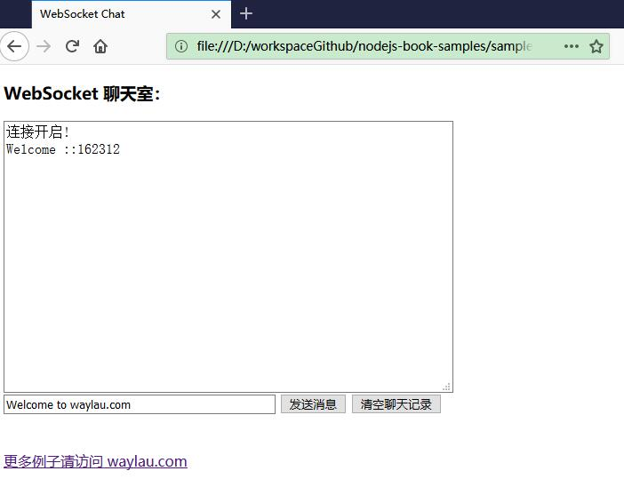
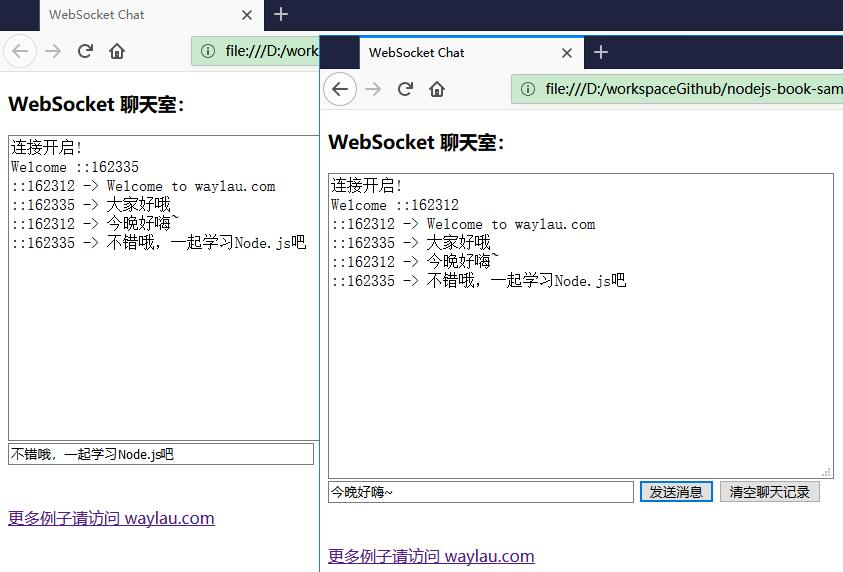

对于聊天室，大家应该都不陌生，笔者也写过很多关于聊天室的例子。

本节，我们将演示如何通过Node.js来实现一个WebSocket聊天服务器的例子。


<!-- more -->

## 使用ws创建WebSokcet服务器

Node.js原生API并未提供WebSocket的支持，因此，需要安装第三方包才能使用WebSocket功能。对于WebSocket的支持，在开源社区有非常多的选择，本例子采用的是“ws”框架（项目主页为<https://github.com/websockets/ws>）。

“ws”顾名思义是一个用于支持WebSocket客户端和服务器的框架。它易于使用，功能强大，且不依赖于其他环境。


想其他Node.js应用一样，使用ws的首选方式是使用npm来管理。以下命令行用于安装ws在应用里面：

```
npm install ws
```

具备了ws包之后，就可以创建WebSocket服务器了。以下是创建服务器的j简单示例：

```js
const WebSocket = require('ws');

const server = new WebSocket.Server({ port: 8080 });
```

上述例子服务器启动在8080端口。

## 聊天服务器的需求

聊天服务器的业务需求比较简单，是一个群聊聊天室。换言之，所有人发送的消息大家都可以见到。

当有新用户连接到服务器时，会以该用户的“IP+端口”作为用户的名称。


## 服务器的实现

根据前面知识的学习，实现一个聊天服务器比较简单，完整代码如下：

```js
const WebSocket = require('ws');

const server = new WebSocket.Server({ port: 8080 });

server.on('open', function open() {
  console.log('connected');
});

server.on('close', function close() {
  console.log('disconnected');
});

server.on('connection', function connection(ws, req) {
  const ip = req.connection.remoteAddress;
  const port = req.connection.remotePort;
  const clientName = ip + port;

  console.log('%s is connected', clientName)

  // 发送欢迎信息给客户端
  ws.send("Welcome " + clientName);

  ws.on('message', function incoming(message) {
    console.log('received: %s from %s', message, clientName);
    
    // 广播消息给所有客户端
    server.clients.forEach(function each(client) {
      if (client.readyState === WebSocket.OPEN) {
        client.send( clientName + " -> " + message);
      }
    });

  });

});
```


当客户端给服务器发送消息时，服务器会将该客户端的消息转发给所有客户端。


## 客户端的实现

客户端是通HTML+JavaScript的方式实现的。由于浏览器原生提供了WebSocket的API，所以并不需要ws框架的支持。

客户端client.html文件代码如下：

```html
<!DOCTYPE html>
<html>

<head>
	<meta charset="UTF-8">
	<title>WebSocket Chat</title>
</head>

<body>
	<script type="text/javascript">
		var socket;
		if (!window.WebSocket) {
			window.WebSocket = window.MozWebSocket;
		}
		if (window.WebSocket) {
			socket = new WebSocket("ws://localhost:8080/ws");
			socket.onmessage = function (event) {
				var ta = document.getElementById('responseText');
				ta.value = ta.value + '\n' + event.data
			};
			socket.onopen = function (event) {
				var ta = document.getElementById('responseText');
				ta.value = "连接开启!";
			};
			socket.onclose = function (event) {
				var ta = document.getElementById('responseText');
				ta.value = ta.value + "连接被关闭";
			};
		} else {
			alert("你的浏览器不支持 WebSocket！");
		}

		function send(message) {
			if (!window.WebSocket) {
				return;
			}
			if (socket.readyState == WebSocket.OPEN) {
				socket.send(message);
			} else {
				alert("连接没有开启.");
			}
		}
	</script>
	<form onsubmit="return false;">
		<h3>WebSocket 聊天室：</h3>
		<textarea id="responseText" style="width: 500px; height: 300px;"></textarea>
		<br>
		<input type="text" name="message" style="width: 300px" value="Welcome to waylau.com">
		<input type="button" value="发送消息" onclick="send(this.form.message.value)">
		<input type="button" onclick="javascript:document.getElementById('responseText').value=''" 
			value="清空聊天记录">
	</form>
	<br>
	<br>
	<a href="https://waylau.com/">更多例子请访问 waylau.com</a>
</body>

</html>
```


## 运行应用

首先启动服务器。执行下面的命令：

```
node index.js
```

接着用浏览器直接打开client.html文件，可以看到如下的聊天界面。




 


打开多个聊天窗口，就能模拟多个用户之间的群聊了。




## 源码


本节例子可以在<https://github.com/waylau/nodejs-book-samples>的“ws-demo”应用中找到。


本节例子可以在“ws-demo”应用中找到。

## 参考引用

* MINA 实现聊天功能: <https://waylau.com/mina-chat/>
* Netty 实现 WebSocket 聊天功能: <https://waylau.com/netty-websocket-chat/>
* Netty 实现聊天功能: <https://waylau.com/netty-chat/>
* WebSocket 和 Golang 实现聊天功能: <https://waylau.com/go-websocket-chat/>