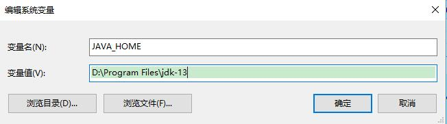
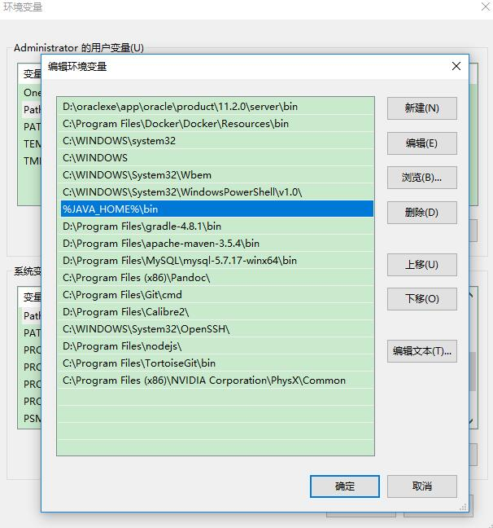
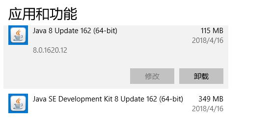

近期 Java 界好消息频传。先是 Java 13 发布，接着 Eclipse 也发布了新版本表示支持新版本的Java 特性。
本文介绍了 Java 13 的新特性并展示了相关的示例。


<!-- more -->

2019年9月17日，Java 13 正式发布。特性如下。

## Java 13 新特性

此版本带来了以下几大新特性：

* JEP 350，Dynamic CDS Archives：扩展应用程序类-数据共享，以允许在 Java 应用程序执行结束时动态归档类。归档类将包括默认的基础层 CDS（class data-sharing）存档中不存在的所有已加载的应用程序类和库类。
* JEP 351，ZGC: Uncommit Unused Memory：增强 ZGC 以将未使用的堆内存返回给操作系统。
* JEP 353，Reimplement the Legacy Socket API：使用易于维护和调试的更简单、更现代的实现替换 java.net.Socket 和 java.net.ServerSocket API 使用的底层实现。
* JEP 354，Switch Expressions (Preview)：可在生产环境中使用的 switch 表达式，JDK 13 中将带来一个 beta 版本实现。switch 表达式扩展了 switch 语句，使其不仅可以作为语句（statement），还可以作为表达式（expression），并且两种写法都可以使用传统的 switch 语法，或者使用简化的“case L ->”模式匹配语法作用于不同范围并控制执行流。这些更改将简化日常编码工作，并为 switch 中的模式匹配（JEP 305）做好准备。
* JEP 355，Text Blocks (Preview)：将文本块添加到 Java 语言。文本块是一个多行字符串文字，它避免了对大多数转义序列的需要，以可预测的方式自动格式化字符串，并在需要时让开发人员控制格式。


## 安装 JDK 13

JDK 13下载地址为 <https://www.oracle.com/technetwork/java/javase/downloads/index.html>。

以Windows环境为例，可通过jdk-13_windows-x64_bin.exe或jdk-13_windows-x64_bin.zip来进行安装。 .exe文件的安装方式较为简单，按照界面提示点击“下一步”即可。

下面演示.zip安装方式。

### 1. 解压.zip文件到指定位置

将jdk-13_windows-x64_bin.zip文件解压到指定的目录下即可。比如，本例子放置在了`D:\Program Files\jdk-13`位置。

### 2. 设置环境变量

创建系统变量“JAVA_HOME”，其值指向了JDK的安装目录。




 


在用户变量“Path”中，增加“%JAVA_HOME%\bin”。




 


注：JDK13已经无需再安装JRE，设置环境变量时也不用设置CLASSPATH了。

### 3. 验证安装

执行“java -version”命令进行安装的验证：

```
$ java -version
java version "13" 2019-09-17
Java(TM) SE Runtime Environment (build 13+33)
Java HotSpot(TM) 64-Bit Server VM (build 13+33, mixed mode, sharing)
```

如果现实上述信息，则说明JDK已经安装完成。

如果显示的内容还是安装前的老JDK版本，则可按照如下步骤解决。

首先，卸载老版本的JDK



其次，在命令行输入如下指令来设置JAVA_HOM和Path：

```
>SET JAVA_HOME=D:\Program Files\jdk-13

>SET Path=%JAVA_HOME%\bin
```

## Eclipse IDE 2019-09

在 Java 13 发布两天后的2019年9月19日，Eclipse IDE 2019-09 发布。Eclipse IDE 2019-09 声称支持Java 13。接下里将演示如何使用Eclipse IDE 2019-09编写 Java 13 的示例。


Eclipse IDE 2019-09 下载地址为 <https://www.eclipse.org/downloads/packages/>。本例使用的是Eclipse 4.14版本。


## 编写 Java 13 示例


### 实战1：Switch表达式的例子

下面是原有的Switch表达式的写法：

```java
switch (day) {
    case MONDAY:
    case FRIDAY:
    case SUNDAY:
        System.out.println(6);
        break;
    case TUESDAY:
        System.out.println(7);
        break;
    case THURSDAY:
    case SATURDAY:
        System.out.println(8);
        break;
    case WEDNESDAY:
        System.out.println(9);
        break;
}
```

在Java 12中，Switch表达式可以改为如下写法：

```java
switch (day) {
    case MONDAY, FRIDAY, SUNDAY -> System.out.println(6);
    case TUESDAY                -> System.out.println(7);
    case THURSDAY, SATURDAY     -> System.out.println(8);
    case WEDNESDAY              -> System.out.println(9);
}
```


还能支持在表达式中返回值：

```java
int numLetters = switch (day) {
    case MONDAY, FRIDAY, SUNDAY -> 6;
    case TUESDAY                -> 7;
    case THURSDAY, SATURDAY     -> 8;
    case WEDNESDAY              -> 9;
};
```

在Java 13中，Switch表达式可以改为如下写法：

```java
int date = switch (day) {
	case MONDAY, FRIDAY, SUNDAY : yield 6;
	case TUESDAY                : yield 7;
	case THURSDAY, SATURDAY     : yield 8;
	case WEDNESDAY              : yield 9;
	default 					: yield 1; // default条件是必须的
};

System.out.println(date);
```

需要注意的是，在使用yield时，必须要有default条件。


### 实战2：文本块

自Java 13开始，支持文本块（Text Blocks）。

以下是Java 13之前的文本块的处理方式的示例：

```java
String html = "<html>\n" +
	              "    <body>\n" +
	              "        <p>Hello, world</p>\n" +
	              "    </body>\n" +
	              "</html>\n";

System.out.println(html);
```


在上述示例中，由于文本块需要换行，所以产生了很多本文的拼接和转义。

以下是Java 13中的文本块示例：


```java
String html2 = """
	              <html>
	                  <body>
	                      <p>Hello, world</p>
	                  </body>
	              </html>
	              """;
	    
System.out.println(html2);
```

在上述示例中，对于文本块的处理变得简洁、自然。

以上两个示例在控制台输出内容都是一样的，效果如下：

```html
<html>
    <body>
        <p>Hello, world</p>
    </body>
</html>
```


更多Java示例，可见“[现代Java案例大全](https://github.com/waylau/modern-java-demos)”。

## 参考引用

* 本文同步至: <https://waylau.com/java-13-new-features-and-samples/>
* 完整源码：<https://github.com/waylau/modern-java-demos>
* <http://openjdk.java.net/projects/jdk/13>