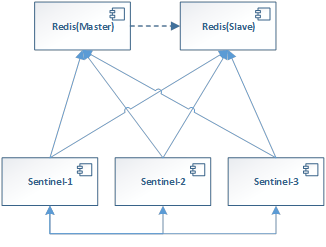
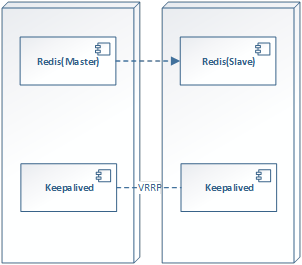

本文介绍Redis主从模式的常用类型。

<!-- more -->

Redis的可靠性主要有主从模式和集群模式。对于主从模式而言，Redis有以下方案：

* Sentinel方案；
* Keepalived方案。

## Sentinel方案

作为Redis主推的官方方案，主要的实现原理是通过引入哨兵sentinel节点，来投标决定master节点故障后，哪个slave节点会被选举接管故障的master节点。

Sentinel节点会周期性的向Redis节点发送心跳消息（10s一次向master节点发送心跳，1s一次向从节点和sentinel集群的其他salve节点发送心跳，2s一次广播当前的master信息和sentinel集群的信息）。

当Sentinel集群检测到Redis的Master节点故障，就需要通过在Sentinel内投票，如果投票通过，则将目标的节点执行failover切换。

优点：官方推荐的方案；

缺点：Sentinel1已经废弃，Sentinel2目前在rewrite阶段，有稳定版本；Sentinel集群至少需要部署3个实例。这样就不利于sentinel部署了，如果我们规定只有两个Redis节点，Sentinel节点就不能部署在Redis节点上，必须找其他的节点来部署，这样部署起来就比较

麻烦一些。

## Keepalived方案

利用Linux官方的Keepalived软件做load balance和HA。主要原理是Keepalived会监控Master和Slaver节点。当主节点故障时，会利用VRRP协议，将IP切换到Slave节点。

优点：非官方方案，但是使用比较广泛，有比较成熟的redis_check.sh, redis_master.sh, redis_backup.sh, redis_fault.sh, redis_stop.sh脚本；Keepalived可以随Redis部署，不需要额外的节点，组网比较简单。

缺点：安装部署需要引入一个新的软件Keepalived。

## 参考引用

* 本文同步至: <https://waylau.com/redis-master-slave/>
* 分布式系统常用技术及案例分析：<https://github.com/waylau/distributed-systems-technologies-and-cases-analysis>
