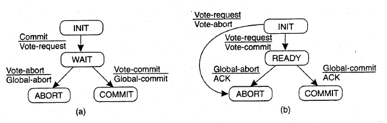

在分布式系统中，为了保证数据的高可用，通常会将数据保留多个副本（replica）, 这些副本会放置在不同的节点上。这些数据节点可能是物理机器，也可能是虚拟机。为了对用户提供正确的CURD等语意，我们需要保证这些放置在不同节点上的副本是一致的，这就涉及分布式事务的问题。

本文介绍分布式事务处理方案之一的两阶段提交协议。

<!-- more -->

 

## 分布式事务
 

分布式事务是指发生在多个数据节点之间的事务，分布式事务比单机事务要复杂的多。在分布式系统中，各个节点之间在是相互独立的，需要通过网络进行沟通和协调。由于存在事务机制，可以保证每个独立节点上的数据操作可以满足ACID。但是，相互独立的节点之间无法准确地知道其他节点的事务执行情况。所以从理论上来讲，两个节点的数据是无法达到一致的状态。如果想让分布式部署的多个节点中的数据保持一致性，那么就要保证在所有节点数据的写操作，要么全部都执行，要么全部都不执行。但是，一台机器在执行本地事务的时候无法知道其他机器中的本地事务的执行结果，所以它也就不知道本次事务到底应该commit还是rollback。所以，常规的解决办法就是引入一个"协调者"的组件来统一调度所有分布式节点的执行。

 

为了解决这种分布式一致性问题，前人在性能和数据一致性的反反复复权衡过程中总结了许多典型的协议和算法。其中比较著名的有二阶提交协议（Two Phase Commitment Protocol）、三阶提交协议（Three Phase Commitment Protocol）和Paxos算法。针对分布式事务，是X/Open 这个组织定义的一套分布式事务的标准X/Open DTP（X/Open Distributed Transaction Processing ReferenceModel），定义了规范和API接口，可以由各个厂商进行具体的实现。

 

大部分的关系型数据库通过两阶段提交（Two Phase Commit，2PC）算法来完成分布式事务，比如Oracle中通过dblink方式进行事务处理。下面重点介绍下2PC算法。

 

## 两阶段提交概述

两阶段提交协议最早是分布式事务的专家Jim Gray在1978年的一篇文章Notes on Database Operating Systems中提及。两阶段提交协议可以保证数据的强一致性，即保证了分布式事务的原子性：所有结点要么全做要么全不做。许多分布式关系型数据管理系统采用此协议来完成分布式事务。它是协调所有分布式原子事务参与者，并决定提交或取消（回滚）的分布式算法。同时也是解决一致性问题的算法。该算法能够解决很多的临时性系统故障（包括进程、网络节点、通信等故障），被广泛地使用。但是，它并不能够通过配置来解决所有的故障，在某些情况下它还需要人为的参与才能解决问题。

 

顾名思义，两阶段提交分为以下两个阶段：

* 准备阶段（Prepare Phase）
* 提交阶段（Commit Phase）

 

在两阶段提交协议中，系统一般包含两类角色：

* 协调者（Coordinator），通常一个系统中只有一个；
* 参与者（Participant），一般包含多个，在数据存储系统中可以理解为数据副本的个数。

 

## 准备阶段

在准备阶段，协调者将通知事务参与者准备提交或取消事务，写本地的redo和undo日志，但不提交，然后进入表决过程。在表决过程中，参与者将告知协调者自己的决策：同意（事务参与者本地作业执行成功）或取消（本地作业执行故障）。

 

协调者协议流程如下：

* 写本地日志“BEGIN_COMMIT”，并进入WAIT状态；
* 向所有参与者发送“VOTE_REQUEST”消息；
* 等待并接收参与者发送的对“VOTE_REQUEST”的响应。参与者响应“VOTE_ABORT”或“VOTE_COMMIT”消息给协调者。

## 提交阶段

在该阶段，协调者将基于第一个阶段的投票结果进行决策：提交或取消。当且仅当所有的参与者同意提交事务协调者才通知所有的参与者提交事务，否则协调者将通知所有的参与者取消事务。参与者在接收到协调者发来的消息后将执行响应的操作。

 

协调者协议流程如下：

* 若收到任何一个参与者发送的“VOTE_ABORT”消息；
    * 写本地“GLOBAL_ABORT”日志，进入ABORT状态；
    * 向所有的参与者发送“GLOBAL_ABORT”消息；
* 若收到所有参与者发送的“VOTE_COMMIT”消息；
    * 写本地“GLOBAL_COMMIT”日志，进入COMMIT状态；
    * 向所有的参与者发送“GLOBAL_COMMIT”消息；
* 等待并接收参与者发送的对“GLOBAL_ABORT”消息或“GLOBAL_COMMIT”消息的确认响应消息，一旦收到所有参与者的确认消息，写本地“END_TRANSACTION”日志流程结束。

## 两阶段提交状态机

下图为两阶段提交协议中的协调者及参与者的状态机。左侧a为协调者状态机；右侧b为参与者状态机。

                                       

## 实际案例

MySQL从5.5版本开始支持，SQL Server 2005开始支持，Oracle 7开始支持。

## 两阶段提交的缺陷
 

一般情况下，两阶段提交机制都能较好的运行，当在事务进行过程中，有参与者宕机时，重启以后，可以通过询问其他参与者或者协调者，从而知道这个事务到底提交了没有。当然，这一切的前提都是各个参与者在进行每一步操作时，都会事先写入日志。

 

两阶段提交不能解决的困境如下：

 

* 同步阻塞问题。执行过程中，所有参与节点都是事务阻塞型的。当参与者占有公共资源时，其他第三方节点访问公共资源不得不处于阻塞状态。
* 单点故障。由于协调者的重要性，一旦协调者发生故障，参与者会一直阻塞下去。尤其在第二阶段，协调者发生故障，那么所有的参与者还都处于锁定事务资源的状态中，而无法继续完成事务操作。（如果是协调者挂掉，可以重新选举一个协调者，但是无法解决因为协调者宕机导致的参与者处于阻塞状态的问题）
* 数据不一致。在二阶段提交的阶段二中，当协调者向参与者发送commit请求之后，发生了局部网络异常或者在发送commit请求过程中协调者发生了故障，这回导致只有一部分参与者接受到了commit请求。而在这部分参与者接到commit请求之后就会执行commit操作。但是其他部分未接到commit请求的机器则无法执行事务提交。于是整个分布式系统便出现了数据不一致性的现象。

  
## 参考引用

* 本文同步至: <https://waylau.com/two-phase-commitment-protocol/>
* Distributed systems: principles and paradigms
* Notes on Database Operating Systems
* 分布式系统常用技术及案例分析：<https://github.com/waylau/distributed-systems-technologies-and-cases-analysis>
