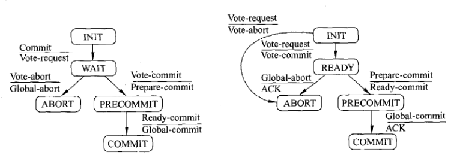

在分布式系统中，为了保证数据的高可用，通常会将数据保留多个副本（replica）, 这些副本会放置在不同的节点上。这些数据节点可能是物理机器，也可能是虚拟机。为了对用户提供正确的CURD等语意，我们需要保证这些放置在不同节点上的副本是一致的，这就涉及分布式事务的问题。

本文介绍分布式事务处理方案之一的三阶段提交协议。

<!-- more -->

 

## 分布式事务
 

分布式事务是指发生在多个数据节点之间的事务，分布式事务比单机事务要复杂的多。在分布式系统中，各个节点之间在是相互独立的，需要通过网络进行沟通和协调。由于存在事务机制，可以保证每个独立节点上的数据操作可以满足ACID。但是，相互独立的节点之间无法准确地知道其他节点的事务执行情况。所以从理论上来讲，两个节点的数据是无法达到一致的状态。如果想让分布式部署的多个节点中的数据保持一致性，那么就要保证在所有节点数据的写操作，要么全部都执行，要么全部都不执行。但是，一台机器在执行本地事务的时候无法知道其他机器中的本地事务的执行结果，所以它也就不知道本次事务到底应该commit还是rollback。所以，常规的解决办法就是引入一个"协调者"的组件来统一调度所有分布式节点的执行。

 

为了解决这种分布式一致性问题，前人在性能和数据一致性的反反复复权衡过程中总结了许多典型的协议和算法。其中比较著名的有二阶提交协议（Two Phase Commitment Protocol）、三阶提交协议（Three Phase Commitment Protocol）和Paxos算法。针对分布式事务，是X/Open 这个组织定义的一套分布式事务的标准X/Open DTP（X/Open Distributed Transaction Processing ReferenceModel），定义了规范和API接口，可以由各个厂商进行具体的实现。

 

大部分的关系型数据库通过两阶段提交（Two Phase Commit，2PC）算法来完成分布式事务，比如Oracle中通过dblink方式进行事务处理。下面重点介绍下3PC算法。

 

下面重点介绍下三阶提交协议算法。

 
## 三阶段提交概述

三阶段提交协议可以理解为两阶段提交协议的改良版，是在协调者和参与者中都引入超时机制，并且把两阶段提交协议的第一个阶段分成了两步: 询问，然后再锁资源，最后真正提交。

 

两阶段提交协议最早是分布式事务的专家Jim Gray在1978年的一篇文章Notes on Database Operating Systems中提及。两阶段提交协议可以保证数据的强一致性，即保证了分布式事务的原子性：所有结点要么全做要么全不做。许多分布式关系型数据管理系统采用此协议来完成分布式事务。它是协调所有分布式原子事务参与者，并决定提交或取消（回滚）的分布式算法。同时也是解决一致性问题的算法。该算法能够解决很多的临时性系统故障（包括进程、网络节点、通信等故障），被广泛地使用。但是，它并不能够通过配置来解决所有的故障，在某些情况下它还需要人为的参与才能解决问题。两阶段提交协议存在的问题是,协调者在某些时刻如果失败了, 整个事务就会阻塞。于是Skeen发布了"NonBlocking Commit Protocols" （1981）这篇论文，论文指出在一个分布式的事务里面, 需要一个三阶段的提交协议来避免在两阶段提交中存在的阻塞问题。

 

顾名思义，三阶段提交分为以下三个阶段：

* CanCommit
* PreCommit
* DoCommit

 

在三阶段提交协议中，系统一般包含两类角色：

* 协调者（Coordinator），通常一个系统中只有一个；
* 参与者（Participant），一般包含多个，在数据存储系统中可以理解为数据副本的个数。

 

## CanCommit

在CanCommit阶段，协调者协议流程如下：

* 写本地日志“BEGIN_COMMIT”，并进入WAIT状态；
* 向所有参与者发送“VOTE_REQUEST”消息；
* 等待并接收参与者发送的对“VOTE_REQUEST”的响应。参与者响应“VOTE_ABORT”或“VOTE_COMMIT”消息给协调者。

 

该流程与两阶段提交协议类似。

## PreCommit

在PreCommit阶段，，协调者将通知事务参与者准备提交或取消事务，写本地的redo和undo日志，但不提交。

 

协调者协议流程如下：

* 若收到任何一个参与者发送的“VOTE_ABORT”消息；
    * 写本地“GLOBAL_ABORT”日志，进入ABORT状态；
    * 向所有的参与者发送“GLOBAL_ABORT”消息；
* 若收到所有参与者发送的“VOTE_COMMIT”消息；
    * 写本地“PREPARE_COMMIT”日志，进入PRECOMMIT状态；
    * 向所有的参与者发送“PREPARE _COMMIT”消息；
* 等待并接收参与者发送的对“GLOBAL_ABORT”消息或“PREPARE_COMMIT”消息的确认响应消息。一旦收到所有参与者的“GLOBAL_ABORT”确认消息或者超时没有收到，写本地“END_TRANSACTION”日志流程结束，则不再进入DoCommit阶段。如果收到所有参与者的“PREPARE_COMMIT”确认消息，则进入DoCommit阶段。

 

该流程与两阶段提交协议相比，多了一个PRECOMMIT状态。

 

## DoCommit

在该阶段，

协调者协议流程如下：

* 向所有参与者发送的“GLOBAL _COMMIT”消息；
* 等待并接收参与者发送的对 “GLOBAL_COMMIT”消息的确认响应消息，一旦收到所有参与者的确认消息，写本地“END_TRANSACTION”日志流程结束。
 

在DoCommit阶段，如果参与者无法及时接收到来自协调者的GLOBAL_COMMIT请求时，会在等待超时之后，会继续进行事务的提交。

## 三阶段提交状态机

下图为三阶段提交协议中的协调者及参与者的状态机。左侧a为协调者状态机；右侧b为参与者状态机。

                                       

## 三阶段提交的缺陷
 

相对于2PC，3PC主要解决的单点故障问题，并减少阻塞，因为一旦参与者无法及时收到来自协调者的信息之后，他会默认执行commit。而不会一直持有事务资源并处于阻塞状态。但是这种机制也会导致数据一致性问题，因为，由于网络原因，协调者发送的abort响应没有及时被参与者接收到，那么参与者在等待超时之后执行了commit操作。这样就和其他接到abort命令并执行回滚的参与者之间存在数据不一致的情况。

## 参考引用

* 本文同步至: <https://waylau.com/three-phase-commitment-protocol/>
* 分布式事务——两阶段提交: <https://waylau.com/two-phase-commitment-protocol/>
* Distributed systems: principles and paradigms
* Notes on Database Operating Systems
* NonBlocking Commit Protocols
* 分布式系统常用技术及案例分析（第二版）：<https://github.com/waylau/distributed-systems-technologies-and-cases-analysis>

