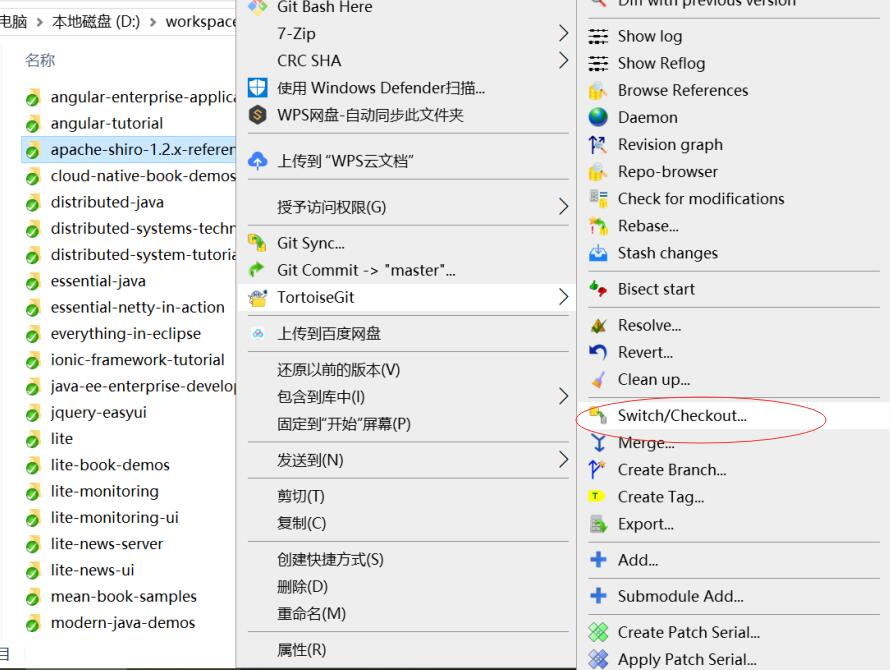
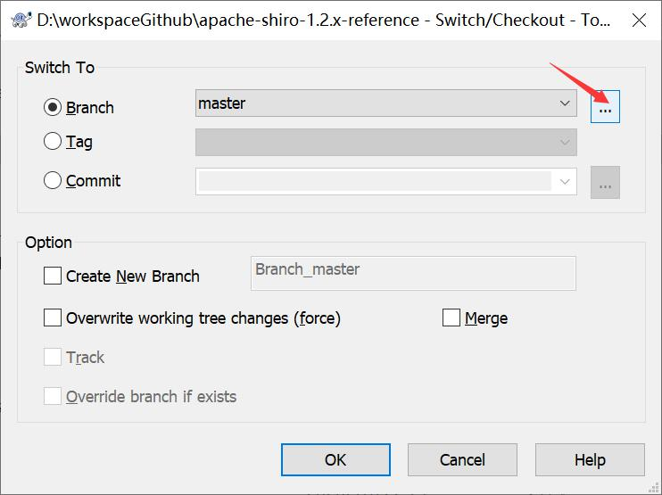
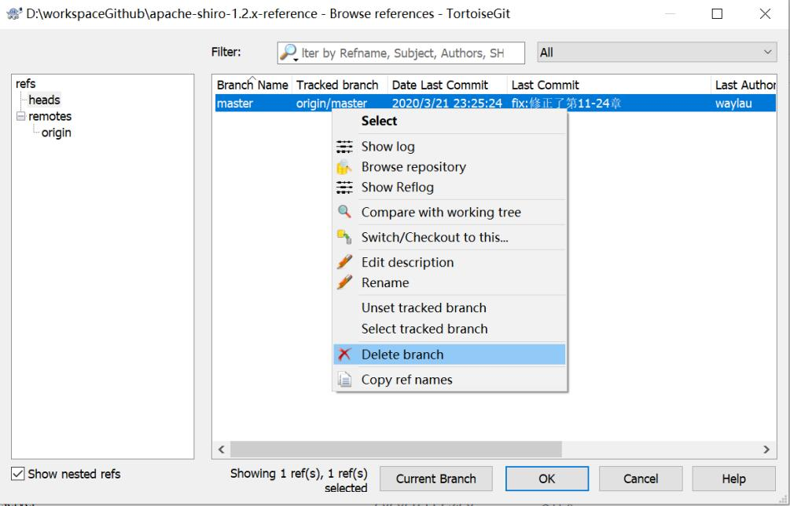

初次使用TortorliseGit的小伙伴，怕是很难找到删除分支的菜单。本文介绍如何使用TortorliseGit删除分支。

<!-- more -->

右键项目，点击“Switch/Checkout”菜单

在点击右侧的三个小点

选中要删除的分支，右键分支，可以看到“Delete branch”按钮，点击该按钮就能删除分支。

点击左侧“remotes”，可以用同样的手法，来删除远端的分支。

## 参考引用

* 本文同步至: <https://waylau.com/tortorlise-git-delete-branch/>
