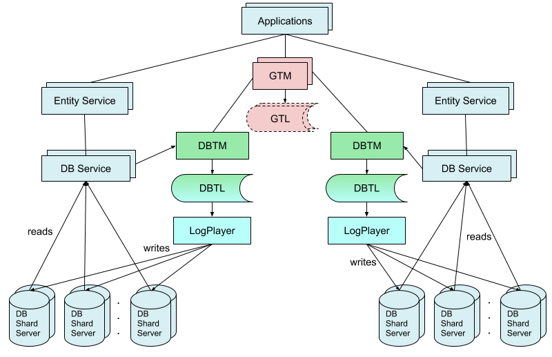
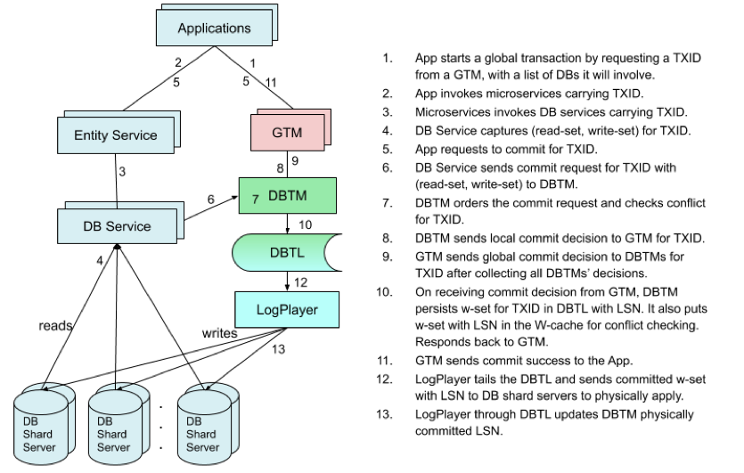
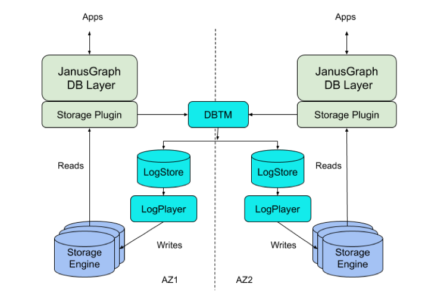

eBay 的技术人员最近展示了一种称为 GRIT 的分布式事务协议，支持跨多个具有多个底层数据库的微服务的 ACID（原子性、一致性、隔离性、持久性）事务。本文描述了在 2019 年 IEEE 数据工程国际会议（ICDE）上公布的 GRIT 协议的基本思想，并提供了一个使用部分协议实现 JanusGraph 事务存储后端的示例。本例关注的是只有一个数据库的系统，但是正如我们所说，GRIT 可以支持包含多个数据库的系统的 ACID 事务。

<!-- more -->

## 背景

在微服务体系结构中，应用程序可能会调用多个微服务，这些微服务通常由不同的团队以不同的应用程序语言实现，并可能使用多个底层数据库来实现其功能。这种流行的架构为跨多个微服务的分布式事务一致性带来了新的挑战。在微服务上下文中支持 ACID 事务是一个实际的需求，但是使用现有的技术很难实现，因为为单个数据库设计的分布式事务机制很难通过微服务扩展到多个数据库。

在涉及多个独立数据库的环境中，在应用程序不做额外工作的情况下，传统的两阶段提交（2PC）协议 （<https://waylau.com/two-phase-commitment-protocol/>） 基本上是系统分布式事务的惟一选择。然而，由于可能需要协调许多参与交互的系统，而且期间需要锁定，它在横向扩展平台上的效果并不好。另一方面，使用由诸如 Saga 之类的框架执行的事务日志会导致应用程序产生复杂的补偿逻辑，并且由于部分成功的事务不可逆，可能会影响业务。

为了解决这些问题，我们开发了 GRIT ，这是一种用于分布式事务全局一致性的新协议，它巧妙地结合了来自乐观并发控制（OCC）、2PC 和确定性数据库的思想，实现了跨多个底层数据库的微服务的高性能、全局一致性事务。

## GRIT：一种分布式事务协议

下图说明了具有两个数据库的微服务系统中的 GRIT 协议。GRIT 组成部分包括 GTM、GTL、DBTM、DBTL 和 LogPlayer，如下图所示。

上图是在不借助 GRIT 组件的情况下，一个普通的微服务架构的系统，它有两个横向扩展的数据库。它的组成部分如下：

* 应用程序：调用微服务来实现功能。
* 微服务（实体服务）：为实现业务逻辑的应用程序提供面向业务的服务构建块。每个 DB 可能支持多个微服务，并且每个微服务可能独立于其他微服务。
* DB 服务：提供 DB 读 / 写接口并直接访问 DB 服务器。在支持事务时，它还在执行阶段缓存每个事务的读 / 写结果，并在提交时将它们发送到其 DBTM 以解决冲突。
* DB 分片服务器：用于数据库的后端存储服务器，通常用于高可用性复制。

GRIT 的主要组件包括：

* 全局事务管理器（GTM）：它协调跨多个数据库的全局事务。GTM 可以有一个或多个。
* 全局事务日志（GTL）：它表示 GTM 的事务请求队列。GTL 中的事务请求顺序决定了全局事务之间的相对可串行化顺序。GTL 的持久性是可选项。
* 数据库事务管理器（DBTM）：每个数据库域的事务管理器。它执行冲突检查和解决，即本地提交决策在这里。
* 数据库事务日志（DBTL）：每个数据库域的事务日志，记录与此数据库相关的逻辑提交的事务（包括单数据库事务和多数据库事务）。DBTL 中的事务顺序决定整个数据库系统的可串行化顺序，包括 GTM 所指示的全局顺序。日志序列号（LSN）分配给每个日志条目。
* LogPlayer：此组件按顺序将日志条目发送到后端存储服务器，以便它们应用更新。每个 DB 服务器按顺序应用逻辑提交事务的日志条目。

为了理解协议的细节，我们使用下图来展示分布式事务的主要步骤。

在 GRIT 中，分布式事务要经历三个阶段：

* 乐观执行（步骤 1-4）：当应用程序通过微服务执行业务逻辑时，数据库服务捕获事务的读集和写集。在此阶段没有实际的数据修改。
* 逻辑提交（步骤 5-11）：一旦应用程序请求事务提交，每个数据库服务点的读集和写集就提交给它的 DBTM。DBTM 对读集和写集进行冲突检查，并实现本地提交决策。GTM 将在为事务收集 DBTM 的所有本地决策之后做出全局提交决策。一旦将事务的写集持久化到相关数据库的日志存储（DBTL）中，事务就会在逻辑上提交。这涉及到 GTM 和 DBTM 之间的最小协调。
* 物理应用（步骤 12-13）：日志播放器异步地将 DBTL 条目发送到后端存储服务器。数据修改发生在这个阶段。

总的来说，我们的方法在执行和提交过程中都避免了悲观锁定，也避免了物理提交等待。我们采用乐观的方法，利用逻辑提交日志，并使用确定性数据库技术将物理数据库修改移出提交决策过程，从而使提交过程非常高效，这与复制中的日志播放类似。

GRIT 能够为调用微服务的应用程序实现高吞吐量且可串行化的分布式事务一致性，并且只需最少的协调。GRIT 非常适合于冲突很少的事务，并为应用程序提供了关键的功能，否则就需要复杂的机制来实现跨多个底层数据库的微服务的事务一致性。

## 将 GRIT 用于单个数据库

如你所见，GRIT 协议包括两个部分：一个针对每个数据库（或每个数据库域，可以是数据库的一组分区），由 DBTM、DBTL 和 LogPlayer 执行，另一个跨数据库协调，由 GTM 和 DBTM 执行。在下图中，我们将演示下如何使用 GRIT 协议的一部分为 JanusGraph 设计一个事务性图形存储后端（称为 NuGraphStore）。

下图展示了如何使用两个可用区域（AZ1 和 AZ2）部署来实现 NuGraphStore，仅供参考：

JanusGraph 的 NuGraphStore 后端包含以下几个组件：

* 存储插件：JanusGraph DB 层与后端存储引擎和事务协议组件之间的自定义存储接口插件。
* DBTM：为乐观并发控制执行关键冲突检查。这是执行 OCC 的单个数据库上的 GRIT 分布式事务协议的一部分。
* LogStore：复制事务修改的日志存储。每个事务一个条目，按日志序列号（LSN）索引。它在传统的数据库系统中充当 WAL（write-ahead-log）的角色。LogStore 是我们 GRIT 架构中的 DBTL。
* LogPlayer：异步地将日志条目应用到后端服务器。
* 存储引擎：后端存储引擎，用于存储 JanusGraph 中的 KCV（键 - 列 - 值）数据。它执行读取和修改，并支持 LSN 定义的快照。

当应用程序执行事务时，它可以从存储区读取数据及向存储区写入数据。对于读操作，存储插件直接与存储服务器通信（除了在事务的写集中找到的读操作）。当应用程序在事务上下文中从存储中读取数据时，存储插件还会跟踪读集。每次读取获得的有用信息是 `<key, lsn>` 对，其中 lsn 是反映读取键值时存储引擎状态的日志序列号。LSN 是事务修改条目的日志索引。它由 LogStore 分配，用于定义后端数据库的快照。没有找到的键也被记录为读集的一部分。与读操作不同，写操作的存储插件并不直接与存储服务器通信。相反，存储插件缓存与事务写集对应的写入。

当事务提交时，存储插件将提交请求连同为事务捕获的读集和写集提交给 DBTM。DBTM 为事务 OCC 执行标准的冲突检查。如果没有冲突，它将把写集持久化到复制的 LogStore 中（即将写集发送到 LogStore 副本集，这样，所有副本都保留了完全相同的日志）。此时，事务提交逻辑完成，DBTM 将响应发回存储插件。LogPlayer 跟踪 LogStore 并根据数据分布将日志条目播放到后端的分片服务器。

需要指出的是，上面描述是一个基本设计，性能和可靠性还有许多可以提高的地方。我们相信，在跨组件优化或使用 DBTM 复制来实现更高的可靠性之前，完善基本组件更高效。同样，我们也有不同的方法来获取读集和写集。对于 KV 存储，我们在冲突检查时需要的最简单形式是 `<key, lsn>` 对。但是，为了支持更复杂的系统，读集可能包括范围或谓词 。目前，NuGraphStore 正在经历开源过程。

## 参考引用

* 本文同步至: <https://waylau.com/grit-a-protocol-for-distributed-transactions-across-microservices>
* GRIT: a Protocol for Distributed Transactions across Microservices：<https://tech.ebayinc.com/engineering/grit-a-protocol-for-distributed-transactions-across-microservices/>
* 分布式事务——两阶段提交：<https://waylau.com/two-phase-commitment-protocol/>
* 分布式事务——三阶段提交：<https://waylau.com/three-phase-commitment-protocol/>