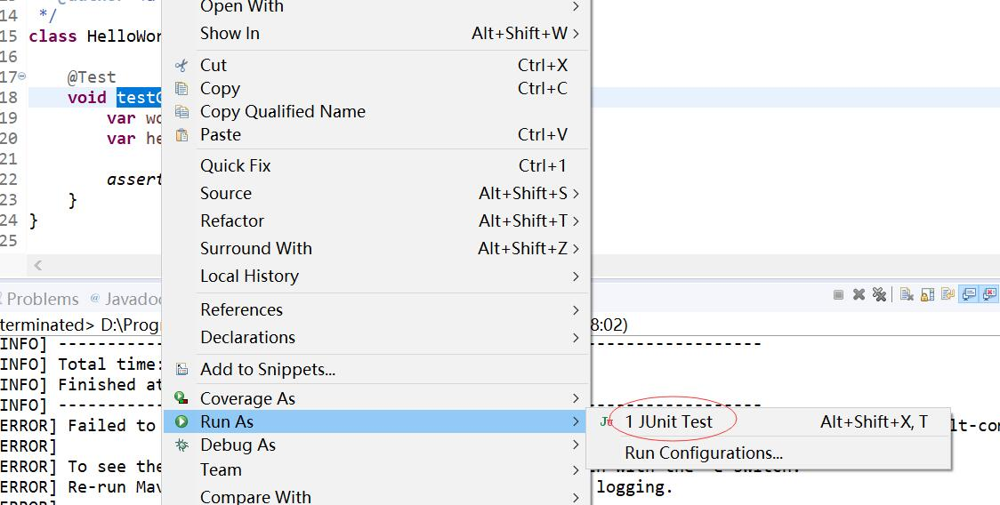

本文演示了如何如何编写JUnit 5测试用例，在Maven项目中运行JUnit 5测试用例。

<!-- more -->


## 编写JUnit 5测试用例

如果你是Java开发者，那么对于JUnit应该就不陌生。JUnit是Java单元测试的基础工具。

JUnit目前最新的版本是JUnit 5.x，但广大的Java开发者估计还停留在JUnit 4.x，因此有必要演示下如何编写JUnit 5测试用例。


### 引入JUnit 5依赖

相比较JUnit 4而言，JUnit 5一个比较大的改变是JUnit 5拥有与JUnit 4不同的全新的API。JUnit 5分成了三部分：

```
JUnit 5 = JUnit Platform + JUnit Jupiter + JUnit Vintage
```


* JUnit Platform是在JVM上启动测试框架的基础。 它还定义了TestEngine API，用于开发在平台上运行的测试框架。 此外，该JUnit Platform还提供了一个控制台启动器（用于从命令行启动该平台）和一个基于JUnit 4的运行器，用于在基于JUnit 4的环境中在该平台上运行任何TestEngine。 流行的IDE（IntelliJ IDEA，Eclipse，NetBeans和Visual Studio Code等）和构建工具（Gradle，Maven和Ant等）中也存在对JUnit平台的一流支持。
* JUnit Jupiter是新编程模型和扩展模型的组合，用于在JUnit 5中编写测试和扩展。Jupiter子项目提供了一个TestEngine，用于在平台上运行基于Jupiter的测试。
* JUnit Vintage提供了一个TestEngine，用于在平台上运行基于JUnit 3和基于JUnit 4的测试。


因此，在Maven中，JUnit 5分模块的，意味着你可以按需引入上面定义的任意模块。这使得引入JUnit 5依赖就有了多个选择。

一般而言，力求省事，就可以通过引入junit-jupiter依赖。junit-jupiter就是常用JUnit 5模块的聚合包。


```xml
<dependency>
    <groupId>org.junit.jupiter</groupId>
    <artifactId>junit-jupiter</artifactId>
    <version>${junit-jupiter.version}</version>
    <scope>test</scope>
</dependency>
```

### 编写测试用例

下面是一段简单的Java程序：

```java
/**
 * Welcome to https://waylau.com
 */
package com.waylau.java.demo;

/**
 * Hello World.
 * 
 * @since 1.0.0 2020年4月12日
 * @author <a href="https://waylau.com">Way Lau</a>
 */
public class HelloWorld {

	private String words;

	public HelloWorld(String words) {
		this.words = words;
	}
	
	public String getWords() {
		return words;
	}

}
```

按照管理，我们会在Maven工程的test目录，创建一个与之对应的单元测试用例：

```java
/**
 * Welcome to https://waylau.com
 */
package com.waylau.java.demo;

import org.junit.jupiter.api.Test;
import static org.junit.jupiter.api.Assertions.assertEquals;

/**
 * HelloWorld Test.
 * 
 * @since 1.0.0 2020年4月12日
 * @author <a href="https://waylau.com">Way Lau</a>
 */
class HelloWorldTests {

	@Test
	void testGetWords() {
		var words = "Hello World";
		var hello = new HelloWorld(words);
		
		assertEquals(words, hello.getWords());
	}
}
```


上述用例非常简单，就是想测试下，HelloWorld的getWords方法，是否与预期的一致。
这里需要强调的是JUnit 5和JUnit 4的不同点：

* JUnit 5使用的API是`org.junit.jupiter.api.*`包下
* 测试方法（比如上例testGetWords），可以不加`public`。

## 运行JUnit 5测试用例

上如上文所讲，在大多数主流的IDE中，都提供了对JUnit 5的支持。因此可以选择在IDE中运行，也可以通过Maven执行测试。


### 在IDE中运行


以Eclipse IDE为例，右键类或者方法，选择“Run As -> JUnit Test”即可。如下图所示。




### 通过Maven执行测试


在Maven中执行测试用例的命令如下：

```
mvn test
```


如果你执行了上述命令，会得到下面的测试结果

```
-------------------------------------------------------
 T E S T S
-------------------------------------------------------
Running com.waylau.java.demo.HelloWorldTests
Tests run: 0, Failures: 0, Errors: 0, Skipped: 0, Time elapsed: 0.002 sec

Results :

Tests run: 0, Failures: 0, Errors: 0, Skipped: 0

[INFO] ------------------------------------------------------------------------
[INFO] BUILD SUCCESS
[INFO] ------------------------------------------------------------------------
[INFO] Total time:  1.983 s
[INFO] Finished at: 2020-04-12T11:22:16+08:00
[INFO] ------------------------------------------------------------------------
```


上面结果没有失败的用例，但同时你也发现了没有成功的用例。因为根本没有执行测试用例。

这是因为，在Maven中并不能直接识别JUnit 5测试用例。如何解决？此时，还需要额外加多Maven Surefire或Maven Failsafe两个插件。


```xml
<build>
    <plugins>
        <plugin>
            <artifactId>maven-surefire-plugin</artifactId>
            <version>${maven-surefire-plugin.version}</version>
        </plugin>
        <plugin>
            <artifactId>maven-failsafe-plugin</artifactId>
            <version>${maven-failsafe-plugin.version}</version>
        </plugin>
    </plugins>
</build>
```


在Maven中再次执行测试用例，会得到下面的测试结果：

```
[INFO] -------------------------------------------------------
[INFO]  T E S T S
[INFO] -------------------------------------------------------
[INFO] Running com.waylau.java.demo.HelloWorldTests
[INFO] Tests run: 1, Failures: 0, Errors: 0, Skipped: 0, Time elapsed: 0.045 s - in com.waylau.java.demo.HelloWorldTests
[INFO]
[INFO] Results:
[INFO]
[INFO] Tests run: 1, Failures: 0, Errors: 0, Skipped: 0
[INFO]
[INFO] ------------------------------------------------------------------------
[INFO] BUILD SUCCESS
[INFO] ------------------------------------------------------------------------
[INFO] Total time:  4.116 s
[INFO] Finished at: 2020-04-12T11:30:29+08:00
[INFO] ------------------------------------------------------------------------
```


可以看到，HelloWorldTests类已经得到了测试执行。


## 参考引用

* 本文同步至: <https://waylau.com/running-junit5-tests-with-maven/>
* Eclipse IDE支持Java 14: <https://waylau.com/eclipse-ide-support-java14/>
* 本文示例源码：<https://github.com/waylau/java-data-structures-and-algorithms-in-action>