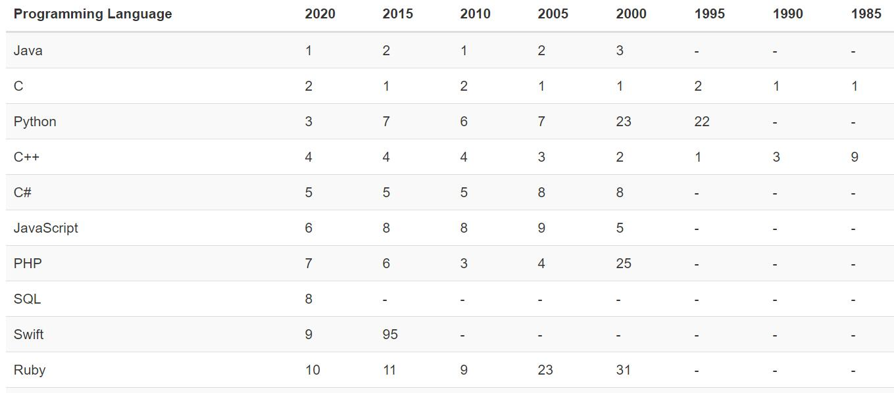

本文介绍了Java的发展趋势，并阐述了如何学习Java技术。

<!-- more -->

## Java为啥火爆？

随着互联网应用的发展，各种编程语言层出不穷，比如C#、Golang、TypeScript、ActionScript等，但不管是哪种语言，都无法撼动Java的“霸主”地位。Java语言始终占据着各类编程语言排行榜的榜首，开发者对于Java的热情也是与日俱增。Java已然成为了企业级应用、云计算和Cloud Native应用的首选语言。

图1-1展示的是1985年至2020年TIOBE编程语言排行榜情况（<https://www.tiobe.com/tiobe-index/>）。从图中可以看出，自Java诞生以来，一直占据排行版前三的位置。

那么为什么Java一致能保持这么火爆呢？究其原因，笔者认为Java能够长盛不衰的最大的秘诀就是能够与时俱进，不断推陈出新。

笔者从事Java开发已经有十几年了，可以说是Java技术发展的见证者和实践者。为了推广Java技术，笔者撰写了包括《分布式系统常用技术及案例分析》、《Spring Boot 企业级应用开发实战》、《Spring Cloud 微服务架构开发实战》、《Spring 5开发大全》、《Cloud Native 分布式架构原理与实践》等在内了几十本Java领域的专著和开源书，期望以个人微薄之力对Java语言有所贡献。由于目前企业所使用的Java，大多是Java 8之前的版本，市面上也缺乏最新Java 12的学习资料，因此笔者才撰写了这本《Java核心编程》一书以补空白。

## Java应该怎么学？

那么，Java应该怎么学？参考《Java核心编程》，学习Java分为以下几个层次：

### 1. 零基础的读者

如果你是没有任何编程经验的技术爱好者，本书可以帮助你打开编程之门。本书案例丰富、思路清晰，可以由浅及深地帮助读者掌握Java。

同时，本书可以帮助读者从一开始就建立正确的编程习惯，逐步树立良好的面向对象设计思维，这对于学习其他语言都是非常有帮助的。

针对这类读者，建议读者在学习过程中，从头至尾详细跟随笔者来理解Java的概念，并编写《Java核心编程》书中的示例。
该书附赠从Java 8到Java 14全套案例：<https://github.com/waylau/modern-java>

### 2. 有后端开发经验的读者

对于有后端或者是其他面向对象编程的经验的开发而言，理解并掌握Java并非难事。 针对这类读者，适当理解下Java的语法即可，把精力放在动手编写Java示例上面。

### 3. 有Java开发经验的读者

大多数Java开发人员肯定熟悉Java的语法，那么需要并把精力放在Java新特性上面，根据自身的实际情况，可以选学本书中的知识点，做到查漏补缺。

让我们一起踏上Java的学习之旅吧。

## 参考引用

* 本文同步至: <https://waylau.com/java-development-is-still-mainstream/>
* Eclipse IDE支持Java 14: <https://waylau.com/eclipse-ide-support-java14/>
* 现代Java案例大全，从Java 8到Java 14：<https://github.com/waylau/modern-java>