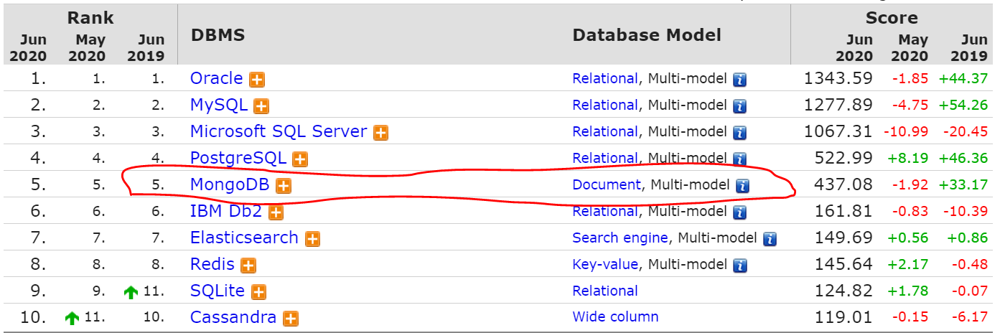

曾几何时，业界流行使用LAMP架构（Linux、Apache、MySQL和PHP）来快速开发中小网站。LAMP是开放源代码的，而且使用简单、价格廉价，因此LAMP这个组合成为了当时开发中小网站的首选，号称“平民英雄”。而今，随着Node.js的流行，这使得JavaScript终于能够在服务器端拥有了一席之地。JavaScript成为了从前端到后端再到数据库层能够支持全栈开发的语言。而以MongoDB、Express、Angular和Node.js四种开源技术为基础的MEAN架构，除了具备LAMP架构的一切优点外，更能支撑高可用、高并发的大型互联网应用的开发。MEAN架构势必也会成为新的“平民英雄”。

本文介绍了MEAN架构的概念、发展趋势，并阐述了如何学习和使用MEAN架构。

<!-- more -->

## 什么是MEAN架构？

MEAN架构，是指以MongoDB、Express、Angular和Node.js四种技术为核心的技术栈，广泛应用于全堆栈Web开发。

#### 1. MongoDB

MongoDB是强大的非关系型数据库（NoSQL）。与Redis或者HBase等不同，MongoDB是一个介于关系数据库和非关系数据库之间的产品，是非关系数据库当中功能最丰富、最像关系数据库的，旨在为Web应用提供可扩展的高性能数据存储解决方案。它支持的数据结构非常松散，是类似JSON的BSON格式，因此可以存储比较复杂的数据类型。MongoDB最大的特点是其支持的查询语言非常强大，其语法有点类似于面向对象的查询语言，几乎可以实现类似关系数据库单表查询的绝大部分功能，而且还支持对数据建立索引。
自MongoDB 4.0开始，MongoDB开始支持事务管理。

图1-1是最新的数据库排行结果。从图中可以看到，MongoDB是在NoSQL数据库中是排行第一的。该数据来自于DB-Engines（<https://db-engines.com/en/ranking>）

在MEAN架构中，MongoDB承担着数据存储的角色。

#### 2. Express

Express是一个简洁而灵活的Node.js Web应用框架, 提供了一系列强大特性帮助你创建各种Web应用。同时，Express也是一款功能非常强大的HTTP工具。

使用Express可以快速地搭建一个完整功能的网站。其核心特性包括：

* 可以设置中间件来响应HTTP请求。
* 定义了路由表用于执行不同的HTTP请求动作。
* 可以通过向模板传递参数来动态渲染HTML页面。

在MEAN架构中，Express承担着构建Web服务的角色。

#### 3. Angular

前端组件化开发是目前主流的开发方式，不管是Angular、React还是Vue.js都如此。相比较而言，Angular不管是其开发功能，还是编程思想，在所有前端框架中都是首屈一指的，特别适合大型企业级应用的开发。

Angular不仅仅是一个前端的框架，而更像是一个前端开发平台，试图解决现代Web应用开发各个方面的问题。Angular有着诸多特性，核心功能包括MVC模式、模块化、自动化双向数据绑定、语义化标签、服务、依赖注入等。而这些概念即便对于后端开发人员来说也不陌生。比如，Java开发人员肯定知道MVC模式、模块化、服务、依赖注入等。

在MEAN架构中，Angular承担着UI客户端开发的角色。

#### 4. Node.js

Node.js是整个MEAN架构的基石。Node.js采用事件驱动和非阻塞I/O模型，使其变得轻微和高效，非常适合构建运行在分布式设备的数据密集型实时应用。自从有了Node.js，JavaScript不再只是前端开发的小脚色，而是拥有了从前后台到数据数据库完整开发能力的全栈能手。JavaScript和Node.js是相辅相成的，配合流行的JavaScript语言，使得Node.js拥有更广泛的受众。

Node.js能够火爆的另外一个原因是npm。npm可以轻松管理项目依赖，同时也促进了Node.js生态圈的繁荣，因为npm让开发人员分享开源技术变得不再困难。

## MEAN架构的优势

MEAN架构的在企业级应用中被广泛采用，总结起来具备以下优势。

#### 1. 开源

正如前两节所述，无论是MongoDB、Express、Angular、Node.js四种核心技术，还是NG-ZORRO、ngx-markdown、NGINX、basic-auth等周边技术，MEAN架构所有的技术栈都是开源的。

开源技术相对与闭源技术而言，有其优势。一方面，开源技术源码是公开的，互联网公司在考察某项技术是否符合自身开发需求时，可以对源码进分析；另一方面，开源技术相对闭源技术而言，商用的成本相对比较低，这对于很多初创的互联网公司而言，可以节省一大笔技术投入。以此，MEAN架构也被称为开发下一代大型互联网应用的“平民英雄”。

当然，开源技术是把双刃剑，你能够看到源码，并不意味着你可以解决所有问题。开源技术在技术支持上不能与闭源技术相提并论，毕竟闭源技术都有成熟的商业模式，会提供完善的商业支持。而开源技术，更多依赖于社区对于开源技术的支持。如果在使用开源技术过程中发现了问题，可以反馈给开源社区，但开源社区不会给你保证什么时候、什么版本能够修复发现的问题。所以，使用开源技术，需要开发团队对开源技术要有深刻的了解。最好能够吃透源码，这样在发现问题时，能够及时解决源码上的问题。

比如，在关系型数据库方面，同属于Oracle公司的MySQL数据库和Oracle数据库，就是开源与闭源技术的两大代表，两者占据了全球数据库的占有率的前两名。MySQL数据库主要是在中小企业或者是云计算供应商中广泛采用，而Oracle数据库则由于其稳定、高性能的特性，深受政府和银行等客户的信赖。

#### 2. 跨平台

跨平台，意味着开发和部署的应用的成本的降低。

试想一下，当今操作系统三足鼎立，分别是Linux、macOS、Windows。如果开发者需要针对不同的操作系统平台，而要开发不同的软件，那么开发成本势必会非常高。而且每个操作系统平台，都有不同的版本、分支，仅仅做不同的版本的适配都需要耗费极大的人力，更别提要针对不同的平台开发软件了。以此，跨平台可以节省开发成本。

同理，由于MEAN架构开发的软件是具有跨平台的，无需担心在部署应用过程中的兼容性问题。开发者在本地开发环境所开发的软件，理论上是可以通过CI\CD平台直接一键部署到测试环境，甚至是生产环境中，因而可以节省部署的成本。

MEAN架构的跨平台特性，使其非常适合构建Cloud Native应用，特别是在当今容器技术常常作为微服务的宿主，而MEAN架构的应用是支持Docker部署的。

有关Cloud Native方面的内容，可以参阅笔者所著的《Cloud Native 分布式架构原理与实践》。

#### 3. 全栈开发

类似与系统架构师，全栈开发者应该是比一般的软件工程师具有更广的知识面，是拥有全端软件设计思想并掌握多种开发技能的复合型人才，能狗独当一面。相比于Node.js工程师、Angular工程师偏重于某项技能而言，全栈开发意味着必须掌握整个架构的全部细节，要求全栈开发者能够从零开始构建全套完整的企业级应用。

作为一名全栈开发者，在开发时往往会做如下风险的预测，并做好防御。

* 当前所开发的应用会部署到什么样的服务器、网络环境中？
* 服务哪里可能会崩？为什么会崩？
* 是否应该适当的使用云存储？
* 程序有无具备数据冗余？
* 是否具备可用性？
* 界面是否友好？
* 性能是否能够满足当前的要求？
* 哪些位置需要加日志，方便日志排查问题？

除上述的思考外，全栈开发者要能够建立合理的、标准的关系模型，包括外键、索引、视图、查找表等。

全栈开发者要熟悉非关系型数据存储，并且知道它们相对关系型存储优势所在。

当然，人的精力毕竟有限，所以想要成为全栈开发者并非易事。所幸MEAN架构让这一切成为了可能。MEAN架构以Node.js为整个技术栈的核心，而Node.js的编程语言是JavaScript，这意味着，开发者只需要掌握JavaScript这一种编程语言，即可以打通所有MEAN架构的技术，这不得不说是全栈开发者的福音。

#### 4. 支持企业级应用

无论是Node.js、Angular还是MongoDB，这些技术在大型互联网公司都被广泛采用。无数应用也证明了MEAN架构是非常适合构建企业级应用的。企业级应用是指那些为商业组织、大型企业而创建并部署的解决方案及应用。这些大型企业级应用的结构复杂，涉及的外部资源众多、事务密集、数据量大、用户数多，有较强的安全性考虑。

MEAN架构用来开发企业级应用，不但具有强大的功能，还能够满足未来业务需求的变化，且易于升级和维护。

更多有关企业级应用开发方面的内容，可以参阅笔者所著的《Spring Boot 企业级应用开发实战》《Angular企业级应用开发实战》《Node.js企业级应用开发实战》等。

#### 5. 支持构建微服务

微服务（Microservices）架构风格就像是把小的服务开发成单一应用的形式，运行在其自己的进程中，并采用轻量级的机制进行通信（一般是HTTP资源API）。这些服务都是围绕业务能力来构建，通过全自动部署工具来实现独立部署。这些服务，其可以使用不同的编程语言和不同的数据存储技术，并保持最小化集中管理。

MEAN架构非常适合构建微服务：

* Node.js本身提供了跨平台的能力，可以运行在自己的进程中。
* Express易于构建Web服务，并支持HTTP的通信。
* Node.js+MongoDB支持从前端到后端再到数据库全栈开发能力。

开发人员可以轻易地通过MEAN架构来构建并快速启动一个微服务应用。业界也提供了成熟的微服务解决方案来打造大型微服务架构系统，比如Tars.js、Seneca等。

读者欲了解更多微服务方面的内容，可以参阅笔者所著的《Spring Cloud 微服务架构开发实战》。

#### 6. 业界主流

MEAN架构所涉及的技术都是业界主流，主要体现在以下几方面。

* MongoDB是在NoSQL数据库中是排行第一的，而且用户量还在递增。
* 只要知道JavaScript就必然知道Node.js，而JavaScript是在开源界最流行的开发语言。
* 前端组件化开发是目前主流的开发方式，不管是Angular、React还是Vue.js都如此。相比较而言，Angular不管是其开发功能，还是编程思想，在所有前端框架中都是首屈一指的，特别适合大型企业级应用的开发。而且，从市场占有率来看，Angular都是首屈一指的。
* 在大型互联网应用中，经常使用NGINX作为Web服务器。NGINX也是目前使用最广泛的代理服务器。

## 如何学习MEAN架构？

MEAN架构知识点繁多，涉及面广，不是一时可以掌握。关于MEAN架构，笔者撰写了多本开源书籍，方便网友学习。包括：

* [REST 案例大全](https://github.com/waylau/RestDemo)
* [REST 实战](https://github.com/waylau/rest-in-action)
* [CSS3 教程](https://github.com/waylau/css3-tutorial)
* [跟老卫学Ionic](https://github.com/waylau/ionic-framework-tutorial)
* [Node.js 案例大全](https://github.com/waylau/nodejs-book-samples)
* [跟老卫学Angular](https://github.com/waylau/angular-tutorial)

这些开源书都免费的，可以随时学习哦，附带案例和源码。有任何问题都可以在线在相关的主页留言，有问必答。

当然，笔者也出版了一些的专著，网友们可以按需选择。包括：

* [Angular企业级应用开发实战](https://github.com/waylau/angular-enterprise-application-development-samples)
* [大型互联网应用轻量级架构实战](https://github.com/waylau/lite-book-demos)
* [MongoDB＋Express＋Angular＋Node.js全栈开发实战派](https://github.com/waylau/mean-book-samples)
* 

上面的案例和源码也都是公开免费的哦。

## 参考引用

* 本文同步至: <https://waylau.com/mean-architecture-in-action/>
* [Angular企业级应用开发实战](https://item.jd.com/12644232.html)（2019年06月出版）
* [大型互联网应用轻量级架构实战](https://item.jd.com/12629095.html)（2019年12月出版）
* [MongoDB＋Express＋Angular＋Node.js全栈开发实战派](https://item.jd.com/12874838.html)（2020年06月出版）
* [Spring Boot 企业级应用开发实战](https://item.jd.com/12340304.html)（2018年03月出版）
* [Spring Cloud 微服务架构开发实战](https://item.jd.com/12382428.html)（2018年06月出版）