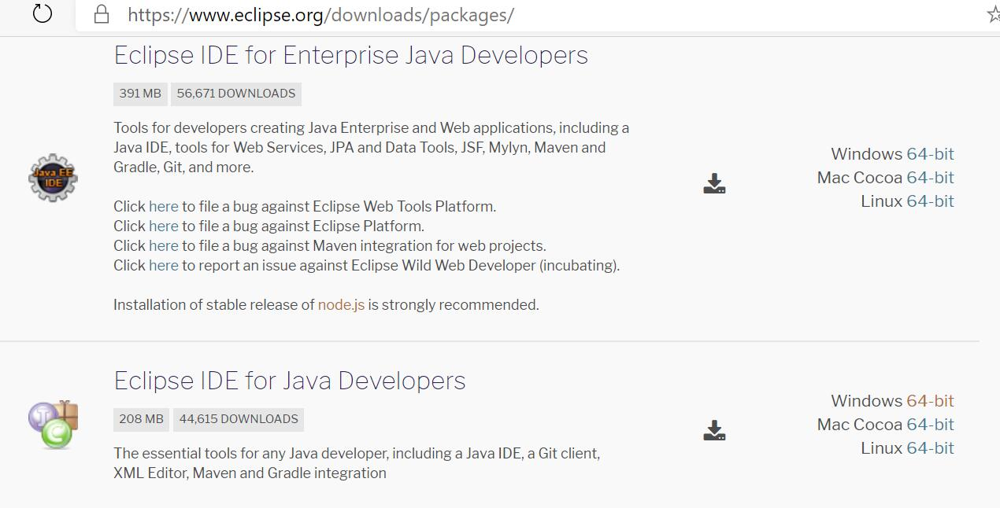
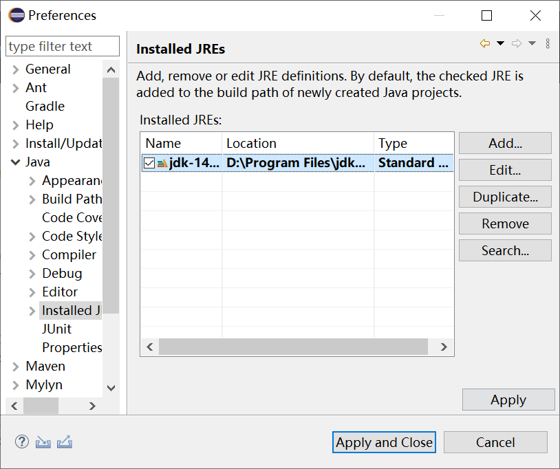
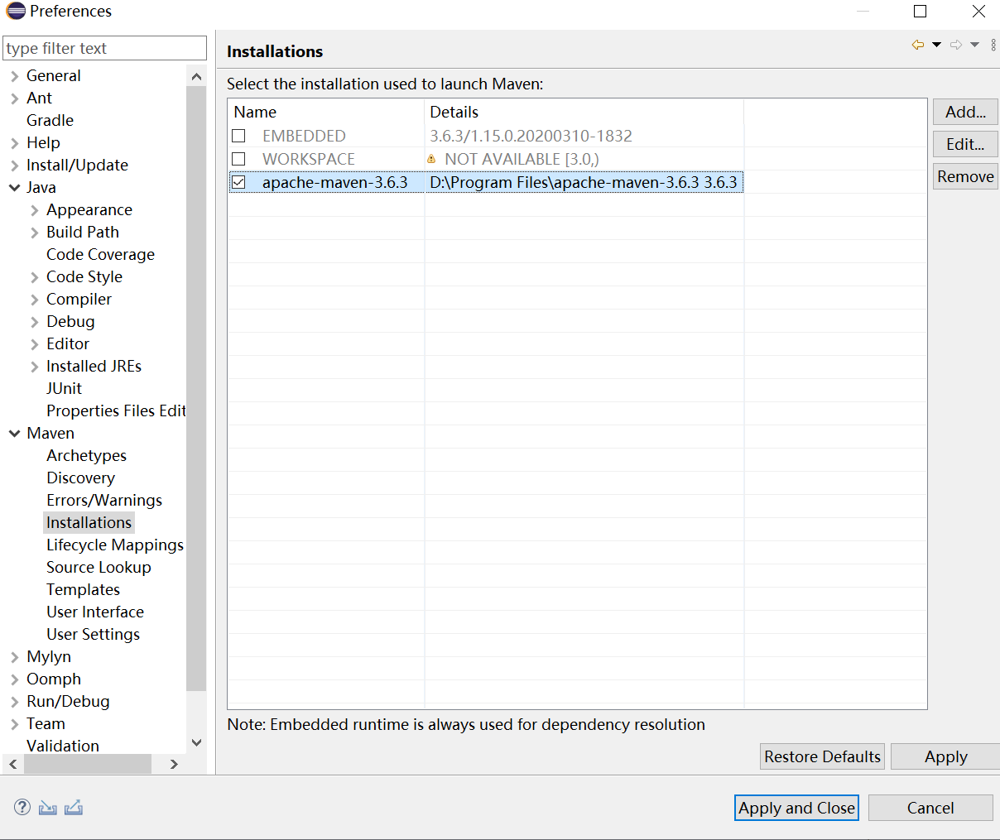
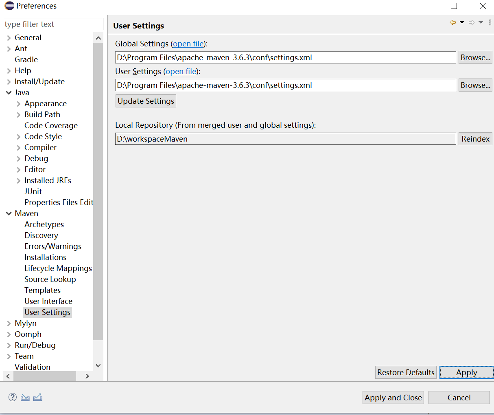
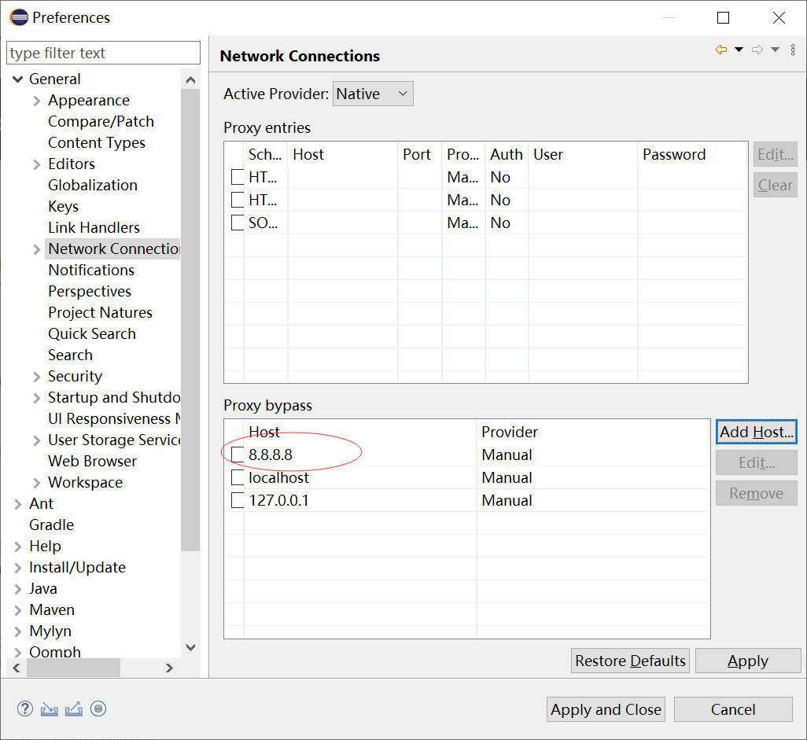
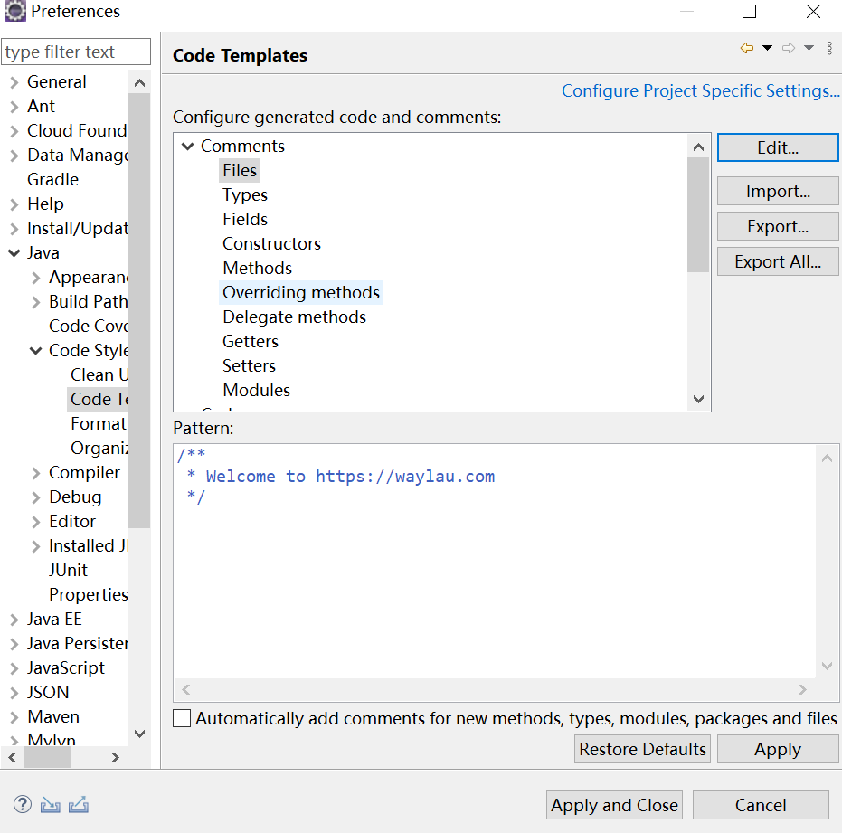
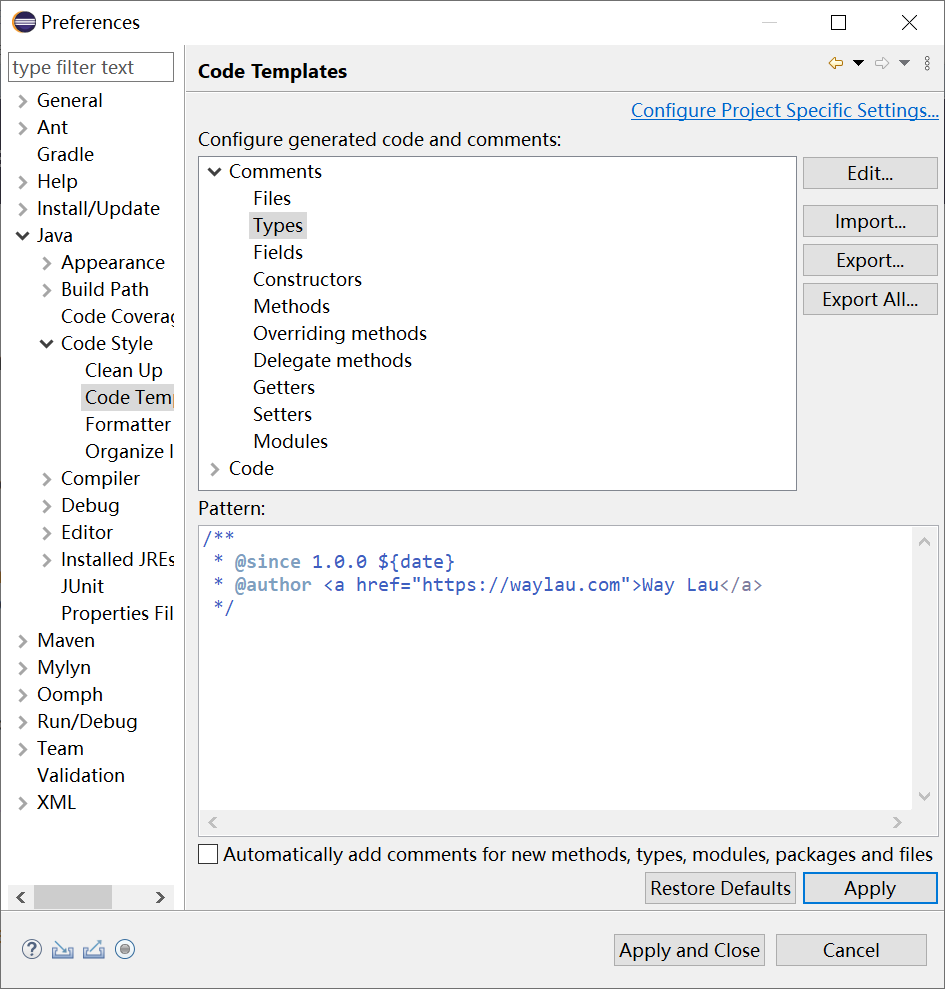
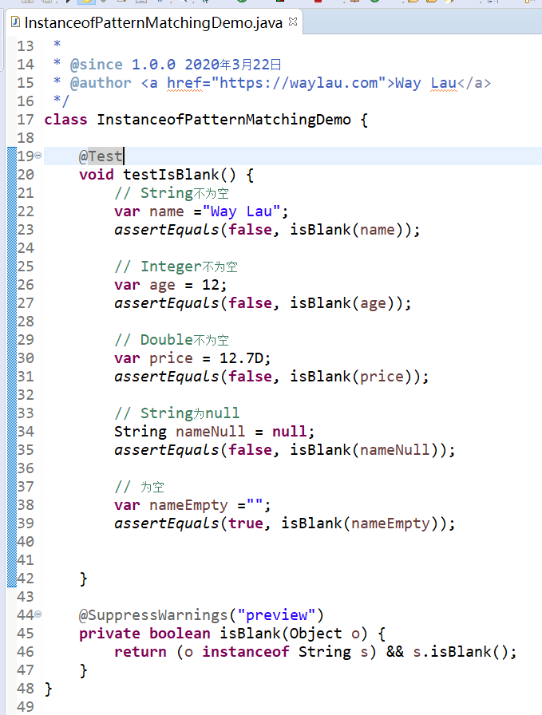

随着JDK 14的发布（<https://waylau.com/jdk-14-released/>），各大Java IDE也开始支持JDK 14。最新版本的Eclipse IDE 2020-06 R也于2020年6月17日发布，本文介绍如何通过Eclipse IDE来开发Java 14应用。

<!-- more -->

这个版本的最大特点就是正式支持Java 14了，无需要额外安装Java 14 Support for Eclipse 2020-03 (4.15)插件（见<https://waylau.com/eclipse-ide-support-java14/>）。

## 下载

下载地址<https://www.eclipse.org/downloads/packages/>

根据个人的需要，下载Java Developers或者Enterprise Java Developers版本。

## 设置JDK

下载最新的JDK 14，并在Eclipse IDE中指向该JDK。

## 设置Maven

可选。如果项目是使用Maven管理，则建议下载最新的Maven，并在Eclipse IDE中指向该Maven。

## 设置网络代理

为了更快的下载插件，需要设置代理。

## 设置代码样式

可选。设置符合自己需求的代码样式。

## 设置字符

建议使用UTF-8。

## 编程

终于可以愉快的玩耍了Java 14了。

本文所有源码可见<https://github.com/waylau/modern-java-demos>。

## 参考引用

* 本文同步至: <https://waylau.com/eclipse-ide-2020‑06-r/>
* Eclipse IDE支持Java 14: <https://waylau.com/eclipse-ide-support-java14/>
* 现代Java案例大全：<https://github.com/waylau/modern-java-demos>
* Java核心编程：<https://item.jd.com/12868796.html>