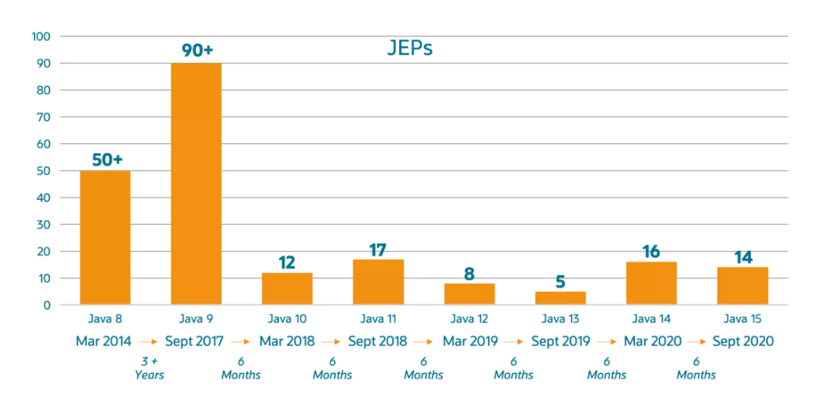
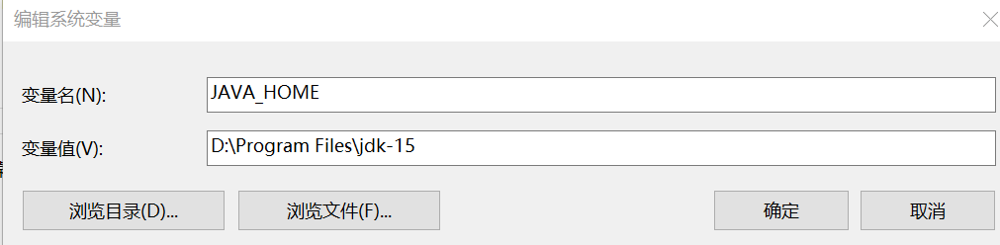
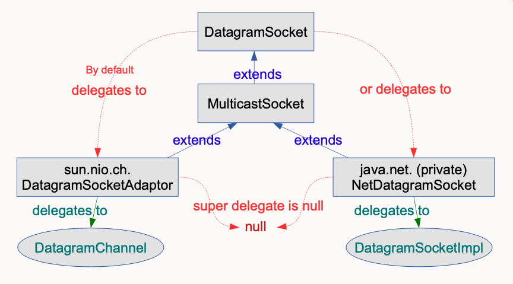

JDK 15已经于2020年9月15日如期发布。本文介绍JDK 15新特性。

<!-- more -->

## 发布版本说明

根据发布的规划，这次发布的 JDK 15 将是一个短期的过度版，只会被 Oracle 支持（维护）6 个月，直到明年 3 月的 JDK 16 发布此版本将停止维护。而 Oracle 下一个长期支持版（LTS 版）会在明年的 9 月份候发布（Java 17），LTS 版每 3 年发布一个，上一次长期支持版是 18 年 9 月发布的 JDK 11。 下图展示了各个版本的发布历史。




## 安装包下载

主要分为OpenJDK版本和Oracle版本，下载地址如下：

* OpenJDK版本：<https://jdk.java.net/15/>
* Oracle版本：<http://www.oracle.com/technetwork/java/javase/downloads/index.html>


上述版本，如果是个人学习用途，则差异不大。但如果是用于商业用途，则需要仔细看好相关的授权。Oracle JDK根据二进制代码许可协议获得许可，而OpenJDK根据GPL v2许可获得许可。 


## 安装、验证

本例子以OpenJDK版本为例。解压安装包`openjdk-15_windows-x64_bin.zip`到任意位置。

设置系统环境变量“JAVA_HOME”，如下图所示。





在用户变量“Path”中，增加“%JAVA_HOME%\bin”。


安装完成后，执行下面命令进行验证：


```
>java -version
openjdk version "15" 2020-09-15
OpenJDK Runtime Environment (build 15+36-1562)
OpenJDK 64-Bit Server VM (build 15+36-1562, mixed mode, sharing)
```

更多有关Java的基本知识，可以参阅《[Java核心编程](https://item.jd.com/12868796.html)》这本书，描述的非常详细。


## JDK 15 新特性说明

JDK 15 为用户提供了14项主要的增强/更改，包括一个孵化器模块，三个预览功能，两个不推荐使用的功能以及两个删除功能。

### 1. EdDSA 数字签名算法

新加入 Edwards-Curve 数字签名算法（EdDSA）实现加密签名。在许多其它加密库（如 OpenSSL 和 BoringSSL）中得到支持。与 JDK 中的现有签名方案相比，EdDSA 具有更高的安全性和性能。这是一个新的功能。


使用示例如下：

```java
// example: generate a key pair and sign
KeyPairGenerator kpg = KeyPairGenerator.getInstance("Ed25519");
KeyPair kp = kpg.generateKeyPair();
// algorithm is pure Ed25519
Signature sig = Signature.getInstance("Ed25519");
sig.initSign(kp.getPrivate());
sig.update(msg);
byte[] s = sig.sign();

// example: use KeyFactory to contruct a public key
KeyFactory kf = KeyFactory.getInstance("EdDSA");
boolean xOdd = ...
BigInteger y = ...
NamedParameterSpec paramSpec = new NamedParameterSpec("Ed25519");
EdECPublicKeySpec pubSpec = new EdECPublicKeySpec(paramSpec, new EdPoint(xOdd, y));
PublicKey pubKey = kf.generatePublic(pubSpec);
```


有关EdDSA 数字签名算法的详细内容见[RFC 8032](https://tools.ietf.org/html/rfc8032)规范。


### 2. 封闭类（预览特性）

可以是封闭类和或者封闭接口，用来增强 Java 编程语言，防止其他类或接口扩展或实现它们。

有了这个特性，意味着以后不是你想继承就继承，想实现就实现了，你得经过允许才行。

示例如下：

```java
public abstract sealed class Student
    permits ZhangSan, LiSi, ZhaoLiu {
    ...
        
}
```

类 Student 被 sealed 修饰，说明它是一个封闭类，并且只允许指定的 3 个子类继承。

### 3. 隐藏类

此功能可帮助需要在运行时生成类的框架。框架生成类需要动态扩展其行为，但是又希望限制对这些类的访问。隐藏类很有用，因为它们只能通过反射访问，而不能从普通字节码访问。此外，隐藏类可以独立于其他类加载，这可以减少框架的内存占用。这是一个新的功能。

### 4. 移除了 Nashorn JavaScript 脚本引擎


移除了 Nashorn JavaScript 脚本引擎、APIs，以及 jjs 工具。这些早在 JDK 11 中就已经被标记为 deprecated 了，JDK 15 被移除就很正常了。

Nashorn 是 JDK 1.8 引入的一个 JavaScript 脚本引擎，用来取代 Rhino 脚本引擎。Nashorn 是 ECMAScript-262 5.1 的完整实现，增强了 Java 和 JavaScript 的兼容性，并且大大提升了性能。

那么为什么要移除？

官方的解释是主要的：随着 ECMAScript 脚本语言的结构、API 的改编速度越来越快，维护 Nashorn 太有挑战性了，所以……。


### 5. 重新实现 DatagramSocket API

重新实现旧版 DatagramSocket API，更简单、更现代的实现来代替java.net.DatagramSocket和java.net.MulticastSocketAPI 的基础实现，提高了 JDK 的可维护性和稳定性。

新的底层实现将很容易使用虚拟线程，目前正在 Loom 项目中进行探索。这也是 JEP 353 的后续更新版本，JEP 353 已经重新实现了 Socket API。




### 6. 准备禁用和废除偏向锁

在 JDK 15 中，默认情况下禁用偏向锁（Biased Locking），并弃用所有相关的命令行选项。

后面再确定是否需要继续支持偏向锁，国为维护这种锁同步优化的成本太高了。


### 7. 模式匹配（第二次预览）

第一次预览是 JDK 14 中提出来的，点击[这里](https://waylau.com/jdk-14-released/)查看我之前写的详细教程。

Java 14 之前用法：

```java
if (obj instanceof String) {
    String s = (String) obj;
    // 使用s
}
```
Java 14之后的用法：

```java
if (obj instanceof String s) {
    // 使用s
}
```

Java 15 并没有对此特性进行调整，继续预览特性，只是为了收集更多的用户反馈，可能还不成熟吧。


### 8. ZGC 功能转正

ZGC是一个可伸缩、低延迟的垃圾回收器。

ZGC 已由JEP 333集成到JDK 11 中，其目标是通过减少 GC 停顿时间来提高性能。借助 JEP 377，JDK 15 将 ZGC 垃圾收集器从预览特性变更为正式特性而已，没错，转正了。

这个 JEP 不会更改默认的 GC，默认仍然是 G1。

### 9. 文本块功能转正

文本块，是一个多行字符串，它可以避免使用大多数转义符号，自动以可预测的方式格式化字符串，并让开发人员在需要时可以控制格式。

文本块最早准备在 JDK 12 添加的，但最终撤消了，然后在 JDK 13 中作为预览特性进行了添加，然后又在 JDK 14 中再次预览，在 JDK 15 中，文本块终于转正，暂不再做进一步的更改。


Java 13 之前用法，使用one-dimensional的字符串语法：

```java
String html = "<html>\n" +
              "    <body>\n" +
              "        <p>Hello, world</p>\n" +
              "    </body>\n" +
              "</html>\n";
```
Java 13 之后用法，使用two-dimensional文本块语法：

```java
String html = """
              <html>
                  <body>
                      <p>Hello, world</p>
                  </body>
              </html>
              """;
```


### 10. Shenandoah 垃圾回收算法转正
Shenandoah 垃圾回收从实验特性变为产品特性。这是一个从 JDK 12 引入的回收算法，该算法通过与正在运行的 Java 线程同时进行疏散工作来减少 GC 暂停时间。Shenandoah 的暂停时间与堆大小无关，无论堆栈是 200 MB 还是 200 GB，都具有相同的一致暂停时间。


JDK 15 Shenandoah垃圾收集器从预览特性变更为正式特性而已，没错，又是转正了。

### 11. 移除了 Solaris 和 SPARC 端口。

移除了 Solaris/SPARC、Solaris/x64 和 Linux/SPARC 端口的源代码及构建支持。这些端口在 JDK 14 中就已经被标记为 deprecated 了，JDK 15 被移除也不奇怪。


### 12. 外部存储器访问 API（二次孵化）

这个最早在 JDK 14 中成为孵化特性，JDK 15 继续二次孵化并对其 API 有了一些更新。

目的是引入一个 API，以允许 Java 程序安全有效地访问 Java 堆之外的外部内存。这同样是 Java 14 的一个预览特性。

### 13. Records Class（二次预览）
Records Class 也是第二次出现的预览功能，它在 JDK 14 中也出现过一次了，使用 Record 可以更方便的创建一个常量类，使用的前后代码对比如下。

旧写法：

```java
class Point {
    private final int x;
    private final int y;
 
    Point(int x, int y) { 
        this.x = x;
        this.y = y;
    }
 
    int x() { return x; }
    int y() { return y; }
 
    public boolean equals(Object o) { 
        if (!(o instanceof Point)) return false;
        Point other = (Point) o;
        return other.x == x && other.y = y;
    }
 
    public int hashCode() {
        return Objects.hash(x, y);
    }
 
    public String toString() { 
        return String.format("Point[x=%d, y=%d]", x, y);
    }
}
```

新写法：

```java
record Point(int x, int y) { }
```

也就是说在使用了 record 之后，就可以用一行代码编写出一个常量类，并且这个常量类还包含了构造方法、toString()、equals() 和 hashCode() 等方法。

### 14. 废除 RMI 激活


废除 RMI 激活，以便在将来进行删除。需要说明的是，RMI 激活是 RMI 中一个过时的组件，自 Java 8 以来一直是可选的。

## 参考引用

* 本文同步至: <https://waylau.com/jdk-15-released/>
* <https://jdk.java.net/15/release-notes>
* <https://openjdk.java.net/projects/jdk/15/>
* <https://openjdk.java.net/projects/jdk/15/spec/>
* 《[Java核心编程](https://item.jd.com/12868796.html)》
* <https://github.com/waylau/modern-java-demos>