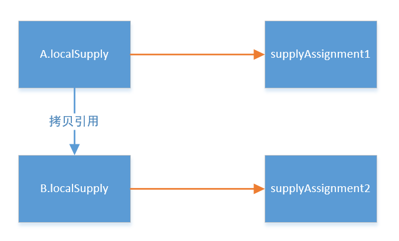
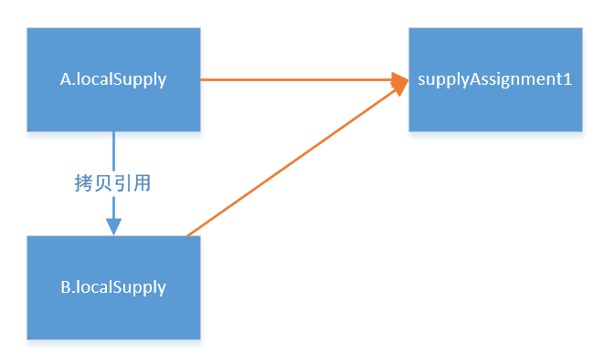

正常情况下，在Java中入参是不建议用做返回值的。除了造成代码不易理解、语义不清等问题外，可能还埋下了陷阱等你入坑。

<!-- more -->


## 问题背景
 

比如有这么一段代码：

 
```java
@Named
public class AService {   
private SupplyAssignment localSupply = new SupplyAssignment();
    @Inject
    private BService bervice;

    public List<Supply> calcSupplyAssignment()
       List<Supply> supplyList = bService.getLocalSupplyList(this.localSupply);
        …
       return supplyList;
    }
}
```

上面代码，服务A希望调用服务B，以获取supplyList，但同时，服务A又希望修改localSupply的状态值，未能避免修改calcSupplyAssignment接口的（不想改返回的类型），将localSupply作为了入参但同时也用作了返回值。

 

服务B代码如下：

 
```java
@Named
public class BService {   

public List<Supply> getLocalSupplyList (SupplyAssignment localSupply)
    SupplyAssignment supplyAssignment = this.getSupplyAssignment();
        // 希望localSupply被重新赋值后返回
        localSupply = supplyAssignment;
        …
        return supplyList;

    }
}
```
 

 

在服务B代码内部，服务A的入参localSupply被传入，希望重新被supplyAssignment赋值而后返回新值。然而，这样做是无效的。

 

## 问题原因
 

先来看下编程语言中关于参数传递的类型：

 

* 值传递（pass by value）是指在调用函数时将实际参数复制一份传递到函数中，这样在函数中如果对参数进行修改，将不会影响到实际参数。
* 引用传递（pass by reference）是指在调用函数时将实际参数的地址直接传递到函数中，那么在函数中对参数所进行的修改，将影响到实际参数。


因为Java程序设计语言是采用的值传递，因为Java没有指针的概念。也就是说方法得到的是所有参数值的一个拷贝，方法并不能修改传递给它的任何参数变量的内容。


因此，上述代码中，服务A调用服务B时，服务B的参数localSupply实际上是服务A的localSupply的一个拷贝，当然，这两个都是指向了同一个地址对象supplyAssignment1。


当在服务B内部对参数localSupply进行重新赋值是localSupply = supplyAssignment，实际上，只是对B的参数localSupply做了从新赋值，B的参数localSupply会指向一个新的地址对象supplyAssignment2。



从上图可以清晰看到，因此，服务A的localSupply和B的参数localSupply已经指向了不同的对象了，对B的参数localSupply做任何的修改，都不会影响服务A的localSupply的原值。这就是问题的原因，你希望服务B来修改服务A入参的状态，并将改后的值返回给服务A，但并不奏效。

 

## 解决方案

### 方案1：入参不要用作返回值

当然，这个是最清晰的且易于理解的，但这会导致有的接口的返回类型产生变化。

有时确实想要入参做返回值，那看方案2。

 
### 方案2：入参不要赋值新对象

这个方案就是直接在入参的对象上做状态的修改，而不要去赋值新对象。还是这个图：



在这个图中，只要我们是一直在B的参数localSupply修改的是supplyAssignment1的状态值，那结果就能反馈到服务A的localSupply上。如何实现？看下下面代码：

 
```java
@Named
public class BService {   

    public List<Supply> getLocalSupplyList (SupplyAssignment localSupply)
        
        SupplyAssignment supplyAssignment = this.getSupplyAssignment();

        // 针对localSupply不能新建引用，只能重新赋值属性
        BeanUtils.copyProperties(supplyAssignment, localSupply);
        …
        return supplyList;

    }

}
```


在上面的方法中，我们用到了Spring的工具类BeanUtils，该类的copyProperties方法的实质是将supplyAssignment的属性值，赋值到了localSupply的属性上。这意味着我们是修改的B的参数localSupply上的属性，而并未新建对象。


## 参考引用

* 原文同步至 <https://waylau.com/trap-in-java-use-param-for-return/>
*  [Java核心编程](https://github.com/waylau/modern-java-demos)