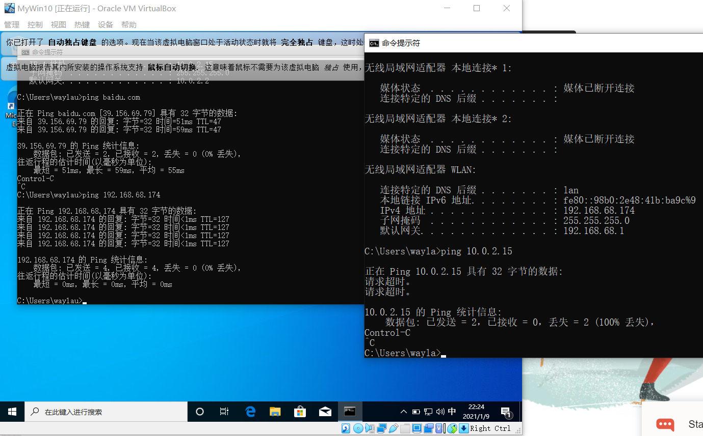
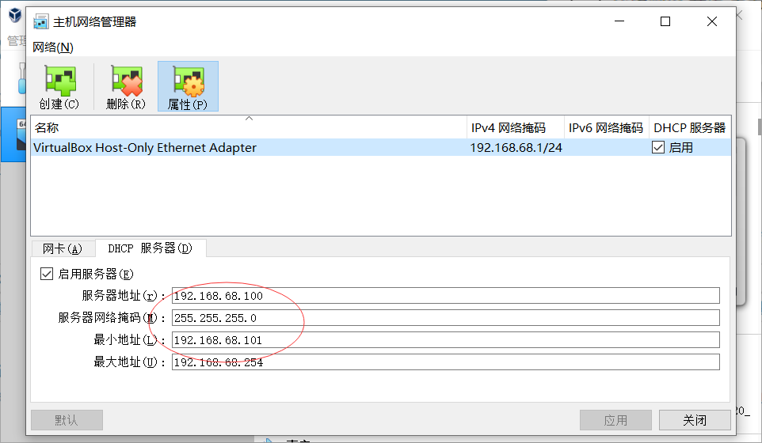
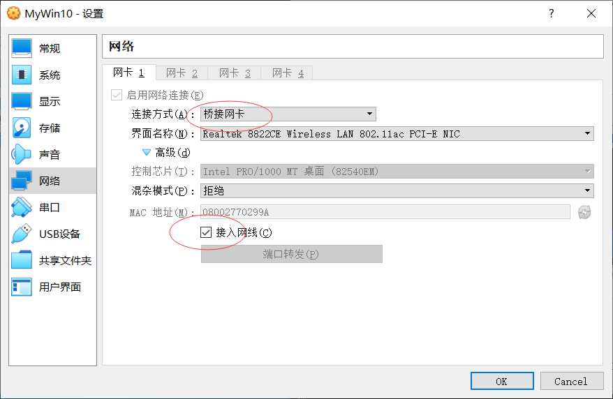
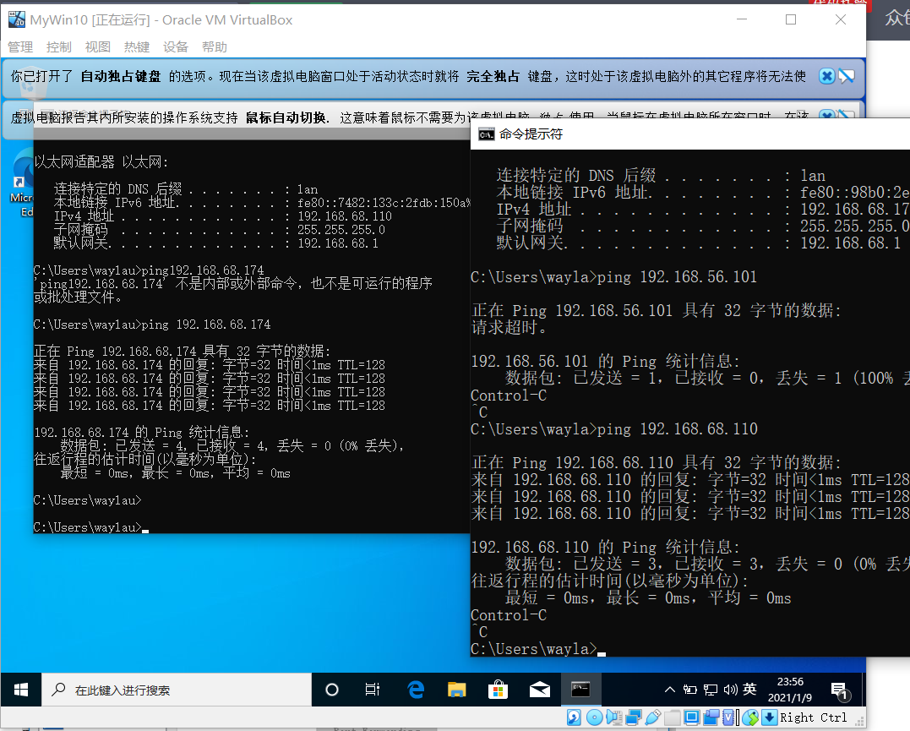

 
VirtualBox 是一款开源虚拟机软件。本文介绍在安装Windows时，如何配置网络。

<!-- more -->

安装方式见<https://waylau.com/categories/#VirtualBox>

## 问题

按照默认的配置进行了安装，默认情况下，虚拟机可以上网，可以ping通宿主机，但宿主机没法ping通虚拟机。

## 解决

解决方式是：

1. 启用DHCP服务器：网络地址跟宿主的网段设成一致

2. 连接方式：桥接网卡

## 结果

设置完成之后，可以看到宿主和虚拟机在同一个网段了，都可以上网，都可以相互ping通。

