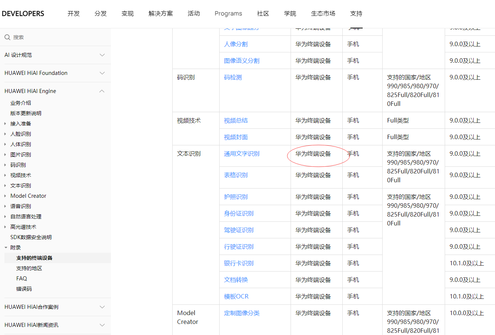

本文介绍了如何在Android Studio中搭建、开发HMS Core的第一个应用。内容涉及HMS Core中的HUAWEI HiAI，以及开发必备工具——HMS Toolkit插件。


<!-- more -->


## 下载、安装Android Studio

这个自然不用说，Android Studio是开发Android 应用的必备工具。

为了体验Android 11，从未做过Android的我，从下载Android Studio，到配置环境、设置Proxy、安装Gradle、设置Maven镜像、安装SDK、安装模拟器等等花了我8个小时。最终将HelloWorld应用跑来起只花了4分钟。

受限于国内网络环境，确实有很多坑，但好在都一一解决了。Android Studio开发Android应用，效果还是很惊艳的！

详细过程，可见视频 （https://www.bilibili.com/video/BV1jh411S7CY/） 这里不再赘述。

## 安装HMS Toolkit插件

主要有两种安装方式。离线安装和在线安装。


### 离线安装

找到插件下载地址：https://developer.huawei.com/consumer/cn/doc/development/Tools-Library/toolkit-download-0000001050148172

下载最新的插件包。
 

通过“Install Plugin from Disk”方式，来安装上述插件。


### 在线安装

也可以直接在插件市场，进行查找“HMS Toolkit”关键字来进行安装。

 


## 使用HMS Toolkit插件

安装完成之后，就能在菜单栏看到“HMS”选项列表了。


 
上述安装过程，可以见视频：https://www.bilibili.com/video/BV1NA411V7ix/


## 创建一个HiAi项目

通过Android Studio，创建了一个名为HuaweiHmsCoreHiAi的项目。这里需要注意的是，由于华为终端设备最高只支持Android 10，因此，创建项目时，选择Android 10的API，否则应用无法在华为远程设备终端里面运行，这个是后话。

## 修改项目级“build.gradle”文件

需要添加华为的Maven仓地址maven `{url 'https://developer.huawei.com/repo/'}`，完整内容如下：


```gradle
// Top-level build file where you can add configuration options common to all sub-projects/modules.
buildscript {
    repositories {
        google()
        jcenter()
        maven {url 'https://developer.huawei.com/repo/'}
    }
    dependencies {
        classpath "com.android.tools.build:gradle:4.1.3"

        // NOTE: Do not place your application dependencies here; they belong
        // in the individual module build.gradle files
    }
}

allprojects {
    repositories {
        google()
        jcenter()
        maven {url 'https://developer.huawei.com/repo/'}
    }
}

task clean(type: Delete) {
    delete rootProject.buildDir
}
```

## 修改应用级的“build.gradle”文件

添加如下以下：

```gradle
// HiAI
implementation 'com.huawei.hiai.hiai-engine:huawei-hiai-vision:11.0.1.300'
implementation 'com.huawei.hiai.hiai-engine:huawei-hiai-pdk:11.0.1.300'
implementation 'com.huawei.hiai.hiai-engine:huawei-hiai-nlu:11.0.1.300'
implementation 'com.huawei.hiai.hiai-engine:huawei-hiai-asr:11.0.1.300'

// GSON
implementation group: 'com.google.code.gson', name: 'gson', version: '2.8.6'
```

完整内容如下：

```gradle
plugins {
    id 'com.android.application'
}

android {
    compileSdkVersion 30
    buildToolsVersion "30.0.3"

    defaultConfig {
        applicationId "com.waylau.android.huaweihmscorehiai"
        minSdkVersion 29
        targetSdkVersion 30
        versionCode 1
        versionName "1.0"

        testInstrumentationRunner "androidx.test.runner.AndroidJUnitRunner"
    }

    buildTypes {
        release {
            minifyEnabled false
            proguardFiles getDefaultProguardFile('proguard-android-optimize.txt'), 'proguard-rules.pro'
        }
    }
    compileOptions {
        sourceCompatibility JavaVersion.VERSION_1_8
        targetCompatibility JavaVersion.VERSION_1_8
    }
}

dependencies {

    implementation 'androidx.appcompat:appcompat:1.1.0'
    implementation 'com.google.android.material:material:1.1.0'
    implementation 'androidx.constraintlayout:constraintlayout:1.1.3'
    testImplementation 'junit:junit:4.+'
    androidTestImplementation 'androidx.test.ext:junit:1.1.1'
    androidTestImplementation 'androidx.test.espresso:espresso-core:3.2.0'

    // HiAI
    implementation 'com.huawei.hiai.hiai-engine:huawei-hiai-vision:11.0.1.300'
    implementation 'com.huawei.hiai.hiai-engine:huawei-hiai-pdk:11.0.1.300'
    implementation 'com.huawei.hiai.hiai-engine:huawei-hiai-nlu:11.0.1.300'
    implementation 'com.huawei.hiai.hiai-engine:huawei-hiai-asr:11.0.1.300'

    // GSON
    implementation group: 'com.google.code.gson', name: 'gson', version: '2.8.6'
}
```

## 申明权限

权限信息如下：

```xml
<?xml version="1.0" encoding="utf-8"?>
<manifest xmlns:android="http://schemas.android.com/apk/res/android"
    package="com.waylau.android.huaweihmscorehiai">
    <uses-permission android:name="android.permission.WRITE_EXTERNAL_STORAGE"/>
    <uses-permission android:name="android.permission.READ_INTERNAL_STORAGE"/>
    <uses-permission android:name="android.permission.CAMERA"/>
    <application
        android:allowBackup="true"
        android:icon="@mipmap/ic_launcher"
        android:label="@string/app_name"
        android:roundIcon="@mipmap/ic_launcher_round"
        android:supportsRtl="true"
        android:theme="@style/Theme.HuaweiHmsCoreHiAi">
        <activity android:name=".MainActivity">
            <intent-filter>
                <action android:name="android.intent.action.MAIN" />

                <category android:name="android.intent.category.LAUNCHER" />
            </intent-filter>
        </activity>
    </application>

</manifest>
```


## UI设计

修改activity_main.xml内容如下：


```xml
<?xml version="1.0" encoding="utf-8"?>
<androidx.constraintlayout.widget.ConstraintLayout xmlns:android="http://schemas.android.com/apk/res/android"
    xmlns:app="http://schemas.android.com/apk/res-auto"
    xmlns:tools="http://schemas.android.com/tools"
    android:layout_width="match_parent"
    android:layout_height="match_parent"
    tools:context=".MainActivity">

    <TextView
        android:id="@+id/text_hello"
        android:layout_width="wrap_content"
        android:layout_height="wrap_content"
        android:text="Hello World!"
        app:layout_constraintBottom_toBottomOf="parent"
        app:layout_constraintLeft_toLeftOf="parent"
        app:layout_constraintRight_toRightOf="parent"
        app:layout_constraintTop_toTopOf="parent" />

    <Button
        android:id="@+id/button"
        android:layout_width="wrap_content"
        android:layout_height="wrap_content"
        android:text="识别"
        tools:layout_editor_absoluteX="134dp"
        tools:layout_editor_absoluteY="161dp" />

</androidx.constraintlayout.widget.ConstraintLayout>
```

上述UI布局比较简单，就是一个按钮、一个文本框，效果如下。


当点击识别按钮时，识别的本文结果会回写到本文框里。在线安装


## 核心处理逻辑

MainActivity代码如下：

```java
package com.waylau.android.huaweihmscorehiai;

import androidx.appcompat.app.AppCompatActivity;
import androidx.core.app.ActivityCompat;

import android.Manifest;
import android.content.pm.PackageManager;
import android.graphics.Bitmap;
import android.graphics.BitmapFactory;
import android.os.Build;
import android.os.Bundle;
import android.util.Log;
import android.view.View;
import android.widget.Button;
import android.widget.TextView;

import com.huawei.hiai.vision.common.ConnectionCallback;
import com.huawei.hiai.vision.common.VisionBase;
import com.huawei.hiai.vision.common.VisionCallback;
import com.huawei.hiai.vision.common.VisionImage;
import com.huawei.hiai.vision.text.TextDetector;
import com.huawei.hiai.vision.visionkit.text.Text;

public class MainActivity extends AppCompatActivity {
    private static final String TAG = "MainActivity";
    private TextView textView;

    @Override
    protected void onCreate(Bundle savedInstanceState) {
        super.onCreate(savedInstanceState);
        setContentView(R.layout.activity_main);

        // 权限申请
        requestPermissions();

        // VisionBase 初始化
        visionInit();

        textView = (TextView) findViewById(R.id.text_hello);

        final Button button = findViewById(R.id.button);
        button.setOnClickListener(new View.OnClickListener() {
            public void onClick(View v) {
                doHiAI();
            }
        });
    }

    private void doHiAI() {
        //进行detector类的初始化
        TextDetector mTextDetector = new TextDetector(MainActivity.this); // 构造Detector

        // 定义VisionImage，并传入待检测图片bitmap
        Bitmap bitmap = BitmapFactory.decodeResource(this.getResources(), R.drawable.wx);
        VisionImage image = VisionImage.fromBitmap(bitmap);

        // 定义Text类
        Text result = new Text();


        // 调用TextDetector的detect的方法，获取结果
        int result_code = mTextDetector.detect(image, result, new VisionCallback() {

            @Override
            public void onResult(Object o) {
                Log.i(TAG, "result: " + result.getValue());

                // 结果回写到界面
                textView.setText(result.getValue());
            }

            @Override
            public void onError(int i) {
                Log.i(TAG, "onError: " + i);
            }

            @Override
            public void onProcessing(float v) {
                Log.i(TAG, "onProcessing: " + v);
            }
        });

        // 获取状态值
        Log.i(TAG, "result_code: " + result_code);
    }

    private void visionInit() {
        VisionBase.init(this, new ConnectionCallback() {
            @Override
            public void onServiceConnect() {
                Log.e(TAG, " onServiceConnect");
            }

            @Override
            public void onServiceDisconnect() {
                Log.e(TAG, " onServiceDisconnect");
            }
        });
    }

    private void requestPermissions() {
        try {
            if (Build.VERSION.SDK_INT >= Build.VERSION_CODES.M) {
                int permission1 = ActivityCompat.checkSelfPermission(this,
                        Manifest.permission.WRITE_EXTERNAL_STORAGE);
                int permission2 = ActivityCompat.checkSelfPermission(this,
                        Manifest.permission.CAMERA);
                if (permission1 != PackageManager.PERMISSION_GRANTED || permission2 != PackageManager
                        .PERMISSION_GRANTED) {
                    ActivityCompat.requestPermissions(this, new String[]{Manifest.permission.WRITE_EXTERNAL_STORAGE,
                            Manifest.permission.READ_EXTERNAL_STORAGE, Manifest.permission.CAMERA}, 0x0010);
                }
            }
        } catch (Exception e) {
            e.printStackTrace();
        }
    }
}
```

上述代码，

* requestPermissions()用于申请权限
* visionInit()用于初始化VisionBase
* Button按钮用于触发识别操作——doHiAI方法

doHiAI方法逻辑大概是以下几个步骤：

* 初始化TextDetector类
* 定义VisionImage并传入待检测图片bitmap
* 定义Text类
* 调用TextDetector的detect的方法，获取结果

## 运行

在res目录下，放置了一张名为wx.png的测试图片。
 


测试图片内容如下。
 


现在要运行应用，此时需要注意了。不能用Android Studio自带的模拟器运行应用，因为不支持。这个笔者试了好久，最后才在官方文档里面找到这个描述。




坑坑坑！说白了就是只能支持华为设备呗。
 

行，话不多说，此时需要祭出HMS Toolkit插件了。


 

点击Cloud Debugging，就能呼唤出华为远程设备。


设备还挺多的，但看Android版本最高只是10，这个就是为什么开篇要创建Android 10的应用。

这里我们选个nova 7 Pro试下。


点击“识别”就能对我们的测试图片进行识别了。


可以看到控制台输出内容如下：

```
2021-04-20 01:22:06.207 14755-14755/com.waylau.android.huaweihmscorehiai E/HWOCR: gOcrHandle: 0xb1e94dc83a5d513f
2021-04-20 01:22:06.207 14755-14755/com.waylau.android.huaweihmscorehiai E/HWOCR: Success to load all syms in cv_lib_ScreenShotOCREngine.so. imax ocr version:1.0 build time:2020-01-16 11:20:37.
2021-04-20 01:22:06.207 14755-14755/com.waylau.android.huaweihmscorehiai E/HWOCR: iMax OCR initialize successfully. version:imax ocr version:1.0 build time:2020-01-16 11:20:37 build time:2020-01-16 11:20:37
2021-04-20 01:22:06.208 14755-14755/com.waylau.android.huaweihmscorehiai I/HwHiAIEngine_VisionTextConfiguration: istracking: 0
2021-04-20 01:22:06.209 14755-14755/com.waylau.android.huaweihmscorehiai I/MainActivity: result_code: 700
2021-04-20 01:22:06.210 14755-14755/com.waylau.android.huaweihmscorehiai I/HwViewRootImpl: removeInvalidNode all the node in jank list is out of time
2021-04-20 01:22:06.212 14755-20341/com.waylau.android.huaweihmscorehiai I/HwHiAIEngine_VisionTextConfiguration: fromBundle isTracking:0
2021-04-20 01:22:06.223 14755-20341/com.waylau.android.huaweihmscorehiai E/HWOCR: imax ocr getOcrResultByRect start.....
2021-04-20 01:22:06.223 14755-20341/com.waylau.android.huaweihmscorehiai E/HWOCR: getOcrResultByRect infoColor info:2558 1438 5752
2021-04-20 01:22:06.223 14755-20341/com.waylau.android.huaweihmscorehiai E/HWOCR: HWOCR_LocAndRecog start.rect:[0_0_1438_2558_]
2021-04-20 01:22:06.274 14755-20341/com.waylau.android.huaweihmscorehiai E/HWOCR: imax ocr end....
2021-04-20 01:22:06.284 14755-20341/com.waylau.android.huaweihmscorehiai I/MainActivity: result: 
2021-04-20 01:22:06.285 14755-20341/com.waylau.android.huaweihmscorehiai E/HwHiAIEngine_VisionEngineBase: java.lang.reflect.InvocationTargetException
2021-04-20 01:22:06.329 14755-14755/com.waylau.android.huaweihmscorehiai E/HwVisionManagerPlugin: onServiceDisconnected: ComponentInfo{com.huawei.hiai/com.huawei.hiai.plugin.PluginService}
2021-04-20 01:22:06.329 14755-14755/com.waylau.android.huaweihmscorehiai E/MainActivity:  onServiceDisconnect
2021-04-20 01:22:07.032 14755-20328/com.waylau.android.huaweihmscorehiai W/HwApsManager: HwApsManagerService, registerCallback, start !
2021-04-20 01:22:07.035 14755-20328/com.waylau.android.huaweihmscorehiai D/Hwaps: APS: EventAnalyzed: registerCallbackInApsManagerService, mPkgName:com.waylau.android.huaweihmscorehiai; result = true
2021-04-20 01:22:07.454 14755-14755/com.waylau.android.huaweihmscorehiai D/HwVisionManagerPlugin: onServiceConnected: ComponentInfo{com.huawei.hiai/com.huawei.hiai.plugin.PluginService}
2021-04-20 01:22:07.454 14755-14755/com.waylau.android.huaweihmscorehiai E/MainActivity:  onServiceConnect
```

从上面的日志，可以看出，调用HiAI服务，返回的状态码是 700 ，证明服务是可以正常调用的。

## 遗留问题


虽然结果是能返回了，但是返回的本文结果是空的，因此界面上也是空。这个可能需要后期排除下，是咱们的图片给的不对，还是服务没有识别到图片中的文字哦。
 


## 参考引用

* 本文同步至: <https://waylau.com/develop-hms-core-hiai-app-with-android-studio/>
