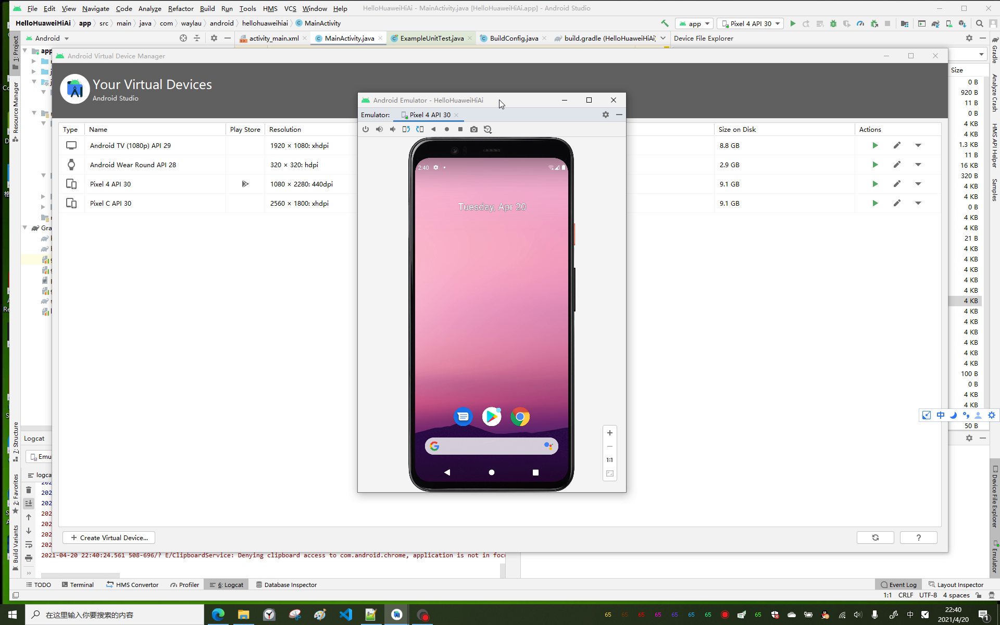
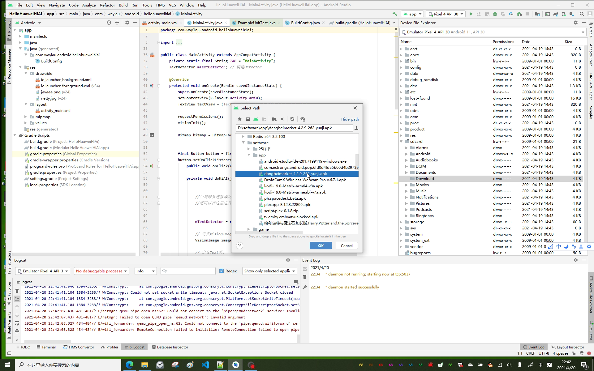
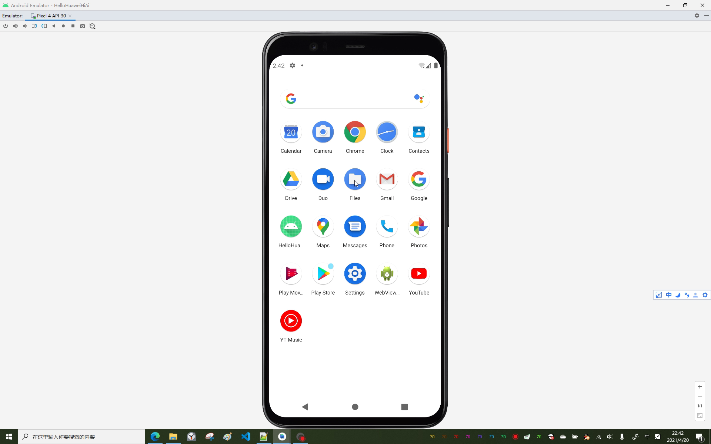
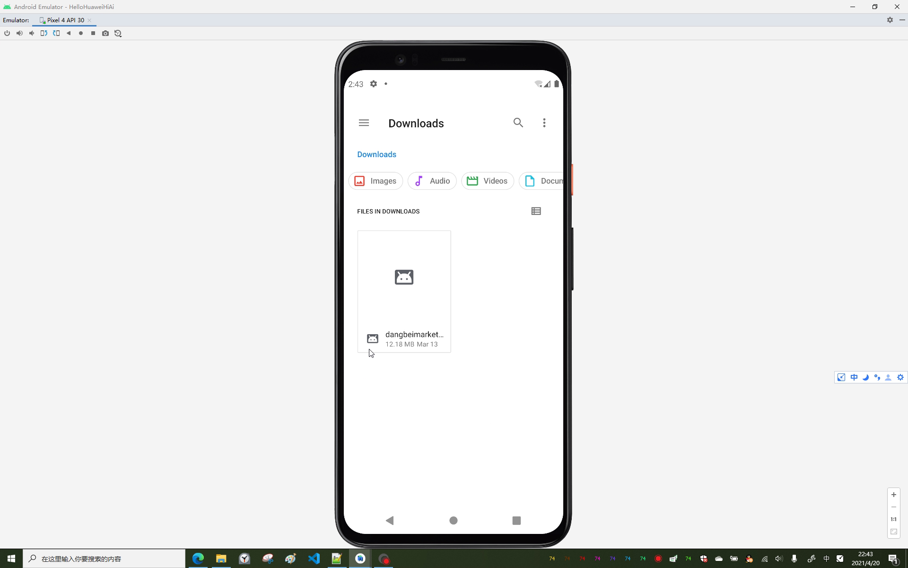
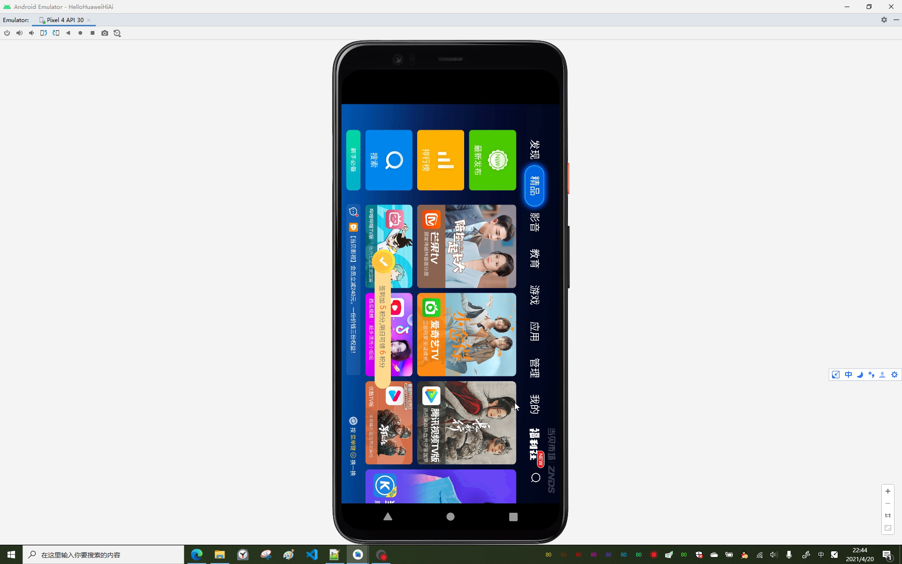
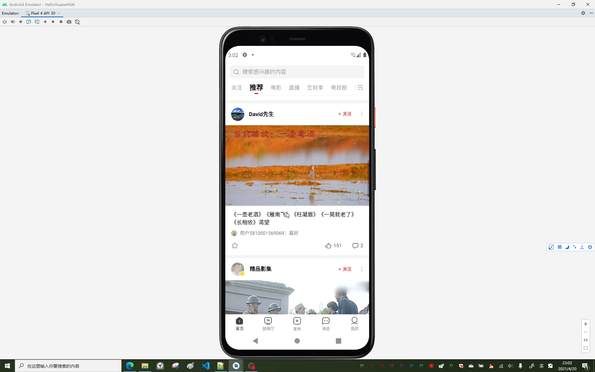
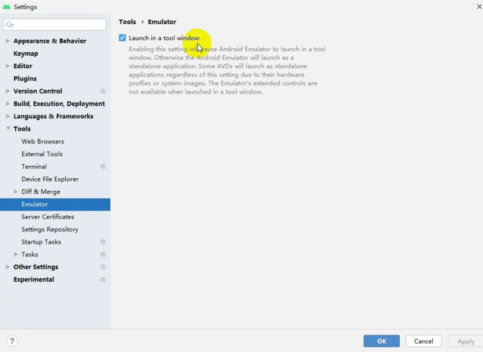
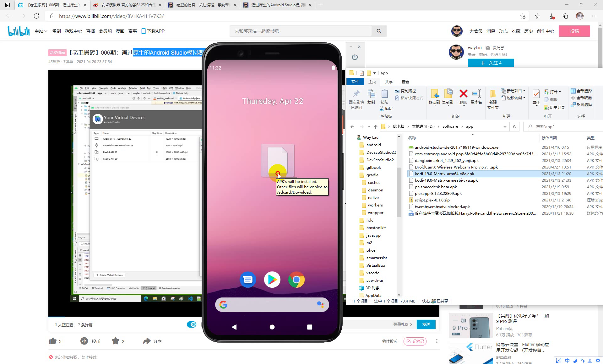

市面上有非常多的安卓模拟器，比如腾讯手游助手、夜神模拟器、蓝叠模拟器等等。这些模拟器大多面向游戏领域，也就是说方面玩家在PC上玩安卓游戏。本节介绍如何通过原生的Android Studio模拟器来安装应用。

<!-- more -->

Android Studio自带的拟器本身功能也是很强大的。实际上，上述模拟器大多也是基于Android Studio模拟器做的二次开发。

在Android Studio模拟器里面安装应用以下有几种方式：

1. 通过Device File Explorer上传apk到模拟器里面，在模拟器里面直接安装
2. 通过浏览器下载apk。推荐下载一个应用市场，后续的app都可以通过应用市场。
3. 拖动apk文件到Android模拟器直接来安装Android应用

## 上传apk到模拟器

Android Studio提供了Device File Explorer，可以通过Device File Explorer上传apk文件到模拟器。

上传完成之后，回到模拟器，找到自带的File应用。

通过File应用，就能找到我们上传的apk文件了。

点击该apk文件进行安装即可。

## 浏览器下载apk到模拟

另外一种方式，就是通过模拟器自带的浏览器去官方网站找到安装包进行下载。一般推荐是下载一个应用市场app，这样，后续的app都可以通过该应用市场进行安装了，方便很多。

比如，我这里下载了一个“安智市场”

在“安智市场”应用，找到任意的应用进行安装，比如，我这里下载了一个“西瓜视频”

以下是“西瓜视频”应用的运行情况，视频、声音都可以完美播放。

## 拖动apk文件到Android模拟器

默认情况下，是没法拖动apk文件到Android模拟器。这是因为默认Android模拟器是在窗口里面运行的。那么如何才能实现拖动apk文件到Android模拟器呢？

在设置里面，看到这一项“Launch in a tool window”如下图所示，该项是默认勾选的。

如果取掉这个勾选，重启模拟器，模拟器就会以独立运行的模式来运行，如下图所示。此时就可以支持将apk文件拖动到Android模拟器直接来安装了。

## 优缺点

* 优点： 功能比较强大；安卓版本是最新；提供的设备也比较新
* 缺点： 部分的app兼容性不够，有可能打不开（模拟器的通病）。

## 参考引用

* 本文同步至: <https://waylau.com/android-studio-emulator-install-app/>
* 视频版本，见我的B站：<https://www.bilibili.com/video/BV1KA411V7K3/> 和 <https://www.bilibili.com/video/bv1uK4y1P7TL>