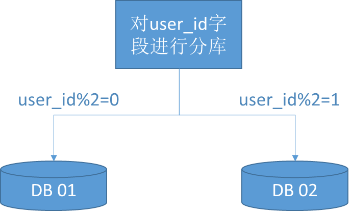

随着业务数据的增加，原有的数据库性能瓶颈凸显，以此就需要对数据库进行分库分表操作。

<!-- more -->

## 为啥需要分库分表

随着业务数据的增加，原有的数据库性能瓶颈凸显，主要体现在以下两个方面。

### IO瓶颈

IO瓶颈主要有以下几种情况：

* 第一种：磁盘读IO瓶颈，热点数据太多，数据库缓存放不下，每次查询时会产生大量的IO，降低查询速度。这种情况适合采用分库和垂直分表。
* 第二种：网络IO瓶颈，请求的数据太多，网络带宽不够。这种情况适合采用分库。

### CPU瓶颈

CPU瓶颈主要有以下几种情况：

* 第一种：SQL问题，如SQL中包含join，group by，order by，非索引字段条件查询等，增加CPU运算的操作。这种情况适合采用SQL优化，建立合适的索引，或者把一些SQL操作移到在业务层中台代码中去做业务计算。
* 第二种：单表数据量太大，查询时扫描的行太多，SQL效率低，CPU率先出现瓶颈这种情况适合采用水平分表。

综上，大多数情况下，需要使用数据库的分库分表方案来解决性能瓶颈。

## 理解分库分表

“分库分表”本质就是把数据分到不同的数据库或者分到不同的数据表上，以减轻单库或者单表的数据量，从而降低访问单库或者单表时的数据压力。

在理解了分库分表的重要性之后，那么来理解下分库分表的实现原理。

### 水平分库

水平分库是指，以字段为依据，按照一定策略（hash、range等），将一个库中的数据拆分到多个库中。

比如以下的例子。对用户表进行水平分库，分库的策略是对user_id字段进行取模。如果取模结果是0，则放入数据库01；如果取模结果是1，则放入数据库02。

水平分库的结果是：

* 每个库的结构都一样；
* 每个库的数据都不一样，没有交集；
* 所有库的并集是全量数据。

水平分库适用的场景是，系统绝对并发量上来了，分表难以根本上解决问题，并且还没有明显的业务归属来垂直分库。

### 水平分表

水平分表是指，以字段为依据，按照一定策略（hash、range等），将一个表中的数据拆分到多个表中。

比如以下的例子。对用户表user_t进行水平分表，分库的策略是对user_id字段进行取模。如果取模结果是0，则放入user_t_01表；如果取模结果是1，则放入user_t_02表。

水平分表的结果是：

* 每个表的结构都一样；
* 每个表的数据都不一样，没有交集；
* 所有表的并集是全量数据。

水平分表适用的场景是，系统绝对并发量并没有上来，只是单表的数据量太多，影响了SQL效率，加重了CPU负担，以至于成为瓶颈。

### 垂直分库

垂直分库是指，以表为依据，按照业务归属不同，将不同的表拆分到不同的库中。

比如以下的例子。用户业务相关的表放入到01库，订单业务相关的表放入到02库。

垂直分库的结果是：

* 每个库的结构都不一样；
* 每个库的数据也不一样，没有交集；
* 所有库的并集是全量数据。

垂直分库适用的场景是，系统绝对并发量上来了，并且可以抽象出单独的业务模块。

到这一步，基本上就可以服务化了。例如，随着业务的发展一些公用的配置表、字典表等越来越多，这时可以将这些表拆到单独的库中，甚至可以服务化。再有，随着业务的发展孵化出了一套业务模式，这时可以将相关的表拆到单独的库中，甚至可以服务化或者微服务化。

### 垂直分表

垂直分表是指，以字段为依据，按照字段的活跃性，将表中字段拆到不同的表（主表和扩展表）中。

垂直分表的结果是：

* 每个表的结构都不一样；
* 每个表的数据也不一样，一般来说，每个表的字段至少有一列交集，一般是主键，用于关联数据；
* 所有表的并集是全量数据。

垂直分表适用的场景是，系统绝对并发量并没有上来，表的记录并不多，但是字段多，并且热点数据和非热点数据在一起，单行数据所需的存储空间较大。以至于数据库缓存的数据行减少，查询时会去读磁盘数据产生大量的随机读IO，产生IO瓶颈。

比如以下“新闻头条”应用的例子，“新闻头条”分为了新闻列表页和新闻详情页。垂直分表的拆分原则是将热点数据（比如新闻的标题）放在一起作为主表（news_t），非热点数据（新闻的内容）放在一起作为扩展表（news_ext_t）。这样更多的热点数据就能被缓存下来，进而减少了随机读IO。拆了之后，要想获得全部数据就需要关联两个表来取数据。

需要注意的是，垂直分表关联两个表查询的时候，避免使用join，因为join不仅会增加CPU负担并且会讲两个表耦合在一起（必须在一个数据库实例上）。关联数据，尽量是放在业务层中台来做。

## 分库分表的几种分配策略

### hash取模

比如，对用户表user_t进行水平分表，分库的策略是对user_id字段进行取模。如果取模结果是0，则放入user_t_01表；如果取模结果是1，则放入user_t_02表。

### 范围分片（range）

比如，user_id从1到10000作为一个分片，从10001到20000作为另一个分片。

### 地理位置分片

华南区一个分片，华北一个分片。

### 时间分片

按月、季度、年分片等等，可以做到冷热数据。

比如，今年内的数据一般就是热数据，而往年的数据就是冷数据。那么可以分为 user_t_2021、user_t_2020等表，user_t_2021是热数据，user_t_2020为冷数据。

## 参考引用

* 本文同步至: <https://waylau.com/database-sharding/>
* <https://shardingsphere.apache.org/document/current/en/overview/>

