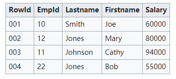
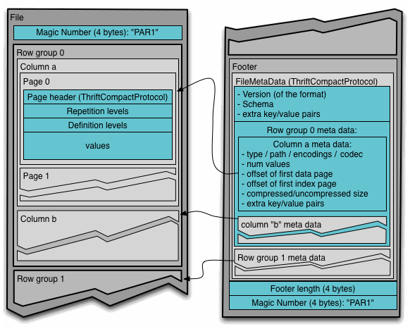

Apache Parquet是Hadoop生态系统中的任何项目都可以使用的列式存储格式。Parquet是语言和平台无关的。Parquet最初是由Twitter和Cloudera合作开发完成并开源，2015年5月从Apache的孵化器里毕业成为Apache顶级项目。


<!-- more -->
在Spark项目中，Parquet也是其默认的数据源。可以通过spark.sql.sources.default，修改默认数据源配置。

## 什么是列式存储格式

在关系型数据库中，列存储与行存储的实际使用几乎没有什么不同。列式数据库和行数据库都可以使用传统的数据库查询语言，如SQL来加载数据和执行查询。行数据库和列数据库都可以成为系统中的主干，为通用的提取、转换、加载（ETL）和数据可视化工具提供数据服务。但是，通过将数据存储在列而不是行中，数据库可以更准确地访问回答查询所需的数据，而不是扫描和丢弃行中不需要的数据。

比如，以下是一张关系数据库管理系统提供表示列和行的二维表的数据。




上面这种二维格式是一个抽象。在实际实现中，存储硬件要求数据序列化为一种或另一种形式。

涉及硬盘的最昂贵的操作是搜索。为了提高整体性能，相关数据应以尽量减少搜索数量的方式存储。这被称为引用的局部性，基本概念出现在许多不同的上下文中。硬盘被组织成一系列固定大小的块，通常足以存储表的几行。通过组织表的数据，使行适合这些块，并将相关行分组到顺序块上，在许多情况下，需要读取或查找的块数量以及查找的数量都会最小化。

### 面向行的系统

存储表的常见方法是序列化每一行数据，如下所示：

```
001:10,Smith,Joe,60000;
002:12,Jones,Mary,80000;
003:11,Johnson,Cathy,94000;
004:22,Jones,Bob,55000;
```


当数据插入表中时，它将被分配一个内部ID，即系统内部用于引用数据的Rowid。在这种情况下，记录具有独立于用户分配的Empid的顺序Rowid。

面向行的系统旨在以尽可能少的操作有效地返回整个行或记录的数据。这与系统试图检索有关特定对象的信息的常见用例匹配。通过将记录的数据与相关记录存储在磁盘上的单个块中，系统可以以最少的磁盘操作快速检索记录。

与少量特定记录相比，面向行的系统在对整表集合操作方面效率不高。例如，为了在示例表中查找工资在40,000到50,000之间的所有记录，DBMS必须完全扫描整个表，寻找匹配的记录。虽然上面显示的示例表可能适合单个磁盘块，但即使有几百行的表也不适合，而且需要多个磁盘操作来检索数据并检查数据。

为了提高这类操作的性能（这些操作非常常见，通常是使用DBMS的要点），大多数DBMS都支持使用数据库索引，这些索引将一组列的所有值以及Rowid指针存储回原始表中。工资列上的索引如下所示：

```
55000:004;
60000:001;
80000:002;
94000:003;
```

由于索引只存储单个数据，而不是整个行，因此索引通常比主表存储小得多。扫描这组较小的数据可以减少磁盘操作的数量。如果索引被大量使用，它可以显著减少常见操作的时间。但是，维护索引会增加系统的开销，特别是当新数据写入数据库时。记录不仅需要存储在主表中，而且任何附加的索引也必须更新。

索引显著提高大型数据集性能的主要原因是，一个或多个列上的数据库索引通常按值排序，这使得范围查询操作（如上面的“查找工资在40,000到50,000之间的所有记录”示例）非常快（时间复杂度较低度）。

许多面向行的数据库被设计成完全适合RAM，这是一个内存数据库。这些系统不依赖于磁盘操作，并且对整个数据集具有同等时间访问权限。这减少了对索引的需求，因为为了典型的聚合目的，它需要相同数量的操作来完全扫描原始数据作为完整索引。因此，这样的系统可能更简单、更小，但只能管理适合内存的数据库。

### 面向列的系统

面向列的数据库将列的所有值序列化在一起，然后将下一列的值序列化在一起，依此类推。对于我们的示例表，数据将以这种方式存储：

```
10:001,12:002,11:003,22:004;
Smith:001,Jones:002,Johnson:003,Jones:004;
Joe:001,Mary:002,Cathy:003,Bob:004;
60000:001,80000:002,94000:003,55000:004;
```

上面任何一列都与面向行的系统中索引的结构更紧密地匹配。这可能会导致混淆，从而导致错误地认为面向列的存储“实际上只是”每个列上都有索引的行存储。然而，数据的映射有很大的不同。在面向行的索引系统中，主键是从索引数据映射的Rowid。在面向列的系统中，主键是从Rowid映射而来的数据。我们从一个例子来理解这两者的差异，上面的两个“Jones” 数据项被压缩成一个具有两个Rowid的数据项：


```
…;Smith:001;Jones:002,004;Johnson:003;…
```


在面向列的系统在运行中是否会更高效，在很大程度上取决于自动化的工作负载。检索给定对象（整行）的所有数据的操作较慢。面向行的系统可以在单个磁盘读取中检索行，而从列式数据库中收集数据需要进行大量磁盘操作。然而，这些整行操作通常很少见。在大多数情况下，仅检索有限的数据子集。例如，在通讯录应用程序中，从许多行中收集名字以构建联系人列表比读取所有数据要常见得多。这对于将数据写入数据库更加正确，特别是如果数据往往是“稀疏”的，有许多可选列。因此，尽管有许多理论上的缺点，但列存储还是表现出了出色的现实性能。

在行式存储中，一行的多列是连续的写在一起的，而在列式存储中，数据按列分开存储。由于同一列的数据类型是一样的，可以使用更高效的压缩编码进一步节约存储空间。

### 选择面向行还是面向列

分区、索引、缓存、视图、OLAP多维数据集以及事务系统，如预写日志记录或多版本并发控制，都会显著影响任一系统的物理组织。这就是说，以在线事务处理（OLTP）为中心的RDBMS系统更面向行，而以在线分析处理（OLAP）为中心的系统则是面向行和面向列的平衡。

## Parquet产生背景

Parquet的灵感来自于2010年Google发表的Dremel论文（Dremel: Interactive Analysis of Web-Scale Datasets），文中介绍了一种支持嵌套结构的存储格式，并且使用了列式存储的方式提升查询性能，在Dremel论文中还介绍了Google如何使用这种存储格式实现并行查询的，如果对此感兴趣可以参考该论文和开源实现Apache Drill（https://drill.apache.org/）。

## Parquet文件格式

Parquet文件是以二进制方式存储的，所以是不可以直接读取的，文件中包括该文件的数据和元数据，因此Parquet格式文件是自解析的。在HDFS文件系统和Parquet文件中存在如下几个概念。

* HDFS块(Block)：它是HDFS上的最小的副本单位，HDFS会把一个Block存储在本地的一个文件并且维护分散在不同的机器上的多个副本，通常情况下一个Block的大小为256M、512M等。
* HDFS文件(File)：一个HDFS的文件，包括数据和元数据，数据分散存储在多个Block中。
* 行组(Row Group)：按照行将数据物理上划分为多个单元，每一个行组包含一定的行数，在一个HDFS文件中至少存储一个行组，Parquet读写的时候会将整个行组缓存在内存中，所以如果每一个行组的大小是由内存大的小决定的，例如记录占用空间比较小的Schema可以在每一个行组中存储更多的行。
* 列块(Column Chunk)：在一个行组中每一列保存在一个列块中，行组中的所有列连续的存储在这个行组文件中。一个列块中的值都是相同类型的，不同的列块可能使用不同的算法进行压缩。
* 页(Page)：每一个列块划分为多个页，一个页是最小的编码的单位，在同一个列块的不同页可能使用不同的编码方式。

一个Parquet文件的内容由Header、Data Block和Footer三部分组成。在文件的首尾各有一个内容为PAR1的Magic Number，用于标识这个文件为Parquet文件。Header部分就是开头的Magic Number。

Data Block是具体存放数据的区域，由多个Row Group组成，每个Row Group包含了一批数据。比如，假设一个文件有1000行数据，按照相应大小切分成了两个Row Group，每个拥有500行数据。每个Row Group中，数据按列汇集存放，每列的所有数据组合成一个Column Chunk。因此一个Row Group由多个Column Chunk组成，Column Chunk的个数等于列数。每个Column Chunk中，数据按照Page为最小单元来存储，根据内容分为Data Page和Dictionary Page。这样逐层设计的目的在于：

* 多个Row Group可以实现数据的并行加载
* 不同Column Chunk用来实现列存储
* 进一步分割成Page，可以实现更细粒度的数据访问

Footer部分由File Metadata、Footer Length和Magic Number三部分组成。Footer Length是一个4字节的数据，用于标识Footer部分的大小，帮助找到Footer的起始指针位置。Magic Number同样是PAR1。File Metada包含了非常重要的信息，包括Schema和每个Row Group的Metadata。每个Row Group的Metadata又由各个Column的Metadata组成，每个Column Metadata包含了其Encoding、Offset、Statistic信息等等。




通常情况下，在存储Parquet数据的时候会按照Block大小设置行组的大小，由于一般情况下每一个Mapper任务处理数据的最小单位是一个Block，这样可以把每一个行组由一个Mapper任务处理，增大任务执行并行度。Parquet文件的格式如下图所示。


## 参考引用

* 本文同步至: <https://waylau.com/about-apache-parquet/>
* <https://en.wikipedia.org/wiki/Column-oriented_DBMS>

