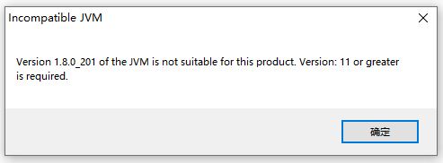

Eclipse Memory Analyzer (MAT)是一个快速且功能丰富的Java堆分析器，可帮助您发现内存泄漏并减少内存消耗。

使用内存分析器分析具有数亿个对象的生产堆转储，快速计算对象的保留大小，查看谁在阻止垃圾收集器收集对象，运行报告以自动提取泄漏嫌疑。

<!-- more -->

## 两种安装方式

有两种安装方式可以使用Memory Analyzer。

### 1. Eclipse IDE 插件方式

以插件方式在已有的Eclipse IDE 中进行安装。

插件地址如下：http://download.eclipse.org/mat/1.10.0/update-site/

### 2. 独立安装方式

独立安装的Memory Analyzer基于Eclipse RCP。如果您不想在运行堆分析的系统上安装完整的Eclipse IDE，它非常有用。因为Memory Analyzer在分析堆内存的时候比较耗费内存，而Eclipse IDE本身又是比较耗费内存的，所以推荐使用独立安装的Memory Analyzer。

安装包地址：https://www.eclipse.org/mat/downloads.php

独立安装的Memory Analyzer的独立版本所需的最低Java版本是Java 11。

要使用较旧的JDK，则只能参考插件方式。

## 如何为Memory Analyzer指定JDK



提示需要JDK 11才可以运行，但是我的环境变量配置的是JDK 8，这咋整？不想更改环境变量中的JDK配置信息，因为有其他很多软件需要JDK 8的支持。

于是想到能不能再在启动时指定JDK版本？

解决办法是，打开MAT的安装目录，有一个配置文件MemoryAnalyzer.ini。打开这个文件，在文件中指定JDK版本即可。新增两行配置：

```
-vm
D:/jalor6-dev/jdk-16.0.1+9/bin/javaw.exe
```


再次点击MemoryAnalyzer.exe，就能打开Memory Analyzer了。


## 参考

原文同步至<https://waylau.com/installation-and-use-of-eclipse-memory-analyzer/>