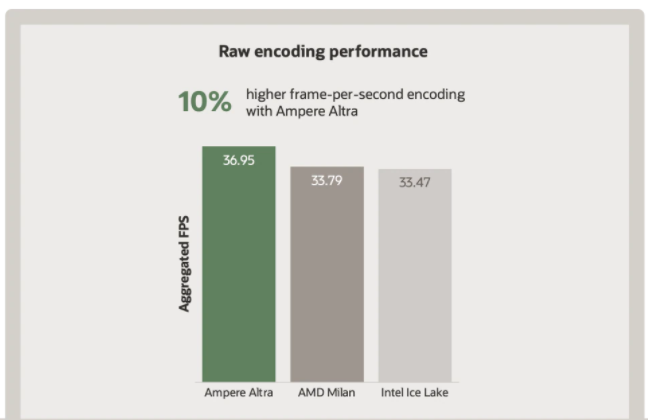
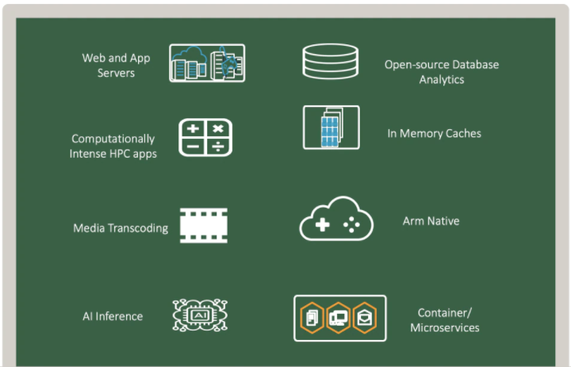

迄今为止，移动电话、物联网传感器及其他设备中已包含 1800 亿个基于 Arm 的处理器。如今，这项技术经过不断发展，已支持超大规模数据中心和云计算。基于 Arm 的处理器对于云客户极具吸引力，因为它们具备线性扩展能力、可预测的性能以及超高的核心密度和经济性。借助基于 Arm 的云计算，客户可以更加低成本地运行现有负载，构建具有卓越经济性和性能的新应用。

<!-- more -->

## 为何要选择 Arm 处理器？

通过在 Armv8 架构和 Neoverse Neoverse 系列中引入 64 位计算，Arm 与 Ampere Computing 等合作伙伴联手进入了服务器市场。而硬件虚拟化和云计算的兴起加快了这一转变步伐。在处理器行业，多 CPU 架构将再次成为常态。客户将再次拥有构建下一代应用的多样性和选择，Arm、X86 和 GPU 正处于领先地位。

Arm Neoverse N1 CPU 架构专为数据中心和云基础设施空间而设计。它提供了一个高核心数的服务器级 SoC 子系统，其强大的性能、功能和可扩展性对于加速转型至可扩展的云及边缘基础设施不可或缺。它从根本上改变了超大规模数据中心和云计算的性能方程式，与传统技术相比，可通过更少的能耗完成更多工作。

Ampere Computing 的 Altra 处理器基于 Neoverse N1 CPU 架构。Ampere 采用 N1 平台，集成了自有创新功能来打造一款专为跨超大规模云数据中心的应用而构建的 SoC。N1 Arm 处理器具备更高的线程数、更高的 CPU 频率和更大的核心密度，这有助于实现：

### 突破性的计算性能

Neoverse N1 Arm CPU 专门针对高性能和超大规模数据中心而设计和优化。这些 CPU 可通过单线程核心架构提供可持续的全频率性能，从而以一致且可预测的性能运行负载，同时实现理想的可扩展性。这些 CPU 的缓存结构适合大型、分支密集型基础设施负载。

客户现在能够以更低的成本可预测地扩展其负载。Arm 处理器（例如 Ampere 的 Altra 处理器）采用每核心单线程架构，支持您以一致且可预测的性能运行负载，同时实现理想的性能扩展。这些核心与运行在同一处理器上的其他负载的嘈杂邻居实现完全隔离。需要超高核心数量的‘纵向扩展’负载将从中受益，而‘横向扩展’负载也将从较小 VM 配置的多个实例中受益。可预测的性能也意味着月末账单具有更高的可预测性。Web 服务器、API 网关、媒体编码、AI 推断和其他受处理器限制的负载将大幅节省成本。

Riken 与 Fujitsu 联合在日本神户开发的 Fugaku 是全球最快的超级计算机，就采用了 Fujitsu 的基于 Arm 的片上系统。Arm 处理器在用于构建超级计算机的处理器架构列表中名列第一。

### 更高的安全性

Ampere Altra 处理器每核单线程处理器设计消除了潜在线程安全问题，并为客户负载提供隔离。这有助于降低因侧信道攻击而引起的风险。通过让每个核心仅运行一个线程，线程之间不会共享执行引擎、寄存器和 L1/L2 缓存，从而尽可能减少攻击面。

Arm TrustZone 是一种硬件安全扩展技术，通过内置于 CPU 中的硬件强制隔离，打造一种高效的全系统安全方案。它为基于平台安全架构 (PSA) 指导准则建立设备信任根提供了一个完美的起点。ARM TrustZone 在两个执行世界（即 Normal World 与 Secure World）之间拆分计算机资源，藉此提供安全的执行环境。

### 专门针对广泛的负载而设计

Arm 服务器端处理器（例如 Ampere Altra）旨在满足各种数据中心部署的最严苛的负载要求。

* 通用负载 — web 应用、应用服务器
* 云原生应用 — 基于 Docker 容器的应用
* 计算密集型应用 — 媒体编码、AI 推断、HPC 应用
* Arm 原生移动应用开发 — 用于开发和测试移动应用的 Android VM
* 内存中缓存和数据库 — Redis、Memcached 数据库、开源数据库

## Oracle在Arm 服务器端开发方面的努力

Arm、Ampere 以及 GitLab 和 Jenkins 等领先 ISV 正在与 Oracle 开展合作，让 Arm 服务器端开发变得简单易行且经济高效。Oracle 云基础设施 (OCI) 与众多合作伙伴开展合作，共同助力客户以超高性价比在云端转换、构建和运行基于 Arm 的应用。Ampere Altra 处理器基于 Arm aarch64 架构，现已在 OCI 上用于裸金属服务器和虚拟机 (VM)。Oracle 云基础设施 (OCI) 与众多合作伙伴开展合作，共同助力客户以超高性价比在云端转换、构建和运行基于 Arm 的应用。Ampere Altra 处理器基于 Arm aarch64 架构，现已在 OCI 上用于裸金属服务器和虚拟机 (VM)。GitLab、Jenkins、Rancher、Genymobile 等领先的 ISV 开发人员工具供应商、持续交付基金会 (CDF) 等开源组织以及 Arm 和 Ampere 等技术合作伙伴，正与 Oracle 合作提供工具和软件来构建和运行基于 Arm 的服务器端解决方案。Oracle 已经发布了支持 aarch64 的 Oracle Linux、Java 和 MySQL 发行版，让您能够快速在 Arm 计算平台上进行开发。

## Ampere Altra 简介

Ampere Altra 处理器是行业首款 80 核服务器处理器，它通过卓越的性能、可扩展性和能效来驱动新一代应用。

* 在双插槽配置中提供多达 160 个核心
* Neoverse N1 Cores Arm v8 架构
* 无嘈杂邻居问题 — 1 线程/核心
* 3.0 GHZ — 以最高频率运行所有核心
* 每一个核心上提供 64 KB L1 I-cache 和 64 KB L1 D-cache
* 高达 1TB 内存
* 相干网格网络 (CMN)
* AI 推断加速
* 7 纳米制程技术

Ampere Arm 处理器适用于通用负载以及快速发展型应用，例如数据分析、移动应用、机器学习推断、内存数据库、网络托管和云原生应用。