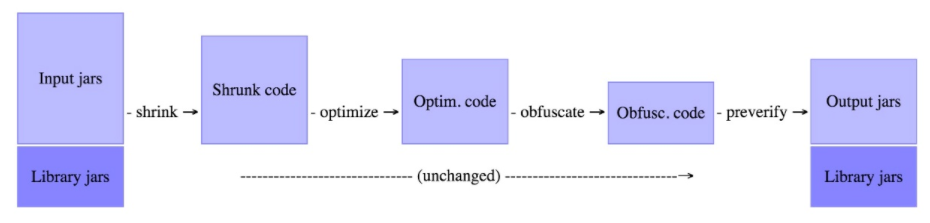
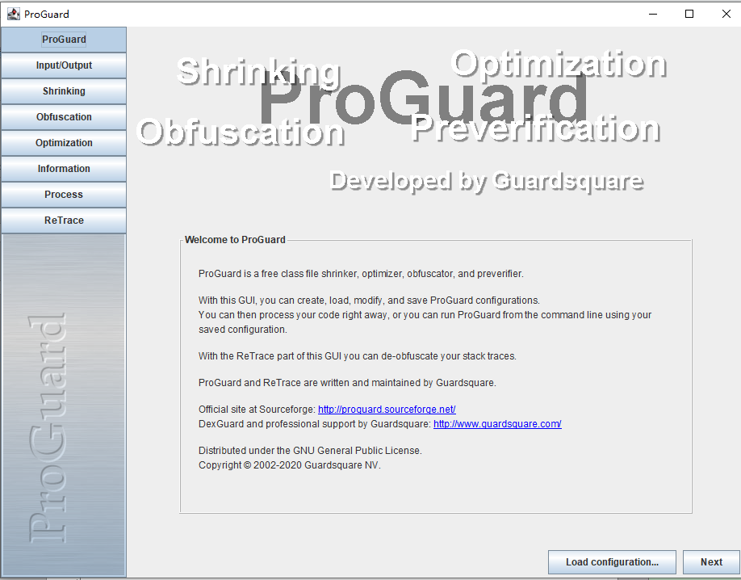
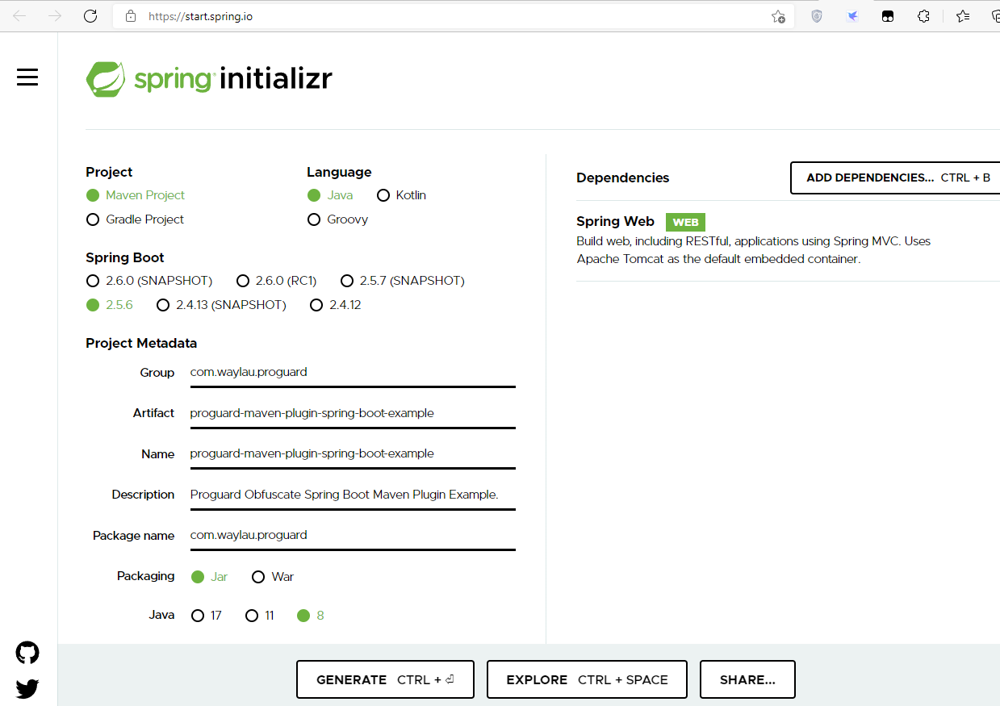
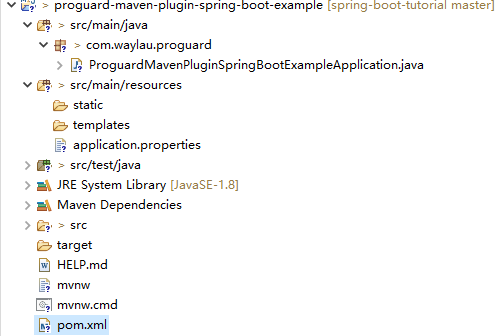
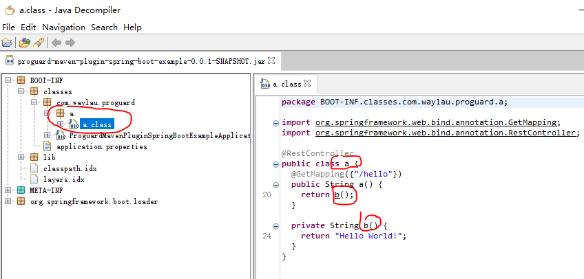

因为Java代码是非常容易反编译，所以为了很好的保护Java源代码，需要Java代码进行混淆。本文介绍如何使用ProGuard的插件proguard-maven-plugin对Java程序进行代码混淆。


<!-- more -->


## ProGuard运行原理


ProGuard能够通过移除无用代码，使用简短无意义的名称来重命名类，字段和方法。从而能够达到压缩、优化和混淆代码的目的。最终会获取一个较小的编译文件，并且这个通过ProGuard处理的编译文件更难于进行逆向工程。

* 压缩（Shrink）:在压缩处理这一步中，用于检测和删除没有使用的类，字段，方法和属性。
* 优化（Optimize）:在优化处理这一步中，对字节码进行优化，并且移除无用指令。
* 混淆（Obfuscate）:在混淆处理这一步中，使用a、b、c等无意义的名称，对类，字段和方法进行重命名。
* 预检（Preveirfy）:在预检这一步中，主要是在Java平台上对处理后的代码进行预检。
　　

对于ProGuard执行流程图如下图所示。



因此，使用ProGuard不仅能够实现代码混淆，还能额外获得代码压缩、优化等方面的好处。

## 如何使用ProGuard

ProGuard提供了几种使用方式：

* 使用ProGuard命令行
* 使用ProGuard GUI程序
* 使用ProGuard 插件


下载安装包，以proguard-7.1.1.zip为例，解压到任意目录即可。双击bin/proguardgui.bat文件即可启动ProGuard工具界面。看画风就是纯纯的Java客户端程序了。



如果是用命令行的方式，则使用proguard.bat文件。

上面的方式都相对来说比较简单，这里不做详细介绍。毕竟ProGuard插件的使用方式，才是本节主要重点。

## 使用ProGuard插件

严格来说，ProGuard插件并不是官方出品。他是由第三方提供的，但也是得到ProGuard承认的。ProGuard插件地址为：<https://github.com/wvengen/proguard-maven-plugin>


### 创建Spring Boot程序

通过Spring Initializr，我们先创建一个简单的Spring Boot程序。




代码结构如下。





### 新建HelloController代码

创建包“com.waylau.proguard.controller”，并在该包下创建HelloController类，代码如下：

```java
/**
 * Welcome to https://waylau.com
 */
package com.waylau.proguard.controller;

import org.springframework.web.bind.annotation.GetMapping;
import org.springframework.web.bind.annotation.RestController;

/**
 * Hello Controller.
 * 
 * @since 1.0.0 2021年11月11日
 * @author <a href="https://waylau.com">Way Lau</a>
 */
@RestController
public class HelloController {
	
	@GetMapping("/hello")
	public String hello() {
		return getMsg();
	}

	private String getMsg() {
		return "Hello World!";
	}

}
```

HelloController类就是实现了一个简单的REST接口。

### 修改pom.xml配置

原有的pom.xml配置如下：

```xml
<?xml version="1.0" encoding="UTF-8"?>
<project xmlns="http://maven.apache.org/POM/4.0.0" xmlns:xsi="http://www.w3.org/2001/XMLSchema-instance"
	xsi:schemaLocation="http://maven.apache.org/POM/4.0.0 https://maven.apache.org/xsd/maven-4.0.0.xsd">
	<modelVersion>4.0.0</modelVersion>
	<parent>
		<groupId>org.springframework.boot</groupId>
		<artifactId>spring-boot-starter-parent</artifactId>
		<version>2.5.6</version>
		<relativePath/>
	</parent>
	<groupId>com.waylau.proguard</groupId>
	<artifactId>proguard-maven-plugin-spring-boot-example</artifactId>
	<version>0.0.1-SNAPSHOT</version>
	<name>proguard-maven-plugin-spring-boot-example</name>
	<description>Proguard Obfuscate Spring Boot Maven Plugin Example.</description>
	<properties>
		<java.version>1.8</java.version>
	</properties>
	<dependencies>
		<dependency>
			<groupId>org.springframework.boot</groupId>
			<artifactId>spring-boot-starter-web</artifactId>
		</dependency>

		<dependency>
			<groupId>org.springframework.boot</groupId>
			<artifactId>spring-boot-starter-test</artifactId>
			<scope>test</scope>
		</dependency>
	</dependencies>

	<build>
		<plugins>
			<plugin>
				<groupId>org.springframework.boot</groupId>
				<artifactId>spring-boot-maven-plugin</artifactId>
			</plugin>
		</plugins>
	</build>

</project>
```

在上述配置中，添加proguard-maven-plugin插件的配置，配置如下：

```xml
<plugin>
    <groupId>com.github.wvengen</groupId>
    <artifactId>proguard-maven-plugin</artifactId>
    <version>${proguard.maven.plugin.version}</version>
    <executions>
        <execution>
            <phase>package</phase>
            <goals>
                <goal>proguard</goal>
            </goals>
        </execution>
    </executions>

    <configuration>
        <proguardVersion>${proguard.version}</proguardVersion>
        <injar>${project.build.finalName}.jar</injar>
        <outjar>${project.build.finalName}.jar</outjar>
        <obfuscate>true</obfuscate>
        <options>
            <option>-dontshrink</option>
            <option>-dontoptimize</option>

            <!-- 此选项将用新的类名替换反射方法调用中的所有字符串。例如，调用Class.forName('className') -->
            <option>-adaptclassstrings</option>

            <!-- 此选项将保存所有原始注解等。否则，将从文件中删除所有注解。 -->
            <option>-keepattributes
                Exceptions,
                InnerClasses,
                Signature,
                Deprecated,
                SourceFile,
                LineNumberTable,
                *Annotation*,
                EnclosingMethod
            </option>

            <!-- 此选项将保存接口中的所有原始名称（不混淆） -->
            <option>-keepnames interface **</option>

            <!-- 此选项将将所有原始方法参数 -->
            <option>-keepparameternames</option>

            <!-- 此选项将保存所有原始类文件（不混淆），一般是混淆领域或者服务包中的文件。 -->
            <option>-keep
                class com.waylau.proguard.ProguardMavenPluginSpringBootExampleApplication {
                    public static
                    void main(java.lang.String[]);
                }
            </option>

            <!-- 此选项忽略警告，例如重复的类定义和命名不正确的文件中的类 -->
            <option>-ignorewarnings</option>

            <!-- 此选项将保存服务包中的所有原始类文件（不进行混淆） -->
            <!-- <option>-keep class com.waylau.proguard.service { *; }</option> -->
            
            <!-- 此选项将保存所有软件包中的所有原始接口文件（不进行混淆） -->
            <option>-keep interface * extends * { *; }</option>
            
            <!-- 此选项将保存所有包中所有类中的所有原始定义的注解 -->
            <option>-keep class com.fasterxml.jackson.** { *; }</option>
            <option>-keep class org.json.JSONObject.** {**
                put(java.lang.String,java.util.Map);}</option>
            <option>-keepclassmembers class * {
                @org.springframework.context.annotation.Bean *;
                @org.springframework.beans.factory.annotation.Autowired *;
                @org.springframework.beans.factory.annotation.Value *;
                }

            </option>

            <option>-dontwarn com.fasterxml.jackson.databind.**</option>
            <option>-dontwarn com.fasterxml.jackson.**</option>

        </options>
        <injarNotExistsSkip>true</injarNotExistsSkip>
        <libs>
            <!--在此添加需要的类库 -->
            <!--<lib>${java.home}/lib/rt.jar</lib> -->
        </libs>

    </configuration>
    <dependencies>
        <dependency>
            <groupId>com.guardsquare</groupId>
            <artifactId>proguard-base</artifactId>
            <version>${proguard.version}</version>
        </dependency>
    </dependencies>
</plugin>
```

上述配置需要注意几点：

* 添加proguard-maven-plugin插件及ProGuard配置
* 在package阶段，就会自动运行proguard
* spring-boot-maven-plugin必须在proguard混淆后运行，这样它就会获取已经混淆的文件。也就是说混淆后的proguard-maven-plugin-spring-boot-example-0.0.1-SNAPSHOT.jar会覆盖掉混淆前的proguard-maven-plugin-spring-boot-example-0.0.1-SNAPSHOT.jar。

## 验证ProGuard插件是否工作正常

验证分为两块，即

* 是否已经完成了混淆；
* 程序经过混淆了之后是否能正常运行。

### 验证程序是否能正常运行

这个比较简单，把程序跑下即可。启动应用执行：


```
java -jar target/proguard-maven-plugin-spring-boot-example-0.0.1-SNAPSHOT.jar
```

启动后，可以通过浏览器访问REST接口。


### 验证是否已经完成了混淆

这里可以使用反编译工具来看是否完成了混淆。

下载安装反编译工具JD-GUI。jd-gui-windows-1.6.6.zip为例，解压到任意目录即可。双击jd-gui.exe文件即可启动JD-GUI工具。

打开我们的proguard-maven-plugin-spring-boot-example-0.0.1-SNAPSHOT.jar，点击左侧class文件，就能看到右侧的反编译后的源码了。



从反编译的结果看，包名、类名、方法名都已经成功做了混淆。

## 参考

* ProGuard项目主页为：<https://github.com/Guardsquare/proguard>
* https://mvnrepository.com/artifact/com.github.wvengen/proguard-maven-plugin
* 《Spring Boot 企业级应用开发实战》<https://item.jd.com/12340304.html>