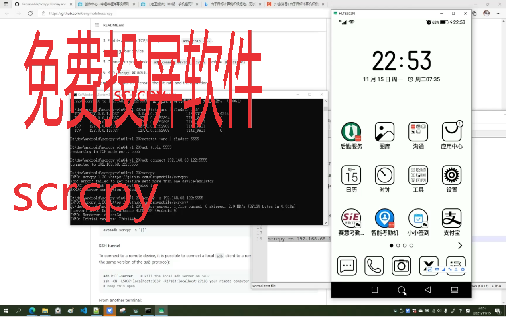

目前市面上有投屏器可以实现将Android手机画面投屏到显示器。本节介绍的是一种通过纯软件的方式，将Android手机投屏到PC电脑上，并且可以在PC上直接控制Android手机。这款开源软件就是scrcpy。


<!-- more -->


## 前置条件

PC和手机是在相同的路由器下（即可以相互ping通）。

## 优点


* 无需有线连接、无需投屏器，存软件实现。
* 手机端无需安装任何软件，只需要开启USB调试即可。

## 使用流程


### 1、下载scrcpy

PC端下载、解压scrcpy，即可完成安装。

下载地址：https://github.com/Genymobile/scrcpy

### 2、获取手机的IP

“设置”->“关于手机”->“状态信息”->“IPv4地址”

本例是192.168.68.122

### 3、PC启用TCP模式端口

执行下面命令启用：

```
restarting in TCP mode port: 5555
```

### 4、手机开启USB调试

手机“开发者选项” 中开启USB调试

### 5、scrcpy自带ADB工具连接到手机

```
adb tcpip 5555

adb connect 192.168.68.122:5555
```

### 6、执行投屏

执行下面命令来执行投屏

```
scrcpy -s 192.168.68.122:5555
```


最终投屏效果如下。




### 7、关闭设备屏幕

使用命令行选项在启动时镜像时可以关闭设备屏幕，这一点也挺实用：

```
--turn-screen-off
```

当然，他们其实不是真的关闭屏幕，只是把屏幕搞成了黑色而已，减少了发光。

其他参数还有

```
--show-touches --stay-awake
```

完整的演示视频：https://www.bilibili.com/video/BV1wL4y1i7t2/
