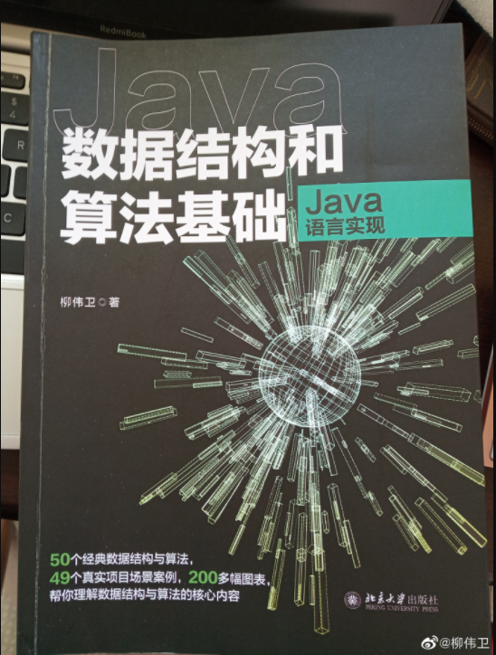

《数据结构和算法基础（Java语言实现）》一书由北京大学出版社出版，已经于近日上市。拿到了样书，第一时间希望与读者朋友们分享下这本书里面的内容。

<!-- more -->

## 为啥要写这本书

12月6日拿到了样书，迫不及待的对新书做了浏览。同时也做了拆书与导读，可以在B站找到：<https://www.bilibili.com/video/BV1fY411s7Kr/>

聊下为啥要写这本书。

其实，这本是我所编写过的书目（<https://waylau.com/books/>）里面，算是最为“低级”的课题了吧，毕竟谁不知道“数据结构和算法”呢？这个课题太基础了。

但是“数据结构和算法”却又是非常重要的课程。**算法和数据结构是程序的灵魂**，在计算机类培训课程中属于必开的课程。虽然实际工作中大多数人并不是专业的算法工程师，不以算法为深，但不可否认算法在工作中的重要性，初级工程师与高级工程师的差距也许就在对于算法的理解上。理解算法，运用合理的数据结构，可以让程序更加高效。

随着云计算、大数据、人工智能、虚拟现实等应用的兴起，企业对于开发人员的算法技术要求也越来越高。不会算法或不精通算法，也许就会错过很多就业良机。另外，在求职时，算法是面试的必考类型。

鉴于算法和数据结构在编程中的重要性，笔者迫不及待地希望将工作中常用的算法介绍给大家。因此，笔者陆续在个人开源网站<https://github.com/waylau/java-data-structures-and-algorithms-in-action>上发表了众多关于算法的技术博客>。2020年年底，笔者将之前算法相关的个人博客整理成册，遂有了本书。

## 三大特点

概况起来，这本《数据结构和算法基础（Java语言实现）》主要有三大特点。B站也有相关介绍：<https://www.bilibili.com/video/BV1Lg411P7LP/>

### 1、涉及面非常广

那么涉及广的话可以体现在哪里呢？可以看这本书的内容简介部分。

该书分为以下几部分：

* 第一部分 预备知识（第1-2章）：介绍数据结构和算法的基本概念，并演示如何搭建开发环境、编写测试用例。
* 第二部分 数据结构（第3-13章）：介绍常见的数据结构，包括数组、链表、矩阵、栈、队列、跳表、散列、树、图等。
* 第三部分 常用算法（第14-19章）：介绍常用的算法，包括分而治之、动态规划、贪心算法、回溯、遗传算法、蚂蚁算法等。
* 第四部分 商业实战（第20章）：介绍汉诺塔游戏的实现。

可以说，基本上你常见的一些是业务上还是技术常用的一些数据结构和算法，这本书都已经涉及了。更难能可贵的是，这本书也对当前非常火爆的诸如AI、机器学习等算法也做了讲解。

### 2、图例非常丰富

这本书是他这个图例非常丰富，从基本的IDE安装，到复杂的数据结构的演示，都有丰富的图例。那么在讲这种数据结构或者算法理论的时候，通过图例的配套讲解演示，可以方便读者理解。

### 3、代码量非常大

第三个特点的话就是它里面的实战案例非常丰富。实战案例体现在，这本书的每一章每个知识点基本上会配套一个实战案例，代码量是非常大的。每行代码这个重点代码它都有一些注释给你写得明明白白。

这本书呢是不单只是简单的讲一些理论，它还有会手把手的教你写代码。理论联系实际。

学习本书，一起手撕算法！

## 参考引用

* 原本同步至：<https://waylau.com/java-data-structures-and-algorithms-in-action-book-three-features/>
* 京东有售：<https://item.jd.com/13014179.html>